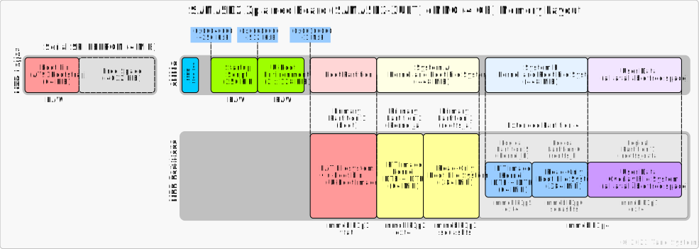

.. SPDX-License-Identifier: MIT

.. _machine-at91-sama5d2-xplained:

**********************
Atmel SAMA5D2 Xplained
**********************

.. rubric:: Contents
.. contents::
   :depth: 1
   :local:

.. _sec-at91-sama5d2-xplained-board:

Board Overview
==============

The SAMA5D2 Xplained Ultra is a fast prototyping and evaluation
platform for the SAMA5D2 series of microprocessors (MPUs) [DS60001476H]_.
The board includes eMMC and DDR3 memories as well as a rich set
of connectivity options. Connectors and expansion headers allows
for easy customization and quick access to leading edge embedded
features such as the Class D amplifier or the capacitive touch
controller (PTC). A Linux distribution and software package
allows you to easily get started with your development.

See [ATSAMA5D2C-XULT]_ for details about SAMA5D2 Xplained board.

.. _fig-at91-sama5d2-xplained:
.. figure:: images/at91-sama5d2-xplained.jpg
   :width: 1000
   :class: with-border

   SAMA5D2 Xplained Board Interfaces and Connectors

Block Diagram
-------------

.. _fig-at91-sama5d2-xplained-block-diagram:
.. figure:: images/at91-sama5d2-xplained-block-diagram.png
   :class: with-border
   :width: 300

   SAMA5D2 Xplained Board Block Diagram

Photos
------

.. container:: flex

   .. _fig-at91-sama5d2-xplained-angled:
   .. figure:: images/at91-sama5d2-xplained-angled.jpg
      :class: with-border
      :width: 300

      SAMA5D2 Xplained Angled View

   .. _fig-at91-sama5d2-xplained-top:
   .. figure:: images/at91-sama5d2-xplained-top.jpg
      :class: with-border
      :width: 300

      SAMA5D2 Xplained Top View

   .. _fig-at91-sama5d2-xplained-bottom:
   .. figure:: images/at91-sama5d2-xplained-bottom.jpg
      :class: with-border
      :width: 300

      SAMA5D2 Xplained Bottom View

Specification
-------------

.. table:: at91-sama5d2-xplained Specification

   +--------------+------------------------------------------------------------------------------------+
   | Model        | SAMA5D2 Xplained                                                                   |
   +==============+====================================================================================+
   | Processor    || Atmel SAMA5D27 (289-ball BGA package)                                             |
   |              || 1 |times| ARM Cortex-A5 with FPU                                                  |
   |              || frequency up to 500 MHz                                                           |
   |              || [DS60001476H]_                                                                    |
   +--------------+------------------------------------------------------------------------------------+
   | Memory       || 512 MiB DDR3L SDRAM                                                               |
   +--------------+------------------------------------------------------------------------------------+
   | Storage      || Full-size SD card slot                                                            |
   |              || 1 |times| eMMC NAND Flash (4 GB)                                                  |
   |              || 1 |times| serial SPI EEPROM (4 MiB)                                               |
   |              || 1 |times| optional QSPI serial flash                                              |
   |              || 1 |times| EEPROM with MAC address and serial number                               |
   +--------------+------------------------------------------------------------------------------------+
   | USB          || 1 |times| USB 2.0 Host with power switch                                          |
   |              || 1 |times| Micro-AB USB 2.0 device                                                 |
   +--------------+------------------------------------------------------------------------------------+
   | Ethernet     || 1 |times| Ethernet 10/100 Mbps PHY (RMII)                                         |
   +--------------+------------------------------------------------------------------------------------+
   | Debug        || 1 |times| JTAG interface connector                                                |
   |              || 1 |times| EDBG interface with CDC                                                 |
   |              || 1 |times| Serial debug console interface (3.3V level)                             |
   +--------------+------------------------------------------------------------------------------------+
   | Expansion    || Arduino R3 compatible set of connectors                                           |
   | Connectors   || XPRO set of connectors                                                            |
   +--------------+------------------------------------------------------------------------------------+
   | Other        || 1 |times| LCD interface connector, LCD TFT Controller with overlay,               |
   |              |            alpha-blending, rotation, scaling and color space conversion            |
   |              || 1 |times| ISC interface and connector                                             |
   |              || 1 |times| RTC                                                                     |
   |              || 1 |times| User RGB LED                                                            |
   |              || 1 |times| User push button                                                        |
   +--------------+------------------------------------------------------------------------------------+
   | Dimensions   | 135 |times| 88 |times| 20 mm                                                       |
   +--------------+------------------------------------------------------------------------------------+
   | Power Source | Micro-AB USB                                                                       |
   +--------------+------------------------------------------------------------------------------------+
   | Power        | 5V/0.5A from USB                                                                   |
   +--------------+------------------------------------------------------------------------------------+

.. _sec-at91-sama5d2-xplained-targets:

Build Targets
=============

.. _sec-at91-sama5d2-xplained-machines:

Machines
--------

.. _table-at91-sama5d2-xplained-machines:
.. table:: Supported Machines

   +------------------+------------------------------------+--------------------------------+------------------------------------+------------------------+--------------------------+
   | Board\ [#]_      | Target YAML\ [#]_                  | Machine\ [#]_                  | Target Recipe(s)\ [#]_             | Running Media\ [#]_    | Installation Media\ [#]_ |
   +==================+====================================+================================+====================================+========================+==========================+
   | SAMA5D2 Xplained | ``at91-sama5d2-xplained-sd.yml``   | ``at91-sama5d2-xplained-sd``   | ``tanowrt-image-full-swu``         | SD card                | |ndash|                  |
   | (Ultra)          +------------------------------------+--------------------------------+------------------------------------+------------------------+--------------------------+
   |                  | ``at91-sama5d2-xplained-emmc.yml`` | ``at91-sama5d2-xplained-emmc`` | ``tanowrt-image-full-swu-factory`` | Internal eMMC          | SD card                  |
   +------------------+------------------------------------+--------------------------------+------------------------------------+------------------------+--------------------------+

.. [#] Target board.
.. [#] Target YAML-file located in the :file:`kas/targets` directory.
.. [#] Target machine name stored in the ``MACHINE`` BitBake variable for selected Target YAML.
.. [#] Recipes that will be built by default for the target. In :numref:`sec-at91-sama5d2-xplained-images`,
       you can find list of supported recipes for the target images, which you can build in addition
       to the default recipes using optional ``--target`` option in build command
       (see :numref:`sec-at91-sama5d2-xplained-build`).
.. [#] External or internal data storage where the TanoWrt operating system is running.
.. [#] External storage device for which an installation image is generated. When booting from
       the Installation Media, the TanoWrt system is installed on the Running Media storage.

.. _sec-at91-sama5d2-xplained-images:

Images
------

.. _table-at91-sama5d2-xplained-images:
.. table:: Supported Images
   :widths: 15, 15, 15, 55

   +---------------------------+------------------------------------+------------------------------------+-----------------------------------------------------+
   | Read-Only Root Filesystem | Recipe\ [#]_                       | Supported by Target(s)             | Description                                         |
   | Image                     |                                    |                                    |                                                     |
   +===========================+====================================+====================================+=====================================================+
   | ``tanowrt-image-full``    | ``tanowrt-image-full``             | *All*                              | Standard TanoWrt image.                             |
   |                           +------------------------------------+------------------------------------+-----------------------------------------------------+
   |                           | ``tanowrt-image-full-swu``         | *All*                              | Standard TanoWrt image                              |
   |                           |                                    |                                    | and :ref:`firmware upgrade <sec-firmware-upgrade>`  |
   |                           |                                    |                                    | image. When building this image,                    |
   |                           |                                    |                                    | ``tanowrt-image-full`` will also be built           |
   |                           |                                    |                                    | as dependency.                                      |
   |                           +------------------------------------+------------------------------------+-----------------------------------------------------+
   |                           | ``tanowrt-image-full-swu-factory`` | ``at91-sama5d2-xplained-emmc.yml`` | Factory installation image for standard TanoWrt     |
   |                           |                                    |                                    | image. When building this image,                    |
   |                           |                                    |                                    | ``tanowrt-image-full``                              |
   |                           |                                    |                                    | and ``tanowrt-image-full-swu`` will also be built   |
   |                           |                                    |                                    | as dependencies.                                    |
   +---------------------------+------------------------------------+------------------------------------+-----------------------------------------------------+

.. [#] Image recipe name. This name can be used as argument
       for ``--target`` build command option (see :numref:`sec-at91-sama5d2-xplained-build` section).

.. _sec-at91-sama5d2-xplained-build:

Build
=====

Please read the common information on how to perform a TanoWrt
images build and preparing the build environment in section ":ref:`sec-build`".

.. seealso:: 

   - See section :numref:`sec-at91-sama5d2-xplained-machines` to select the required target YAML file (``<target-yml>``).
   - See section :numref:`sec-at91-sama5d2-xplained-images` to select the required root filesystem image recipe (``<target-recipe>``).
   - See section :numref:`sec-at91-sama5d2-xplained-artifacts` for detailed information
     about the produced build artifacts.

Examples
--------

Build Default Images for SAMA5D2 Xplained Board
~~~~~~~~~~~~~~~~~~~~~~~~~~~~~~~~~~~~~~~~~~~~~~~

.. rubric:: For SD Card

.. code-block:: console

   $ kas build targets/kas/at91-sama5d2-xplained-sd.yml

Default images will be produced to boot and run from the SD
card on the SAMA5D2 Xplained target board.

.. rubric:: For Internal eMMC

.. code-block:: console

   $ kas build targets/kas/at91-sama5d2-xplained-emmc.yml

An initial factory installation image will be generated,
intended to run from the SD card. The installer image
will install the default image to the internal eMMC flash
memory and further the SAMA5D2 Xplained board will boot
and run from the eMMC flash memory.

.. _sec-at91-sama5d2-xplained-partitioning:

Partitioning Layouts
====================

SD Card
-------

The partitioning and data layout of the SD card image for the SAMA5D2 Xplained board
are shown in the figure below.

.. _fig-at91-sama5d2-xplained-layout-sd:
.. figure:: images/at91-sama5d2-xplained-layout-sd.svg
   :width: 900

   SAMA5D2 Xplained Partitions Layout for SD Card

eMMC
----

The partitioning and data layout of the eMMC image for the SAMA5D2 Xplained board
are shown in the figure below.

.. _fig-at91-sama5d2-xplained-layout-emmc:

   SAMA5D2 Xplained Partitions Layout for eMMC

The eMMC boot partitions 1  (:file:`/dev/mmcblk0boot0`) and
2 (:file:`/dev/mmcblk0boot1`) are currently not used. Second bootloader
AT91Bootstrap for this layout are placed in the serial SPI EEPROM due to
some SAMA5D2 chip revisions have a eMMC boot issues [DS80000803A]_.

.. _sec-at91-sama5d2-xplained-artifacts:

Produced Build Artifacts
========================

All produced build artifacts are stored in the :file:`~/tanowrt/build/tanowrt-glibc/deploy/images/<MACHINE>` directory.
Refer to table :ref:`table-at91-sama5d2-xplained-artifacts` for a description of some common (not all) build artifacts.

.. _table-at91-sama5d2-xplained-artifacts:
.. table:: Produced Build Artifacts
   :widths: 15, 15, 70

   +---------------------------------------------------------------------+-------------------------------------+----------------------------------------------------------------------+
   | Artifact                                                            | Target(s)                           | Description                                                          |
   +=====================================================================+=====================================+======================================================================+
   | .. centered:: Bootloader (AT91Bootstrap)                                                                                                                                         |
   +---------------------------------------------------------------------+-------------------------------------+----------------------------------------------------------------------+
   | :file:`at91bootstrap.bin-sdcard`                                    | *All*                               | AT91Bootstrap binary for SD card images.                             |
   +---------------------------------------------------------------------+-------------------------------------+----------------------------------------------------------------------+
   | :file:`at91bootstrap.bin-emmc`                                      | ``at91-sama5d2-xplained-emcc.yml``  | AT91Bootstrap binary for eMMC flash images.                          |
   +---------------------------------------------------------------------+-------------------------------------+----------------------------------------------------------------------+
   | .. centered:: Bootloader (U-Boot)                                                                                                                                                |
   +---------------------------------------------------------------------+-------------------------------------+----------------------------------------------------------------------+
   | :file:`startup-<MACHINE>.img`                                       | *All*                               | U-Boot startup script.                                               |
   +---------------------------------------------------------------------+-------------------------------------+----------------------------------------------------------------------+
   | :file:`startup-factory-<MACHINE>.img`                               | ``at91-sama5d2-xplained-emmc.yml``  | U-Boot startup script for factory installation image.                |
   +---------------------------------------------------------------------+-------------------------------------+----------------------------------------------------------------------+
   | :file:`u-boot-initial-env-<MACHINE>-sdcard`                         | *All*                               | U-Boot initial environment image for SD card image.                  |
   +---------------------------------------------------------------------+-------------------------------------+----------------------------------------------------------------------+
   | :file:`u-boot-initial-env-<MACHINE>-emmc`                           | ``at91-sama5d2-xplained-emmc.yml``  | U-Boot initial environment image for internal eMMC flash.            |
   +---------------------------------------------------------------------+-------------------------------------+----------------------------------------------------------------------+
   | :file:`u-boot-<MACHINE>.bin-sdcard`                                 | *All*                               | U-Boot binary image for booting from SD card.                        |
   +---------------------------------------------------------------------+-------------------------------------+----------------------------------------------------------------------+
   | :file:`u-boot-<MACHINE>.bin-emmc`                                   | ``at91-sama5d2-xplained-emmc.yml``  | U-Boot binary image for booting from internal eMMC flash.            |
   +---------------------------------------------------------------------+-------------------------------------+----------------------------------------------------------------------+
   | .. centered:: Linux Kernel and DTB                                                                                                                                               |
   +---------------------------------------------------------------------+-------------------------------------+----------------------------------------------------------------------+
   | :file:`fitImage-<MACHINE>.bin`                                      | *All*                               | Flattened Image Tree (FIT) image with Linux kernel                   |
   |                                                                     |                                     | and Device Tree Blobs (DTB).                                         |
   +---------------------------------------------------------------------+-------------------------------------+----------------------------------------------------------------------+
   | :file:`fitImage-<MACHINE>.ext4`                                     | *All*                               | FIT image packed into an ext4 file system image.                     |
   +---------------------------------------------------------------------+-------------------------------------+----------------------------------------------------------------------+
   | :file:`at91-sama5d2_xplained.dtb`                                   | *All*                               | Target Device Tree Blob (DTB).                                       |
   +---------------------------------------------------------------------+-------------------------------------+----------------------------------------------------------------------+
   | :file:`fitImage-tanowrt-image-initramfs-swu-factory-<MACHINE>.ext4` | ``at91-sama5d2-xplained-emmc.yml``  | FIT image for SWU factory installation image with                    |
   |                                                                     |                                     | initramfs image.                                                     |
   +---------------------------------------------------------------------+-------------------------------------+----------------------------------------------------------------------+
   | .. centered:: Images                                                                                                                                                             |
   +---------------------------------------------------------------------+-------------------------------------+----------------------------------------------------------------------+
   | :file:`<rootfs-image>-<MACHINE>.sdcard.img`                         | ``at91-sama5d2-xplained-sd.yml``    | SD card image including all required partitions for booting          |
   |                                                                     |                                     | and running the system. This image is ready to be written            |
   |                                                                     |                                     | to the SD card using the :command:`dd` utility or similar            |
   |                                                                     |                                     | (see :ref:`sec-at91-sama5d2-xplained-flash`).                        |
   +---------------------------------------------------------------------+-------------------------------------+----------------------------------------------------------------------+
   | :file:`<rootfs-image>-swu-factory-<MACHINE>.sdcard.img`             | ``at91-sama5d2-xplained-emmc.yml``  | SD card factory installation image. This image is ready              |
   |                                                                     |                                     | to be written to the SD card using the :command:`dd` utility         |
   |                                                                     |                                     | or similar (see :ref:`sec-at91-sama5d2-xplained-flash`).             |
   +---------------------------------------------------------------------+-------------------------------------+----------------------------------------------------------------------+
   | :file:`tanowrt-image-initramfs-swu-factory-<MACHINE>.cpio.gz`       | ``at91-sama5d2-xplained-emmc.yml``  | Root filesystem initramfs image for factory installtion              |
   |                                                                     |                                     | image. This image is included in                                     |
   |                                                                     |                                     | :file:`fitImage-tanowrt-image-initramfs-swu-factory-<MACHINE>.ext4`. |
   +---------------------------------------------------------------------+-------------------------------------+----------------------------------------------------------------------+
   | :file:`<rootfs-image>-<MACHINE>.squashfs-lzo`                       | *All*                               | Root filesystem image (squashfs with LZO compression).               |
   +---------------------------------------------------------------------+-------------------------------------+----------------------------------------------------------------------+
   | :file:`<rootfs-image>-swu-<MACHINE>.swu`                            | *All*                               | :ref:`Firmware upgrade <sec-firmware-upgrade>` image.                |
   +---------------------------------------------------------------------+-------------------------------------+----------------------------------------------------------------------+

.. note:: ``<MACHINE>`` in the artifacts path and artifact file names are replaced by
          the actual value of the ``MACHINE`` BitBake variable for the chosen
          `target <sec-at91-sama5d2-xplained-targets_>`__. ``<rootfs-image>`` is replaced by
          the actual read-only root filesystem `image <sec-at91-sama5d2-xplained-images_>`__ name.

For example, below is the lists of artifacts produced by the ``at91-sama5d2-xplained-emmc.yml``
and ``at91-sama5d2-xplained-sd.yml`` target builds. There are two types of listings here |mdash|
a complete listing, and a reduced listing without the symbolic links display.

Build Artifacts Listings for ``at91-sama5d2-xplained-sd.yml`` Target
--------------------------------------------------------------------

.. tabs::

   .. tab:: Reduced

      .. code-block:: console

         [~/tanowrt/build/tanowrt-glibc/deploy/images/at91-sama5d2-xplained-sd]$ ls -gGh | grep -v -e "^l"
         total 133M
         -rwxr-xr-x 2  24K Aug  7 00:33 at91bootstrap.bin-sdcard
         -rw-r--r-- 2  44K Aug  7 00:22 at91-sama5d2_xplained--4.19.78+git0+046113c438-tano0.2.20.20.0.0-at91-sama5d2-xplained-sd-20220806211906.dtb
         -rw-r--r-- 2 4.5M Aug  7 00:22 fitImage--4.19.78+git0+046113c438-tano0.2.20.20.0.0-at91-sama5d2-xplained-sd-20220806211906.bin
         -rw-r--r-- 2 6.3M Aug  7 00:22 fitImage-4.19.78+gitAUTOINC+046113c438-tano0.2.20.20.0.0-at91-sama5d2-xplained-sd.ext4
         -rw-r--r-- 2 6.3M Aug  7 00:22 fitImage-at91-sama5d2-xplained-sd.ext4
         -rw-r--r-- 2 1.6K Aug  7 00:22 fitImage-its--4.19.78+git0+046113c438-tano0.2.20.20.0.0-at91-sama5d2-xplained-sd-20220806211906.its
         -rw-r--r-- 2 4.4M Aug  7 00:22 fitImage-linux.bin--4.19.78+git0+046113c438-tano0.2.20.20.0.0-at91-sama5d2-xplained-sd-20220806211906.bin
         -rw-r--r-- 2 2.0M Aug  7 00:22 modules--4.19.78+git0+046113c438-tano0.2.20.20.0.0-at91-sama5d2-xplained-sd-20220806211906.tgz
         drwxr-xr-x 7  260 Jul 27 16:28 sam-ba
         -rw-r--r-- 2 2.1K Aug  7 00:33 startup.img
         -rw-r--r-- 2   19 Aug  7 00:33 startup.img.version
         -rw-r--r-- 2  67K Aug  7 00:36 tanowrt-image-full-at91-sama5d2-xplained-sd-20220806211906.rootfs.manifest
         -rw-r--r-- 2 940M Aug  7 00:37 tanowrt-image-full-at91-sama5d2-xplained-sd-20220806211906.rootfs.sdcard.img
         -rw-r--r-- 2  24M Aug  7 00:37 tanowrt-image-full-at91-sama5d2-xplained-sd-20220806211906.rootfs.squashfs-lzo
         -rw-r--r-- 2   24 Aug  7 00:37 tanowrt-image-full-at91-sama5d2-xplained-sd-20220806211906.rootfs.version
         -rw-r--r-- 2 343K Aug  7 00:36 tanowrt-image-full-at91-sama5d2-xplained-sd-20220806211906.testdata.json
         -rw-r--r-- 2 5.5K Aug  7 00:37 tanowrt-image-full.env
         -rw-r--r-- 2 2.7K Aug  7 00:37 tanowrt-image-full-sdimage-at91-swu-a-b.wks
         -rw-r--r-- 2  31M Aug  7 00:37 tanowrt-image-full-swu-at91-sama5d2-xplained-sd-20220806211906.swu
         -rw-r--r-- 2  192 Aug  7 00:33 u-boot-initial-env-at91-sama5d2-xplained-sd-sdcard-v2020.01-at91+gitAUTOINC+af59b26c22-tano0.2
         -rw-r--r-- 2 128K Aug  7 00:33 u-boot-initial-env-at91-sama5d2-xplained-sd-sdcard-v2020.01-at91+gitAUTOINC+af59b26c22-tano0.2.bin
         -rw-r--r-- 2 476K Aug  7 00:33 u-boot-sdcard-v2020.01-at91+gitAUTOINC+af59b26c22-tano0.2.bin

   .. tab:: Complete

      .. code-block:: console

         [~/tanowrt/build/tanowrt-glibc/deploy/images/at91-sama5d2-xplained-sd]$ ls -gGh
         total 133M
         -rwxr-xr-x 2  24K Aug  7 00:33 at91bootstrap.bin-sdcard
         -rw-r--r-- 2  44K Aug  7 00:22 at91-sama5d2_xplained--4.19.78+git0+046113c438-tano0.2.20.20.0.0-at91-sama5d2-xplained-sd-20220806211906.dtb
         lrwxrwxrwx 2  108 Aug  7 00:22 at91-sama5d2_xplained-at91-sama5d2-xplained-sd.dtb -> at91-sama5d2_xplained--4.19.78+git0+046113c438-tano0.2.20.20.0.0-at91-sama5d2-xplained-sd-20220806211906.dtb
         lrwxrwxrwx 2  108 Aug  7 00:22 at91-sama5d2_xplained.dtb -> at91-sama5d2_xplained--4.19.78+git0+046113c438-tano0.2.20.20.0.0-at91-sama5d2-xplained-sd-20220806211906.dtb
         lrwxrwxrwx 2   24 Aug  7 00:33 boot.bin-sdcard -> at91bootstrap.bin-sdcard
         lrwxrwxrwx 2   95 Aug  7 00:22 fitImage -> fitImage--4.19.78+git0+046113c438-tano0.2.20.20.0.0-at91-sama5d2-xplained-sd-20220806211906.bin
         -rw-r--r-- 2 4.5M Aug  7 00:22 fitImage--4.19.78+git0+046113c438-tano0.2.20.20.0.0-at91-sama5d2-xplained-sd-20220806211906.bin
         -rw-r--r-- 2 6.3M Aug  7 00:22 fitImage-4.19.78+gitAUTOINC+046113c438-tano0.2.20.20.0.0-at91-sama5d2-xplained-sd.ext4
         lrwxrwxrwx 2   95 Aug  7 00:22 fitImage-at91-sama5d2-xplained-sd.bin -> fitImage--4.19.78+git0+046113c438-tano0.2.20.20.0.0-at91-sama5d2-xplained-sd-20220806211906.bin
         -rw-r--r-- 2 6.3M Aug  7 00:22 fitImage-at91-sama5d2-xplained-sd.ext4
         -rw-r--r-- 2 1.6K Aug  7 00:22 fitImage-its--4.19.78+git0+046113c438-tano0.2.20.20.0.0-at91-sama5d2-xplained-sd-20220806211906.its
         lrwxrwxrwx 2   99 Aug  7 00:22 fitImage-its-at91-sama5d2-xplained-sd -> fitImage-its--4.19.78+git0+046113c438-tano0.2.20.20.0.0-at91-sama5d2-xplained-sd-20220806211906.its
         -rw-r--r-- 2 4.4M Aug  7 00:22 fitImage-linux.bin--4.19.78+git0+046113c438-tano0.2.20.20.0.0-at91-sama5d2-xplained-sd-20220806211906.bin
         lrwxrwxrwx 2  105 Aug  7 00:22 fitImage-linux.bin-at91-sama5d2-xplained-sd -> fitImage-linux.bin--4.19.78+git0+046113c438-tano0.2.20.20.0.0-at91-sama5d2-xplained-sd-20220806211906.bin
         -rw-r--r-- 2 2.0M Aug  7 00:22 modules--4.19.78+git0+046113c438-tano0.2.20.20.0.0-at91-sama5d2-xplained-sd-20220806211906.tgz
         lrwxrwxrwx 2   94 Aug  7 00:22 modules-at91-sama5d2-xplained-sd.tgz -> modules--4.19.78+git0+046113c438-tano0.2.20.20.0.0-at91-sama5d2-xplained-sd-20220806211906.tgz
         drwxr-xr-x 7  260 Jul 27 16:28 sam-ba
         lrwxrwxrwx 2   11 Aug  7 00:33 startup-at91-sama5d2-xplained-sd.img -> startup.img
         lrwxrwxrwx 2   19 Aug  7 00:33 startup-at91-sama5d2-xplained-sd.img.version -> startup.img.version
         -rw-r--r-- 2 2.1K Aug  7 00:33 startup.img
         -rw-r--r-- 2   19 Aug  7 00:33 startup.img.version
         -rw-r--r-- 2  67K Aug  7 00:36 tanowrt-image-full-at91-sama5d2-xplained-sd-20220806211906.rootfs.manifest
         -rw-r--r-- 2 940M Aug  7 00:37 tanowrt-image-full-at91-sama5d2-xplained-sd-20220806211906.rootfs.sdcard.img
         -rw-r--r-- 2  24M Aug  7 00:37 tanowrt-image-full-at91-sama5d2-xplained-sd-20220806211906.rootfs.squashfs-lzo
         -rw-r--r-- 2   24 Aug  7 00:37 tanowrt-image-full-at91-sama5d2-xplained-sd-20220806211906.rootfs.version
         -rw-r--r-- 2 343K Aug  7 00:36 tanowrt-image-full-at91-sama5d2-xplained-sd-20220806211906.testdata.json
         lrwxrwxrwx 2   74 Aug  7 00:36 tanowrt-image-full-at91-sama5d2-xplained-sd.manifest -> tanowrt-image-full-at91-sama5d2-xplained-sd-20220806211906.rootfs.manifest
         lrwxrwxrwx 2   76 Aug  7 00:37 tanowrt-image-full-at91-sama5d2-xplained-sd.sdcard.img -> tanowrt-image-full-at91-sama5d2-xplained-sd-20220806211906.rootfs.sdcard.img
         lrwxrwxrwx 2   78 Aug  7 00:37 tanowrt-image-full-at91-sama5d2-xplained-sd.squashfs-lzo -> tanowrt-image-full-at91-sama5d2-xplained-sd-20220806211906.rootfs.squashfs-lzo
         lrwxrwxrwx 2   72 Aug  7 00:36 tanowrt-image-full-at91-sama5d2-xplained-sd.testdata.json -> tanowrt-image-full-at91-sama5d2-xplained-sd-20220806211906.testdata.json
         lrwxrwxrwx 2   73 Aug  7 00:37 tanowrt-image-full-at91-sama5d2-xplained-sd.version -> tanowrt-image-full-at91-sama5d2-xplained-sd-20220806211906.rootfs.version
         -rw-r--r-- 2 5.5K Aug  7 00:37 tanowrt-image-full.env
         -rw-r--r-- 2 2.7K Aug  7 00:37 tanowrt-image-full-sdimage-at91-swu-a-b.wks
         -rw-r--r-- 2  31M Aug  7 00:37 tanowrt-image-full-swu-at91-sama5d2-xplained-sd-20220806211906.swu
         lrwxrwxrwx 2   66 Aug  7 00:37 tanowrt-image-full-swu-at91-sama5d2-xplained-sd.swu -> tanowrt-image-full-swu-at91-sama5d2-xplained-sd-20220806211906.swu
         lrwxrwxrwx 2   61 Aug  7 00:33 u-boot-at91-sama5d2-xplained-sd.bin -> u-boot-sdcard-v2020.01-at91+gitAUTOINC+af59b26c22-tano0.2.bin
         lrwxrwxrwx 2   61 Aug  7 00:33 u-boot-at91-sama5d2-xplained-sd.bin-sdcard -> u-boot-sdcard-v2020.01-at91+gitAUTOINC+af59b26c22-tano0.2.bin
         lrwxrwxrwx 2   61 Aug  7 00:33 u-boot.bin -> u-boot-sdcard-v2020.01-at91+gitAUTOINC+af59b26c22-tano0.2.bin
         lrwxrwxrwx 2   61 Aug  7 00:33 u-boot.bin-sdcard -> u-boot-sdcard-v2020.01-at91+gitAUTOINC+af59b26c22-tano0.2.bin
         lrwxrwxrwx 2   94 Aug  7 00:33 u-boot-initial-env-at91-sama5d2-xplained-sd-sdcard -> u-boot-initial-env-at91-sama5d2-xplained-sd-sdcard-v2020.01-at91+gitAUTOINC+af59b26c22-tano0.2
         lrwxrwxrwx 2   98 Aug  7 00:33 u-boot-initial-env-at91-sama5d2-xplained-sd-sdcard.bin -> u-boot-initial-env-at91-sama5d2-xplained-sd-sdcard-v2020.01-at91+gitAUTOINC+af59b26c22-tano0.2.bin
         -rw-r--r-- 2  192 Aug  7 00:33 u-boot-initial-env-at91-sama5d2-xplained-sd-sdcard-v2020.01-at91+gitAUTOINC+af59b26c22-tano0.2
         -rw-r--r-- 2 128K Aug  7 00:33 u-boot-initial-env-at91-sama5d2-xplained-sd-sdcard-v2020.01-at91+gitAUTOINC+af59b26c22-tano0.2.bin
         lrwxrwxrwx 2   94 Aug  7 00:33 u-boot-initial-env-sdcard -> u-boot-initial-env-at91-sama5d2-xplained-sd-sdcard-v2020.01-at91+gitAUTOINC+af59b26c22-tano0.2
         lrwxrwxrwx 2   98 Aug  7 00:33 u-boot-initial-env-sdcard.bin -> u-boot-initial-env-at91-sama5d2-xplained-sd-sdcard-v2020.01-at91+gitAUTOINC+af59b26c22-tano0.2.bin
         -rw-r--r-- 2 476K Aug  7 00:33 u-boot-sdcard-v2020.01-at91+gitAUTOINC+af59b26c22-tano0.2.bin

Build Artifacts Listings for ``at91-sama5d2-xplained-emmc.yml`` Target
----------------------------------------------------------------------

.. tabs::

   .. tab:: Reduced

      .. code-block:: console

         [~/tanowrt/build/tanowrt-glibc/deploy/images/at91-sama5d2-xplained-emmc]$ ls -gGh | grep -v -e "^l"
         total 163M
         -rwxr-xr-x 2  23K Aug  7 00:38 at91bootstrap.bin-emmc
         -rwxr-xr-x 2  24K Aug  7 00:38 at91bootstrap.bin-sdcard
         -rw-r--r-- 2  44K Aug  7 00:41 at91-sama5d2_xplained--4.19.78+git0+046113c438-tano0.2.20.20.0.0-at91-sama5d2-xplained-emmc-20220806213751.dtb
         -rw-r--r-- 2 4.5M Aug  7 00:41 fitImage--4.19.78+git0+046113c438-tano0.2.20.20.0.0-at91-sama5d2-xplained-emmc-20220806213751.bin
         -rw-r--r-- 2 6.3M Aug  7 00:41 fitImage-4.19.78+gitAUTOINC+046113c438-tano0.2.20.20.0.0-at91-sama5d2-xplained-emmc.ext4
         -rw-r--r-- 2 6.3M Aug  7 00:41 fitImage-at91-sama5d2-xplained-emmc.ext4
         -rw-r--r-- 2 1.6K Aug  7 00:41 fitImage-its--4.19.78+git0+046113c438-tano0.2.20.20.0.0-at91-sama5d2-xplained-emmc-20220806213751.its
         -rw-r--r-- 2 2.3K Aug  7 00:41 fitImage-its-tanowrt-image-initramfs-swu-factory-at91-sama5d2-xplained-emmc--4.19.78+git0+046113c438-tano0.2.20.20.0.0-at91-sama5d2-xplained-emmc-20220806213751.its
         -rw-r--r-- 2 4.4M Aug  7 00:41 fitImage-linux.bin--4.19.78+git0+046113c438-tano0.2.20.20.0.0-at91-sama5d2-xplained-emmc-20220806213751.bin
         -rw-r--r-- 2  16M Aug  7 00:41 fitImage-tanowrt-image-initramfs-swu-factory-4.19.78+gitAUTOINC+046113c438-tano0.2.20.20.0.0-at91-sama5d2-xplained-emmc.ext4
         -rw-r--r-- 2  12M Aug  7 00:41 fitImage-tanowrt-image-initramfs-swu-factory-at91-sama5d2-xplained-emmc--4.19.78+git0+046113c438-tano0.2.20.20.0.0-at91-sama5d2-xplained-emmc-20220806213751.bin
         -rw-r--r-- 2  16M Aug  7 00:41 fitImage-tanowrt-image-initramfs-swu-factory-at91-sama5d2-xplained-emmc.ext4
         -rw-r--r-- 2 2.0M Aug  7 00:41 modules--4.19.78+git0+046113c438-tano0.2.20.20.0.0-at91-sama5d2-xplained-emmc-20220806213751.tgz
         drwxr-xr-x 7  260 Jul 27 16:28 sam-ba
         -rw-r--r-- 2  890 Aug  7 00:39 startup-factory.img
         -rw-r--r-- 2   19 Aug  7 00:39 startup-factory.img.version
         -rw-r--r-- 2 2.1K Aug  7 00:39 startup.img
         -rw-r--r-- 2   19 Aug  7 00:39 startup.img.version
         -rw-r--r-- 2  68K Aug  7 00:41 tanowrt-image-full-at91-sama5d2-xplained-emmc-20220806213751.rootfs.manifest
         -rw-r--r-- 2  23M Aug  7 00:42 tanowrt-image-full-at91-sama5d2-xplained-emmc-20220806213751.rootfs.squashfs-lzo
         -rw-r--r-- 2   24 Aug  7 00:42 tanowrt-image-full-at91-sama5d2-xplained-emmc-20220806213751.rootfs.version
         -rw-r--r-- 2 343K Aug  7 00:41 tanowrt-image-full-at91-sama5d2-xplained-emmc-20220806213751.testdata.json
         -rw-r--r-- 2  30M Aug  7 00:42 tanowrt-image-full-swu-at91-sama5d2-xplained-emmc-20220806213751.swu
         -rw-r--r-- 2  44M Aug  7 00:42 tanowrt-image-full-swu-factory-at91-sama5d2-xplained-emmc-20220806213751.sdcard.img
         -rw-r--r-- 2 6.2K Aug  7 00:41 tanowrt-image-full-swu-factory.env
         -rw-r--r-- 2  843 Aug  7 00:41 tanowrt-image-full-swu-factory-sdimage-at91-swu-factory.wks
         -rw-r--r-- 2 7.6M Aug  7 00:41 tanowrt-image-initramfs-swu-factory-at91-sama5d2-xplained-emmc-20220806213751.rootfs.cpio.gz
         -rw-r--r-- 2 4.1K Aug  7 00:41 tanowrt-image-initramfs-swu-factory-at91-sama5d2-xplained-emmc-20220806213751.rootfs.manifest
         -rw-r--r-- 2   24 Aug  7 00:41 tanowrt-image-initramfs-swu-factory-at91-sama5d2-xplained-emmc-20220806213751.rootfs.version
         -rw-r--r-- 2 350K Aug  7 00:41 tanowrt-image-initramfs-swu-factory-at91-sama5d2-xplained-emmc-20220806213751.testdata.json
         -rw-r--r-- 2 476K Aug  7 00:38 u-boot-emmc-v2020.01-at91+gitAUTOINC+af59b26c22-tano0.2.bin
         -rw-r--r-- 2  192 Aug  7 00:38 u-boot-initial-env-at91-sama5d2-xplained-emmc-emmc-v2020.01-at91+gitAUTOINC+af59b26c22-tano0.2
         -rw-r--r-- 2 128K Aug  7 00:38 u-boot-initial-env-at91-sama5d2-xplained-emmc-emmc-v2020.01-at91+gitAUTOINC+af59b26c22-tano0.2.bin
         -rw-r--r-- 2  192 Aug  7 00:38 u-boot-initial-env-at91-sama5d2-xplained-emmc-sdcard-v2020.01-at91+gitAUTOINC+af59b26c22-tano0.2
         -rw-r--r-- 2 128K Aug  7 00:38 u-boot-initial-env-at91-sama5d2-xplained-emmc-sdcard-v2020.01-at91+gitAUTOINC+af59b26c22-tano0.2.bin
         -rw-r--r-- 2 476K Aug  7 00:38 u-boot-sdcard-v2020.01-at91+gitAUTOINC+af59b26c22-tano0.2.bin

   .. tab:: Complete

      .. code-block:: console

         [~/tanowrt/build/tanowrt-glibc/deploy/images/at91-sama5d2-xplained-emmc]$ ls -gGh
         total 163M
         -rwxr-xr-x 2  23K Aug  7 00:38 at91bootstrap.bin-emmc
         -rwxr-xr-x 2  24K Aug  7 00:38 at91bootstrap.bin-sdcard
         -rw-r--r-- 2  44K Aug  7 00:41 at91-sama5d2_xplained--4.19.78+git0+046113c438-tano0.2.20.20.0.0-at91-sama5d2-xplained-emmc-20220806213751.dtb
         lrwxrwxrwx 2  110 Aug  7 00:41 at91-sama5d2_xplained-at91-sama5d2-xplained-emmc.dtb -> at91-sama5d2_xplained--4.19.78+git0+046113c438-tano0.2.20.20.0.0-at91-sama5d2-xplained-emmc-20220806213751.dtb
         lrwxrwxrwx 2  110 Aug  7 00:41 at91-sama5d2_xplained.dtb -> at91-sama5d2_xplained--4.19.78+git0+046113c438-tano0.2.20.20.0.0-at91-sama5d2-xplained-emmc-20220806213751.dtb
         lrwxrwxrwx 2   22 Aug  7 00:38 boot.bin-emmc -> at91bootstrap.bin-emmc
         lrwxrwxrwx 2   24 Aug  7 00:38 boot.bin-sdcard -> at91bootstrap.bin-sdcard
         lrwxrwxrwx 2   97 Aug  7 00:41 fitImage -> fitImage--4.19.78+git0+046113c438-tano0.2.20.20.0.0-at91-sama5d2-xplained-emmc-20220806213751.bin
         -rw-r--r-- 2 4.5M Aug  7 00:41 fitImage--4.19.78+git0+046113c438-tano0.2.20.20.0.0-at91-sama5d2-xplained-emmc-20220806213751.bin
         -rw-r--r-- 2 6.3M Aug  7 00:41 fitImage-4.19.78+gitAUTOINC+046113c438-tano0.2.20.20.0.0-at91-sama5d2-xplained-emmc.ext4
         lrwxrwxrwx 2   97 Aug  7 00:41 fitImage-at91-sama5d2-xplained-emmc.bin -> fitImage--4.19.78+git0+046113c438-tano0.2.20.20.0.0-at91-sama5d2-xplained-emmc-20220806213751.bin
         -rw-r--r-- 2 6.3M Aug  7 00:41 fitImage-at91-sama5d2-xplained-emmc.ext4
         -rw-r--r-- 2 1.6K Aug  7 00:41 fitImage-its--4.19.78+git0+046113c438-tano0.2.20.20.0.0-at91-sama5d2-xplained-emmc-20220806213751.its
         lrwxrwxrwx 2  101 Aug  7 00:41 fitImage-its-at91-sama5d2-xplained-emmc -> fitImage-its--4.19.78+git0+046113c438-tano0.2.20.20.0.0-at91-sama5d2-xplained-emmc-20220806213751.its
         -rw-r--r-- 2 2.3K Aug  7 00:41 fitImage-its-tanowrt-image-initramfs-swu-factory-at91-sama5d2-xplained-emmc--4.19.78+git0+046113c438-tano0.2.20.20.0.0-at91-sama5d2-xplained-emmc-20220806213751.its
         lrwxrwxrwx 2  164 Aug  7 00:41 fitImage-its-tanowrt-image-initramfs-swu-factory-at91-sama5d2-xplained-emmc-at91-sama5d2-xplained-emmc -> fitImage-its-tanowrt-image-initramfs-swu-factory-at91-sama5d2-xplained-emmc--4.19.78+git0+046113c438-tano0.2.20.20.0.0-at91-sama5d2-xplained-emmc-20220806213751.its
         -rw-r--r-- 2 4.4M Aug  7 00:41 fitImage-linux.bin--4.19.78+git0+046113c438-tano0.2.20.20.0.0-at91-sama5d2-xplained-emmc-20220806213751.bin
         lrwxrwxrwx 2  107 Aug  7 00:41 fitImage-linux.bin-at91-sama5d2-xplained-emmc -> fitImage-linux.bin--4.19.78+git0+046113c438-tano0.2.20.20.0.0-at91-sama5d2-xplained-emmc-20220806213751.bin
         -rw-r--r-- 2  16M Aug  7 00:41 fitImage-tanowrt-image-initramfs-swu-factory-4.19.78+gitAUTOINC+046113c438-tano0.2.20.20.0.0-at91-sama5d2-xplained-emmc.ext4
         -rw-r--r-- 2  12M Aug  7 00:41 fitImage-tanowrt-image-initramfs-swu-factory-at91-sama5d2-xplained-emmc--4.19.78+git0+046113c438-tano0.2.20.20.0.0-at91-sama5d2-xplained-emmc-20220806213751.bin
         lrwxrwxrwx 2  160 Aug  7 00:41 fitImage-tanowrt-image-initramfs-swu-factory-at91-sama5d2-xplained-emmc-at91-sama5d2-xplained-emmc -> fitImage-tanowrt-image-initramfs-swu-factory-at91-sama5d2-xplained-emmc--4.19.78+git0+046113c438-tano0.2.20.20.0.0-at91-sama5d2-xplained-emmc-20220806213751.bin
         -rw-r--r-- 2  16M Aug  7 00:41 fitImage-tanowrt-image-initramfs-swu-factory-at91-sama5d2-xplained-emmc.ext4
         -rw-r--r-- 2 2.0M Aug  7 00:41 modules--4.19.78+git0+046113c438-tano0.2.20.20.0.0-at91-sama5d2-xplained-emmc-20220806213751.tgz
         lrwxrwxrwx 2   96 Aug  7 00:41 modules-at91-sama5d2-xplained-emmc.tgz -> modules--4.19.78+git0+046113c438-tano0.2.20.20.0.0-at91-sama5d2-xplained-emmc-20220806213751.tgz
         drwxr-xr-x 7  260 Jul 27 16:28 sam-ba
         lrwxrwxrwx 2   11 Aug  7 00:39 startup-at91-sama5d2-xplained-emmc.img -> startup.img
         lrwxrwxrwx 2   19 Aug  7 00:39 startup-at91-sama5d2-xplained-emmc.img.version -> startup.img.version
         lrwxrwxrwx 2   19 Aug  7 00:39 startup-factory-at91-sama5d2-xplained-emmc.img -> startup-factory.img
         lrwxrwxrwx 2   27 Aug  7 00:39 startup-factory-at91-sama5d2-xplained-emmc.img.version -> startup-factory.img.version
         -rw-r--r-- 2  890 Aug  7 00:39 startup-factory.img
         -rw-r--r-- 2   19 Aug  7 00:39 startup-factory.img.version
         -rw-r--r-- 2 2.1K Aug  7 00:39 startup.img
         -rw-r--r-- 2   19 Aug  7 00:39 startup.img.version
         -rw-r--r-- 2  68K Aug  7 00:41 tanowrt-image-full-at91-sama5d2-xplained-emmc-20220806213751.rootfs.manifest
         -rw-r--r-- 2  23M Aug  7 00:42 tanowrt-image-full-at91-sama5d2-xplained-emmc-20220806213751.rootfs.squashfs-lzo
         -rw-r--r-- 2   24 Aug  7 00:42 tanowrt-image-full-at91-sama5d2-xplained-emmc-20220806213751.rootfs.version
         -rw-r--r-- 2 343K Aug  7 00:41 tanowrt-image-full-at91-sama5d2-xplained-emmc-20220806213751.testdata.json
         lrwxrwxrwx 2   76 Aug  7 00:41 tanowrt-image-full-at91-sama5d2-xplained-emmc.manifest -> tanowrt-image-full-at91-sama5d2-xplained-emmc-20220806213751.rootfs.manifest
         lrwxrwxrwx 2   80 Aug  7 00:42 tanowrt-image-full-at91-sama5d2-xplained-emmc.squashfs-lzo -> tanowrt-image-full-at91-sama5d2-xplained-emmc-20220806213751.rootfs.squashfs-lzo
         lrwxrwxrwx 2   74 Aug  7 00:41 tanowrt-image-full-at91-sama5d2-xplained-emmc.testdata.json -> tanowrt-image-full-at91-sama5d2-xplained-emmc-20220806213751.testdata.json
         lrwxrwxrwx 2   75 Aug  7 00:42 tanowrt-image-full-at91-sama5d2-xplained-emmc.version -> tanowrt-image-full-at91-sama5d2-xplained-emmc-20220806213751.rootfs.version
         -rw-r--r-- 2  30M Aug  7 00:42 tanowrt-image-full-swu-at91-sama5d2-xplained-emmc-20220806213751.swu
         lrwxrwxrwx 2   68 Aug  7 00:42 tanowrt-image-full-swu-at91-sama5d2-xplained-emmc.swu -> tanowrt-image-full-swu-at91-sama5d2-xplained-emmc-20220806213751.swu
         -rw-r--r-- 2  44M Aug  7 00:42 tanowrt-image-full-swu-factory-at91-sama5d2-xplained-emmc-20220806213751.sdcard.img
         lrwxrwxrwx 2   83 Aug  7 00:42 tanowrt-image-full-swu-factory-at91-sama5d2-xplained-emmc.sdcard.img -> tanowrt-image-full-swu-factory-at91-sama5d2-xplained-emmc-20220806213751.sdcard.img
         -rw-r--r-- 2 6.2K Aug  7 00:41 tanowrt-image-full-swu-factory.env
         -rw-r--r-- 2  843 Aug  7 00:41 tanowrt-image-full-swu-factory-sdimage-at91-swu-factory.wks
         -rw-r--r-- 2 7.6M Aug  7 00:41 tanowrt-image-initramfs-swu-factory-at91-sama5d2-xplained-emmc-20220806213751.rootfs.cpio.gz
         -rw-r--r-- 2 4.1K Aug  7 00:41 tanowrt-image-initramfs-swu-factory-at91-sama5d2-xplained-emmc-20220806213751.rootfs.manifest
         -rw-r--r-- 2   24 Aug  7 00:41 tanowrt-image-initramfs-swu-factory-at91-sama5d2-xplained-emmc-20220806213751.rootfs.version
         -rw-r--r-- 2 350K Aug  7 00:41 tanowrt-image-initramfs-swu-factory-at91-sama5d2-xplained-emmc-20220806213751.testdata.json
         lrwxrwxrwx 2   92 Aug  7 00:41 tanowrt-image-initramfs-swu-factory-at91-sama5d2-xplained-emmc.cpio.gz -> tanowrt-image-initramfs-swu-factory-at91-sama5d2-xplained-emmc-20220806213751.rootfs.cpio.gz
         lrwxrwxrwx 2   93 Aug  7 00:41 tanowrt-image-initramfs-swu-factory-at91-sama5d2-xplained-emmc.manifest -> tanowrt-image-initramfs-swu-factory-at91-sama5d2-xplained-emmc-20220806213751.rootfs.manifest
         lrwxrwxrwx 2   91 Aug  7 00:41 tanowrt-image-initramfs-swu-factory-at91-sama5d2-xplained-emmc.testdata.json -> tanowrt-image-initramfs-swu-factory-at91-sama5d2-xplained-emmc-20220806213751.testdata.json
         lrwxrwxrwx 2   92 Aug  7 00:41 tanowrt-image-initramfs-swu-factory-at91-sama5d2-xplained-emmc.version -> tanowrt-image-initramfs-swu-factory-at91-sama5d2-xplained-emmc-20220806213751.rootfs.version
         lrwxrwxrwx 2   59 Aug  7 00:38 u-boot-at91-sama5d2-xplained-emmc.bin -> u-boot-emmc-v2020.01-at91+gitAUTOINC+af59b26c22-tano0.2.bin
         lrwxrwxrwx 2   59 Aug  7 00:38 u-boot-at91-sama5d2-xplained-emmc.bin-emmc -> u-boot-emmc-v2020.01-at91+gitAUTOINC+af59b26c22-tano0.2.bin
         lrwxrwxrwx 2   61 Aug  7 00:38 u-boot-at91-sama5d2-xplained-emmc.bin-sdcard -> u-boot-sdcard-v2020.01-at91+gitAUTOINC+af59b26c22-tano0.2.bin
         lrwxrwxrwx 2   59 Aug  7 00:38 u-boot.bin -> u-boot-emmc-v2020.01-at91+gitAUTOINC+af59b26c22-tano0.2.bin
         lrwxrwxrwx 2   59 Aug  7 00:38 u-boot.bin-emmc -> u-boot-emmc-v2020.01-at91+gitAUTOINC+af59b26c22-tano0.2.bin
         lrwxrwxrwx 2   61 Aug  7 00:38 u-boot.bin-sdcard -> u-boot-sdcard-v2020.01-at91+gitAUTOINC+af59b26c22-tano0.2.bin
         -rw-r--r-- 2 476K Aug  7 00:38 u-boot-emmc-v2020.01-at91+gitAUTOINC+af59b26c22-tano0.2.bin
         lrwxrwxrwx 2   94 Aug  7 00:38 u-boot-initial-env-at91-sama5d2-xplained-emmc-emmc -> u-boot-initial-env-at91-sama5d2-xplained-emmc-emmc-v2020.01-at91+gitAUTOINC+af59b26c22-tano0.2
         lrwxrwxrwx 2   98 Aug  7 00:38 u-boot-initial-env-at91-sama5d2-xplained-emmc-emmc.bin -> u-boot-initial-env-at91-sama5d2-xplained-emmc-emmc-v2020.01-at91+gitAUTOINC+af59b26c22-tano0.2.bin
         -rw-r--r-- 2  192 Aug  7 00:38 u-boot-initial-env-at91-sama5d2-xplained-emmc-emmc-v2020.01-at91+gitAUTOINC+af59b26c22-tano0.2
         -rw-r--r-- 2 128K Aug  7 00:38 u-boot-initial-env-at91-sama5d2-xplained-emmc-emmc-v2020.01-at91+gitAUTOINC+af59b26c22-tano0.2.bin
         lrwxrwxrwx 2   96 Aug  7 00:38 u-boot-initial-env-at91-sama5d2-xplained-emmc-sdcard -> u-boot-initial-env-at91-sama5d2-xplained-emmc-sdcard-v2020.01-at91+gitAUTOINC+af59b26c22-tano0.2
         lrwxrwxrwx 2  100 Aug  7 00:38 u-boot-initial-env-at91-sama5d2-xplained-emmc-sdcard.bin -> u-boot-initial-env-at91-sama5d2-xplained-emmc-sdcard-v2020.01-at91+gitAUTOINC+af59b26c22-tano0.2.bin
         -rw-r--r-- 2  192 Aug  7 00:38 u-boot-initial-env-at91-sama5d2-xplained-emmc-sdcard-v2020.01-at91+gitAUTOINC+af59b26c22-tano0.2
         -rw-r--r-- 2 128K Aug  7 00:38 u-boot-initial-env-at91-sama5d2-xplained-emmc-sdcard-v2020.01-at91+gitAUTOINC+af59b26c22-tano0.2.bin
         lrwxrwxrwx 2   94 Aug  7 00:38 u-boot-initial-env-emmc -> u-boot-initial-env-at91-sama5d2-xplained-emmc-emmc-v2020.01-at91+gitAUTOINC+af59b26c22-tano0.2
         lrwxrwxrwx 2   98 Aug  7 00:38 u-boot-initial-env-emmc.bin -> u-boot-initial-env-at91-sama5d2-xplained-emmc-emmc-v2020.01-at91+gitAUTOINC+af59b26c22-tano0.2.bin
         lrwxrwxrwx 2   96 Aug  7 00:38 u-boot-initial-env-sdcard -> u-boot-initial-env-at91-sama5d2-xplained-emmc-sdcard-v2020.01-at91+gitAUTOINC+af59b26c22-tano0.2
         lrwxrwxrwx 2  100 Aug  7 00:38 u-boot-initial-env-sdcard.bin -> u-boot-initial-env-at91-sama5d2-xplained-emmc-sdcard-v2020.01-at91+gitAUTOINC+af59b26c22-tano0.2.bin
         -rw-r--r-- 2 476K Aug  7 00:38 u-boot-sdcard-v2020.01-at91+gitAUTOINC+af59b26c22-tano0.2.bin

.. _sec-at91-sama5d2-xplained-flash:

Writing Images
==============

.. _sec-at91-sama5d2-xplained-flash-sd:

Writing Image to SD Card
-----------------------------

No special information about writing images to SD card
for SAMA5D2 Xplained. See common instructions in :ref:`sec-writing-sd-or-usb` section.

.. rubric:: Examples

Writing factory installation image for the ``at91-sama5d2-xplained-emmc.yml`` target to the SD
card :file:`/dev/mmcblk1`:

.. code-block:: console

   $ dd if=tanowrt-image-full-swu-factory-at91-sama5d2-xplained-emmc.sdcard.img of=/dev/mmcblk1

Writing bootable card image for the ``at91-sama5d2-xplained-sd.yml`` target to the SD
card :file:`/dev/mmcblk1`:

.. code-block:: console

   $ dd if=tanowrt-image-full-at91-sama5d2-xplained-sd.sdcard.img of=/dev/mmcblk1

.. _sec-at91-sama5d2-xplained-flash-emmc:

Writing Image to eMMC Flash
---------------------------

For the initial flashing of the internal eMMC memory it is recommended to use
the special image of the initial factory installation. If you choose a build target
(see :ref:`sec-at91-sama5d2-xplained-targets` for details) that assumes using the
factory installation image for the initial flashing of the
device, a factory installation image (:file:`<rootfs-image>-swu-factory-<MACHINE>.sdcard.img`)
will be automatically generated during the build process
(see :ref:`sec-at91-sama5d2-xplained-build`).
To write the factory installation image to a SD card, follow the instructions
from :ref:`sec-writing-sd-or-usb` section.

When you boot device from the prepaired SD card with factory installation image the installation
of TanoWrt to the internal eMMC flash memory will be done automatically. The detailed
installation log is available on the :ref:`debug UART <sec-at91-sama5d2-xplained-serial>`.
After the installation is complete, the board will power off automatically. You need
to remove SD card with the installation image and power on the board. When the
board boots up, the installed system will be booted from the internal eMMC flash memory.

.. caution:: Be aware that during the installation all existing data on the internal eMMC
             flash and on the serial SPI EEPROM will be permanently lost.

.. _sec-at91-sama5d2-xplained-spi-eeprom-erase:

Erasing Serial SPI EEPROM
-------------------------

You can erase the serial SPI EEPROM memory in the following ways:

- Linux command line;
- U-Boot command line;
- special utilities and USB connection with PC.

.. tabs::

   .. tab:: Linux CLI

      .. rubric:: Erasing SPI EEPROM Using Linux Command Line

      If the device has a bootable Linux system, you can erase the SPI EEPROM
      by the following command entered in the Linux terminal:

      .. code-block:: console

         [root@tanowrt ~]# dd if=/dev/zero of=/dev/mtdblock0 bs=1k count=65536

      Note that if the running Linux distribution is not TanoWrt, the device
      name of the SPI EEPROM memory may be different.

   .. tab:: U-Boot CLI

      .. rubric:: Erasing SPI EEPROM Using U-Boot Command Line

      If the device has a functional U-Boot bootloader, you can erase
      SPI EEPROM with the following commands entered at the U-Boot command line:

      .. code-block:: console

         => sf probe
         SF: Detected at25df321a with page size 256 Bytes, erase size 4 KiB, total 4 MiB
         => sf erase 0 10000
         SF: 65536 bytes @ 0x0 Erased: OK
         =>

      Please note that if the running U-Boot bootloader
      is different from the one built as part of the TanoWrt distribution,
      the SPI EEPROM erasing procedure may may differ from the one described above.

   .. tab:: USB Connection with PC

      .. rubric:: Erasing SPI EEPROM Using Special Utilities and USB Connection with PC

      If the device fails to boot, e.g. due to a corrupted boot loader,
      the only way to erase the SPI EEPROM memory is to use a USB
      connection with a PC and use special utilities.

      .. todo:: Add content

.. _sec-at91-sama5d2-xplained-booting:

Booting and Running
===================

The default boot sequence for SAMA5D2 devices [DS00002791A]_
is shown in the table below.

+----------+-------------+------------------------+
| Sequence | Boot Device | SAMA5D2 Xplained Board |
+==========+=============+========================+
| 1        | SDMMC1      | SD Card                |
+----------+-------------+------------------------+
| 2        | SDMMC0      | eMMC Flash             |
+----------+-------------+------------------------+
| 3        | SMC (Static | --                     |
|          | Memory      |                        |
|          | Controller) |                        |
+----------+-------------+------------------------+
| 4        | SPI0        | SPI EEPROM             |
+----------+-------------+------------------------+
| 5        | SPI1        | --                     |
+----------+-------------+------------------------+
| 6        | QSPI0       | Optional Serial Flash  |
+----------+-------------+------------------------+
| 7        | QSPI1       | --                     |
+----------+-------------+------------------------+

Booting from SD Card
--------------------

1. Insert the SD card into the slot on the SAMA5D2 Xplained (power is off).
2. Power on board.
3. TanoWrt will be booting from SD card.
4. Log in to system using default :ref:`credentials <sec-access-creds>`.

Booting from eMMC Flash
-----------------------

1. Remove any bootable SD card from the slot on the SAMA5D2 Xplained (power is off).
2. Power on board.
3. TanoWrt will be booting from eMMC flash (see :ref:`sec-at91-sama5d2-xplained-flash-emmc`
   for details about writing TanoWrt image to eMMC flash memory).
4. Log in to system using default :ref:`credentials <sec-access-creds>`.

.. _sec-at91-sama5d2-xplained-serial:

Serial Console
==============

Serial console on SAMA5D2 Xplained board are available through 6-pin
serial communication header J1 Debug.
Connect the USB to TTL serial cable as described below.
Don't connect the VCC wire of the USB to TTL converted,
connect only TX, RX and GND wires.

+----------------------------------+-----------------+
| SAMA5D2 Xplained J1 6-pin Header | Signal          |
+==================================+=================+
| Pin 2                            | TX              |
+----------------------------------+-----------------+
| Pin 3                            | RX              |
+----------------------------------+-----------------+
| Pin 6                            | GND             |
+----------------------------------+-----------------+

See :numref:`fig-at91-sama5d2-xplained` for example
connection USB to TTL converter with SAMA5D2 Xplained board.

The default serial console settings for SAMA5D2 Xplained for U-Boot and kernel
are described in the table below.

+-----------------+-------------------+
| Parameter       | Value             |
+=================+===================+
| Baudrate        | 115200            |
+-----------------+-------------------+
| Data bits       | 8                 |
+-----------------+-------------------+
| Stop bits       | 1                 |
+-----------------+-------------------+
| Parity          | none              |
+-----------------+-------------------+
| Flow control    | none              |
+-----------------+-------------------+

.. _sec-at91-sama5d2-xplained-network-config:

Default Network Configuration
=============================

By default Ethernet port (``eth0`` interface) are joined into a bridge (``br-lan`` interface).
Bridge (``br-lan``) configured to obtain IP configuration via :term:`DHCP` client.
To see obtained IP configuration use the following command:

.. code-block:: console

   [root@tanowrt ~]# ifstatus lan | jsonfilter -e '@["ipv4-address"][0].address'
   192.168.0.35

In this example, the device got the IP address 192.168.0.35 via :term:`DHCP`.

Also you can connect to the board using USB network connection (``usb0`` interface).
USB network interface configured with static IP address 192.168.128.1 with enabled
:term:`DHCP` server with pool with single IP address for client (your PC) 192.168.128.100.

Ethernet port ``eth0`` have enabled :term:`LLDP` for Rx and Tx state by default.

.. _sec-at91-sama5d2-xplained-webui:

Web User Interface
==================

The WebUI can be accessed via any Ethernet port bridged to LAN network
or via USB RNDIS connection through HTTP(s) protocol.
You must see something like this in browser:

.. _fig-at91-sama5d2-xplained-luci-login:
.. figure:: /common/images/luci/page-login.png
   :width: 900

   LuCI WebUI Login Page

.. _fig-at91-sama5d2-xplained-luci-status:
.. figure:: images/at91-sama5d2-xplained-luci-status.png
   :width: 900

   LuCI WebUI Overview Page

.. _sec-at91-sama5d2-xplained-upgrade:

Firmware Upgrade
================

No special information about firmware upgrade.
Use produced :file:`.swu` :ref:`artifact <table-at91-sama5d2-xplained-artifacts>` for upgrading running system.

.. seealso:: See common instructions in :ref:`sec-firmware-upgrade` section.

Additional Information
======================

Here are sections with various additional information about the
SAMA5D2 Xplained and the operation of TanoWrt on it.

.. toctree::

   factory-installation-to-emmc.rst
   bootlog-emmc.rst
   bootlog-sd.rst

References
==========

.. [ATSAMA5D2C-XULT] `SAMA5D2 Xplained Ultra Evaluation Kit User Guide <https://www.microchip.com/en-us/development-tool/atsama5d2c-xult>`_
.. [DS80000803A] `SAMA5D2 Family Silicon Errata and Data Sheet Clarification <http://ww1.microchip.com/downloads/en/DeviceDoc/SAMA5D2-Family-Silicon-Errata-and-Data-Sheet-Clarification-DS80000803A.pdf>`_
.. [DS60001476H] `SAMA5D2 Series Datasheet <https://ww1.microchip.com/downloads/aemDocuments/documents/MPU32/ProductDocuments/DataSheets/SAMA5D2-Series-Datasheet-DS60001476H.pdf>`_
.. [DS00002791A] `Booting from External Non-Volatile Memory (NVM) on SAMA5D2 MPU <https://ww1.microchip.com/downloads/en/Appnotes/AN2791-Booting-from-External-Non-Volatile-Memory-on-SAMA5D2-MPU-Application-Note-DS00002791A.pdf>`_
