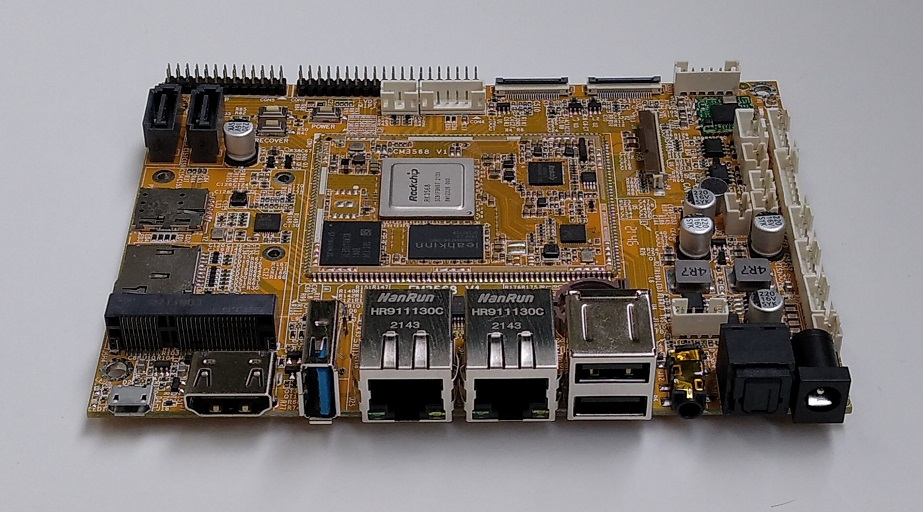
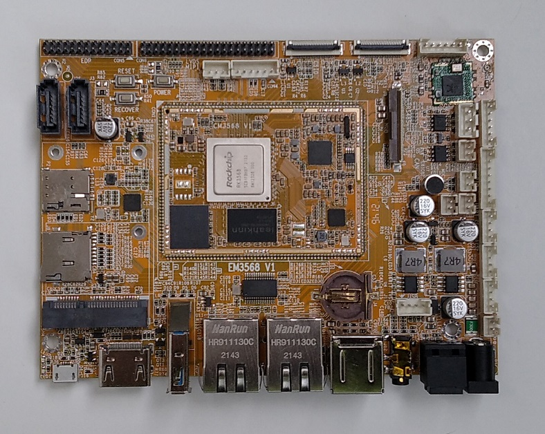
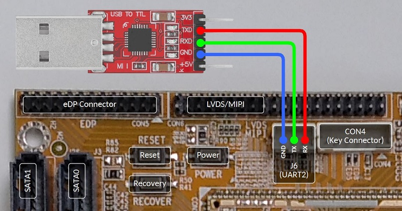

.. SPDX-License-Identifier: MIT

.. include:: <xhtml1-lat1.txt>
.. include:: <xhtml1-special.txt>

.. _device-boardcon-em3568:

*******************
Boardcon EM3568 SBC
*******************

.. _sec-boardcon-em3568-board:

Board Overview
==============

Boardcon EM3568 single board computer (:term:`SBC`) features 2 GiB memory
(up to 8 GiB), comes with MIPI/LVDS, HDMI and eDP video out, and offers
Gigabit Ethernet port, as well as M.2 socket which enables expansion with
a large hard drive and plus a miniPCIe, a Nano SIM card socket for
4G cellular connectivity. Display and camera capabilities with graphics
and video hardware acceleration make it suitable for machine vision
applications. And built-in independent NPU, computing power of 0.8 TOPS
for AI accelerator extend the reach of AI solutions. EM3568 supports
microphone array input, with high dynamic noise reduction algorithm,
it can accurately recognize human voices even in noisy environments,
and achieve precise voice control of the devices.

Interfaces and Connectors
-------------------------

.. _fig-boardcon-em3568:
.. figure:: images/boardcon-em3568.jpg
    :width: 1000
    :class: with-border

    Boardcon EM3568 Single Board Computer

Photos
------

.. _fig-boardcon-em3568-angle-front:

    Boardcon EM3568 front view

.. _fig-boardcon-em3568-top:

    Boardcon EM3568 top view

Features
--------

.. table:: Boardcon EM3568 Features

   +--------------+------------------------------------------------------------------------------+
   | Model        | Boardcon EM3568                                                              |
   +==============+==============================================================================+
   | Processor    || SoC Rockchip RK3568                                                         |
   |              || Quad Cortex-A55 ARM 64 bits processor                                       |
   |              || frequency up to 2.0 GHz                                                     |
   +--------------+------------------------------------------------------------------------------+
   | GPU          | RM Mali-G52 GPU with support for                                             |
   |              | OpenGL ES 1.1/2.0/3.2, OpenCL 2.0, Vulkan 1.1                                |
   +--------------+------------------------------------------------------------------------------+
   | NPU          | 0.8 TOPS                                                                     |
   +--------------+------------------------------------------------------------------------------+
   | Memory       | 2 GiB, 4 GiB or 8 GiB LPDDR4                                                 |
   +--------------+------------------------------------------------------------------------------+
   | Storage      || microSD(TF)                                                                 |
   |              || 8 GiB eMMC flash (up to 128 GiB)                                            |
   |              || SATA 3.0                                                                    |
   +--------------+------------------------------------------------------------------------------+
   | Wireless     || 802.11 b/g/n WiFi                                                           |
   |              || Bluetooth 4.0                                                               |
   |              || External antenna                                                            |
   +--------------+------------------------------------------------------------------------------+
   | Connectivity | PCIe socket with Nano SIM card port to support 4G/GPS module                 |
   +--------------+------------------------------------------------------------------------------+
   | USB          || 1 |times| USB OTG 2.0                                                       |
   |              || 3 |times| USB Host 2.0 (USB-AF or 4-pin connector)                          |
   |              || 1 |times| USB 3.0                                                           |
   +--------------+------------------------------------------------------------------------------+
   | Ethernet     || 2 |times| Gigabit Ethernet RJ45 ports                                       |
   |              || (|RTL8211F-CG|)                                                             |
   +--------------+------------------------------------------------------------------------------+
   | Serial       || 1 |times| Serial port for debug (3-pin connector)                           |
   |              || 3 |times| UART (4-pin connectors)                                           |
   |              || 1 |times| RS485 (3-pin connector)                                           |
   +--------------+------------------------------------------------------------------------------+
   | Video        || HDMI 2.0, 4Kp60                                                             |
   |              || MIPI DSI/LVDS, 1080p60 (40-pin header)                                      |
   |              || eDP 1.3, 2560x1600\@60Hz (30-pin header)                                    |
   |              || RGB, up to 1920x1080\@60Hz (40-pin FPC connector)                           |
   +--------------+------------------------------------------------------------------------------+
   | Audio        || 3.5 mm audio I/O jack, ES8388 audio codec                                   |
   |              || 8-channel audio via HDMI                                                    |
   |              || Speaker (2-pin connector)                                                   |
   +--------------+------------------------------------------------------------------------------+
   | Camera       | 2 |times| Cameras via MIPI CSI (24-pin FPC connector)                        |
   | (optional)   |                                                                              |
   +--------------+------------------------------------------------------------------------------+
   | Keys         || 1 |times| Recovery                                                          |
   |              || 1 |times| Reset                                                             |
   |              || 1 |times| Power                                                             |
   +--------------+------------------------------------------------------------------------------+
   | Other        || RTC with battery connector                                                  |
   | Features     || GPIO                                                                        |
   |              || I2C                                                                         |
   |              || CAN                                                                         |
   |              || Key connector (PWM3_IR/Reset/Recovery/Power)                                |
   +--------------+------------------------------------------------------------------------------+
   | Power        | 12V/3A DC input jack                                                         |
   +--------------+------------------------------------------------------------------------------+
   | Dimensions   || Base board: 135 mm |times| 100 mm                                           |
   |              || CPU module: 45 mm |times| 60 mm                                             |
   |              || |boardcon-em3568-dimensions|                                                |
   +--------------+------------------------------------------------------------------------------+

.. |RTL8211F-CG| replace:: :download:`Realtek RTL8211F-CG controller <http://www.armdesigner.com/download/RTL8211F-CG-Realtek.pdf>`

.. |boardcon-em3568-dimensions| image:: images/boardcon-em3568-dimensions.jpeg
   :class: with-border
   :width: 450px

.. _sec-boardcon-em3568-targets:

Supported Build Targets
=======================

.. _table-boardcon-em3568-supported-targets:
.. table:: Supported Build Targets

   +------------------------------+--------------------------+------------------------+--------------------+
   | Target                       | Machine                  | Running Media          | Installation Media |
   +==============================+==========================+========================+====================+
   | ``boardcon-em3568-sd.yml``   | ``boardcon-em3568-sd``   | microSD card           | |ndash|            |
   +------------------------------+--------------------------+------------------------+--------------------+
   | ``boardcon-em3568-emmc.yml`` | ``boardcon-em3568-emmc`` | internal eMMC          | microSD card       |
   +------------------------------+--------------------------+------------------------+--------------------+

Short explanations for the table columns:

- Target: target YML-file located in ``kas/targets`` directory.
- Machine: target machine name stored in the ``MACHINE`` BitBake variable.
- Running Media: external or internal data storage where the TanoWrt operating system is running.
- Installation Media: external storage device for which an installation image is generated. When booting from
  the Installation Media, the TanoWrt system is installed on the Running Media storage.
- Root Filesystem Image: root file system image recipe name (see :ref:`sec-boardcon-em3568-images` to see supported images).

.. _sec-boardcon-em3568-images:

Supported Images
================

Supported root filesystem images are listed in the Table
:ref:`table-boardcon-em3568-supported-images`.

.. _table-boardcon-em3568-supported-images:
.. table:: Supported Images

   +-----------------------------------+----------------------+--------------------------+
   | Image Recipe (``<image-recipe>``) | Supported Target(s)  | Description              |
   +===================================+======================+==========================+
   | ``tanowrt-image-full``            | *All*                | Standard TanoWrt image   |
   +-----------------------------------+----------------------+--------------------------+
   | ``tanowrt-image-full-swu``        | *All*                | Standard TanoWrt image   |
   |                                   |                      | (SWUpdate upgrade image) |
   +-----------------------------------+----------------------+--------------------------+

.. _sec-boardcon-em3568-build:

Build
=====

.. include:: ../../../../include/kas-common-part.rst.inc

By default, unless otherwise specified, a root file system image specified
in the target configuration is built. The default root filesystem image
recipe name for each supported target can be found in Table
:ref:`table-boardcon-em3568-supported-targets` (Root Filesystem Image column).
If you need to build a different image for the target, the following build
command should be used:

.. code-block:: console

   $ kas build --target <image-recipe> kas/targets/<target-yml-file>

.. seealso:: 

   - See :ref:`sec-boardcon-em3568-targets` section to select the required target file.
   - See :ref:`sec-boardcon-em3568-images` section to select the required root filesystem image recipe.
   - See :ref:`sec-boardcon-em3568-artifacts` section for detailed information
     about the produced build artifacts.

.. _sec-boardcon-em3568-artifacts:

Produced Build Artifacts
========================

All produced build artifacts are stored in the ``~/tanowrt/build/tanowrt-glibc/deploy/images/<MACHINE>`` directory.

.. note:: ``<MACHINE>`` in the artifacts path is replaced by the actual value of the
          ``MACHINE`` BitBake variable for the chosen `target <sec-boardcon-em3568-targets_>`__.

Refer to table :ref:`table-boardcon-em3568-artifacts` for a description of some common (not all) build artifacts.

.. _table-boardcon-em3568-artifacts:
.. table:: Produced Build Artifacts

   +---------------------------------------------------------+-------------------------------+---------------------------------------------------------------+
   | Artifact                                                | Target(s)                     | Description                                                   |
   +=========================================================+===============================+===============================================================+
   | ``startup-<MACHINE>.img``                               | *All*                         | U-Boot startup script.                                        |
   +---------------------------------------------------------+-------------------------------+---------------------------------------------------------------+
   | ``startup-factory-<MACHINE>.img``                       | ``boardcon-em3568-emmc.yml``  | U-Boot startup script for factory installation image.         |
   +---------------------------------------------------------+-------------------------------+---------------------------------------------------------------+
   | ``idblock.img-<MACHINE>-sdcard``                        | *All*                         | Rockchip IDBLOCK image for booting from SD card.              |
   +---------------------------------------------------------+-------------------------------+---------------------------------------------------------------+
   | ``idblock.img-<MACHINE>-emmc``                          | ``boardcon-em3568-emmc.yml``  | Rockchip IDBLOCK image for booting from internal eMMC.        |
   +---------------------------------------------------------+-------------------------------+---------------------------------------------------------------+
   | ``u-boot-initial-env-<MACHINE>-sdcard``                 | *All*                         | U-Boot initial environment image for SD card image.           |
   +---------------------------------------------------------+-------------------------------+---------------------------------------------------------------+
   | ``u-boot-initial-env-<MACHINE>-emmc``                   | ``boardcon-em3568-emmc.yml``  | U-Boot initial environment image for internal eMMC image.     |
   +---------------------------------------------------------+-------------------------------+---------------------------------------------------------------+
   | ``fitImage-<MACHINE>.bin``                              | *All*                         | Flattened Image Tree (FIT) image with Linux kernel            |
   |                                                         |                               | and Device Tree Blobs (DTB).                                  |
   +---------------------------------------------------------+-------------------------------+---------------------------------------------------------------+
   | ``fitImage-<MACHINE>.ext4``                             | *All*                         | FIT image packed into an ext4 file system image.              |
   +---------------------------------------------------------+-------------------------------+---------------------------------------------------------------+
   | ``rk3308-boardcon-em3568-<MACHINE>.dtb``                | *All*                         | Target Device Tree Blob (DTB).                                |
   +---------------------------------------------------------+-------------------------------+---------------------------------------------------------------+
   | ``<image-recipe>-<MACHINE>.sdcard.img``                 | ``boardcon-em3568-sd.yml``    | SD card image including all required partitions for booting   |
   |                                                         |                               | and running the system. This image is ready to be written     |
   |                                                         |                               | to the SD card using the dd utility or similar                |
   |                                                         |                               | (see :ref:`sec-boardcon-em3568-flash`).                       |
   +---------------------------------------------------------+-------------------------------+---------------------------------------------------------------+
   | ``<image-recipe>-swu-factory-<MACHINE>.sdcard.img``     | ``boardcon-em3568-emmc.yml``  | SD card factory installation image. This image is ready       |
   |                                                         |                               | to be written to the SD card using the dd utility or similar  |
   |                                                         |                               | (see :ref:`sec-boardcon-em3568-flash`).                       |
   +---------------------------------------------------------+-------------------------------+---------------------------------------------------------------+
   | ``<image-recipe>-<MACHINE>.squashfs-lzo``               | *All*                         | Root filesystem image (squashfs with LZO compression).        |
   +---------------------------------------------------------+-------------------------------+---------------------------------------------------------------+
   | ``<image-recipe>-swu-<MACHINE>.swu``                    | *All*                         | SWUpdate image for updating system                            |
   |                                                         |                               | (see :ref:`sec-boardcon-em3568-upgrade`).                     |
   +---------------------------------------------------------+-------------------------------+---------------------------------------------------------------+

.. note:: ``<MACHINE>`` in the artifact name is replaced by the actual value of the
          ``MACHINE`` BitBake variable for the chosen `target <sec-boardcon-em3568-targets_>`__.
          ``<image-recipe>`` is replaced by the actual `image recipe <sec-boardcon-em3568-images_>`__ name.

For example, below is the complete list of artifacts produced by the
``boardcon-em3568-sd.yml`` target build.

.. code-block:: console

   [~/tanowrt/build/tanowrt-glibc/deploy/images/boardcon-em3568-sd]$ $ ls -gGh
   total 311M
   -rw-r--r-- 2 105K Jul 20 06:00 boardcon-em3568--4.19.219+git0+40b753b965-tano2.2.20.20.1.8-boardcon-em3568-sd-20220720025543.dtb
   lrwxrwxrwx 2   97 Jul 20 06:00 boardcon-em3568-boardcon-em3568-sd.dtb -> boardcon-em3568--4.19.219+git0+40b753b965-tano2.2.20.20.1.8-boardcon-em3568-sd-20220720025543.dtb
   lrwxrwxrwx 2   97 Jul 20 06:00 boardcon-em3568.dtb -> boardcon-em3568--4.19.219+git0+40b753b965-tano2.2.20.20.1.8-boardcon-em3568-sd-20220720025543.dtb
   lrwxrwxrwx 2   90 Jul 20 06:00 fitImage -> fitImage--4.19.219+git0+40b753b965-tano2.2.20.20.1.8-boardcon-em3568-sd-20220720025543.bin
   -rw-r--r-- 2 9.0M Jul 20 06:00 fitImage--4.19.219+git0+40b753b965-tano2.2.20.20.1.8-boardcon-em3568-sd-20220720025543.bin
   -rw-r--r-- 2  12M Jul 20 06:00 fitImage-4.19.219+gitAUTOINC+40b753b965-tano2.2.20.20.1.8-boardcon-em3568-sd.ext4
   lrwxrwxrwx 2   90 Jul 20 06:00 fitImage-boardcon-em3568-sd.bin -> fitImage--4.19.219+git0+40b753b965-tano2.2.20.20.1.8-boardcon-em3568-sd-20220720025543.bin
   -rw-r--r-- 2  12M Jul 20 06:00 fitImage-boardcon-em3568-sd.ext4
   -rw-r--r-- 2 1.6K Jul 20 06:00 fitImage-its--4.19.219+git0+40b753b965-tano2.2.20.20.1.8-boardcon-em3568-sd-20220720025543.its
   lrwxrwxrwx 2   94 Jul 20 06:00 fitImage-its-boardcon-em3568-sd -> fitImage-its--4.19.219+git0+40b753b965-tano2.2.20.20.1.8-boardcon-em3568-sd-20220720025543.its
   -rw-r--r-- 2 8.9M Jul 20 06:00 fitImage-linux.bin--4.19.219+git0+40b753b965-tano2.2.20.20.1.8-boardcon-em3568-sd-20220720025543.bin
   lrwxrwxrwx 2  100 Jul 20 06:00 fitImage-linux.bin-boardcon-em3568-sd -> fitImage-linux.bin--4.19.219+git0+40b753b965-tano2.2.20.20.1.8-boardcon-em3568-sd-20220720025543.bin
   lrwxrwxrwx 2   78 Jul 20 05:56 idblock.img-boardcon-em3568-sd-sdcard -> idblock.img-boardcon-em3568-sd-sdcard-2017.09+gitAUTOINC+e3ca3c3805_fe66a9be19
   -rwxr-xr-x 2 294K Jul 20 05:56 idblock.img-boardcon-em3568-sd-sdcard-2017.09+gitAUTOINC+e3ca3c3805_fe66a9be19
   lrwxrwxrwx 2   77 Jul 20 05:56 loader.bin-boardcon-em3568-sd-sdcard -> loader.bin-boardcon-em3568-sd-sdcard-2017.09+gitAUTOINC+e3ca3c3805_fe66a9be19
   -rwxr-xr-x 2 453K Jul 20 05:56 loader.bin-boardcon-em3568-sd-sdcard-2017.09+gitAUTOINC+e3ca3c3805_fe66a9be19
   -rw-r--r-- 2  50M Jul 20 06:00 modules--4.19.219+git0+40b753b965-tano2.2.20.20.1.8-boardcon-em3568-sd-20220720025543.tgz
   lrwxrwxrwx 2   89 Jul 20 06:00 modules-boardcon-em3568-sd.tgz -> modules--4.19.219+git0+40b753b965-tano2.2.20.20.1.8-boardcon-em3568-sd-20220720025543.tgz
   lrwxrwxrwx 2   11 Jun  8 03:04 startup-boardcon-em3568-sd.img -> startup.img
   lrwxrwxrwx 2   19 Jun  8 03:04 startup-boardcon-em3568-sd.img.version -> startup.img.version
   -rw-r--r-- 2 2.2K Jun  8 03:04 startup.img
   -rw-r--r-- 2   16 Jun  8 03:04 startup.img.version
   -rw-r--r-- 2  55K Jul 20 10:44 tanowrt-image-full-boardcon-em3568-sd-20220720074256.rootfs.manifest
   -rw-r--r-- 2 945M Jul 20 10:45 tanowrt-image-full-boardcon-em3568-sd-20220720074256.rootfs.sdcard.img
   -rw-r--r-- 2  47M Jul 20 10:44 tanowrt-image-full-boardcon-em3568-sd-20220720074256.rootfs.squashfs-lzo
   -rw-r--r-- 2   24 Jul 20 10:45 tanowrt-image-full-boardcon-em3568-sd-20220720074256.rootfs.version
   -rw-r--r-- 2 393K Jul 20 10:44 tanowrt-image-full-boardcon-em3568-sd-20220720074256.testdata.json
   lrwxrwxrwx 2   68 Jul 20 10:44 tanowrt-image-full-boardcon-em3568-sd.manifest -> tanowrt-image-full-boardcon-em3568-sd-20220720074256.rootfs.manifest
   lrwxrwxrwx 2   70 Jul 20 10:45 tanowrt-image-full-boardcon-em3568-sd.sdcard.img -> tanowrt-image-full-boardcon-em3568-sd-20220720074256.rootfs.sdcard.img
   lrwxrwxrwx 2   72 Jul 20 10:44 tanowrt-image-full-boardcon-em3568-sd.squashfs-lzo -> tanowrt-image-full-boardcon-em3568-sd-20220720074256.rootfs.squashfs-lzo
   lrwxrwxrwx 2   66 Jul 20 10:44 tanowrt-image-full-boardcon-em3568-sd.testdata.json -> tanowrt-image-full-boardcon-em3568-sd-20220720074256.testdata.json
   lrwxrwxrwx 2   67 Jul 20 10:45 tanowrt-image-full-boardcon-em3568-sd.version -> tanowrt-image-full-boardcon-em3568-sd-20220720074256.rootfs.version
   -rw-r--r-- 2 5.3K Jul 20 10:44 tanowrt-image-full.env
   -rw-r--r-- 2 2.3K Jul 20 10:44 tanowrt-image-full-sdimage-rockchip-swu-a-b.wks
   -rw-r--r-- 2  61M Jul 20 10:45 tanowrt-image-full-swu-boardcon-em3568-sd-20220720074256.swu
   lrwxrwxrwx 2   60 Jul 20 10:45 tanowrt-image-full-swu-boardcon-em3568-sd.swu -> tanowrt-image-full-swu-boardcon-em3568-sd-20220720074256.swu
   lrwxrwxrwx 2   64 Jul 20 05:56 u-boot-boardcon-em3568-sd.bin -> u-boot-sdcard-2017.09+gitAUTOINC+e3ca3c3805_fe66a9be19-tano8.bin
   lrwxrwxrwx 2   64 Jul 20 05:56 u-boot-boardcon-em3568-sd.bin-sdcard -> u-boot-sdcard-2017.09+gitAUTOINC+e3ca3c3805_fe66a9be19-tano8.bin
   lrwxrwxrwx 2   91 Jul 20 05:56 u-boot-initial-env-boardcon-em3568-sd-sdcard -> u-boot-initial-env-boardcon-em3568-sd-sdcard-2017.09+gitAUTOINC+e3ca3c3805_fe66a9be19-tano8
   -rw-r--r-- 2  468 Jul 20 05:56 u-boot-initial-env-boardcon-em3568-sd-sdcard-2017.09+gitAUTOINC+e3ca3c3805_fe66a9be19-tano8
   -rw-r--r-- 2  32K Jul 20 05:56 u-boot-initial-env-boardcon-em3568-sd-sdcard-2017.09+gitAUTOINC+e3ca3c3805_fe66a9be19-tano8.bin
   lrwxrwxrwx 2   95 Jul 20 05:56 u-boot-initial-env-boardcon-em3568-sd-sdcard.bin -> u-boot-initial-env-boardcon-em3568-sd-sdcard-2017.09+gitAUTOINC+e3ca3c3805_fe66a9be19-tano8.bin
   lrwxrwxrwx 2   91 Jul 20 05:56 u-boot-initial-env-sdcard -> u-boot-initial-env-boardcon-em3568-sd-sdcard-2017.09+gitAUTOINC+e3ca3c3805_fe66a9be19-tano8
   lrwxrwxrwx 2   95 Jul 20 05:56 u-boot-initial-env-sdcard.bin -> u-boot-initial-env-boardcon-em3568-sd-sdcard-2017.09+gitAUTOINC+e3ca3c3805_fe66a9be19-tano8.bin
   -rw-r--r-- 2 2.0M Jul 20 05:56 u-boot-sdcard-2017.09+gitAUTOINC+e3ca3c3805_fe66a9be19-tano8.bin

.. _sec-boardcon-em3568-flash:

Flash Images
============

.. _sec-boardcon-em3568-flash-sd:

Flash Image to microSD Card
---------------------------

Use the ``dd`` utility to write the generated ``.sdcard.img`` images to the SD card.
This can be an SD card image intended for booting and running the system from
an SD card (``<image-recipe>-<MACHINE>.sdcard.img``) or a factory installation
image (``<image-recipe>-swu-factory-<MACHINE>.sdcard.img``).
See :ref:`sec-boardcon-em3568-artifacts` for details.

For example:

.. code-block:: console

   $ sudo dd if=~/tanowrt/build/tanowrt-glibc/deploy/images/boardcon-em3568-sd/tanowrt-image-full-boardcon-em3568-sd.sdcard.img \
             of=/dev/mmcblk1 \
             bs=1k

Where ``/dev/mmcblk1`` is the device name of the SD card.

.. tip:: For writing SD card under Windows we recommend to use
         `PassMark imageUSB utility <https://www.osforensics.com/tools/write-usb-images.html>`__.

.. _sec-boardcon-em3568-flash-emmc:

Flash Image to eMMC Flash
----------------------------

For the initial flashing of the internal eMMC memory it is recommended to use
the special image of the initial factory installation. If you choose a build target
(see :ref:`sec-boardcon-em3568-targets` for details) that assumes using the
factory installation image for the initial flashing of the
device, a factory installation image (``<image-recipe>-swu-factory-<MACHINE>.sdcard.img``)
will be automatically generated during the build process
(see :ref:`sec-boardcon-em3568-build`).

.. note:: To write the factory installation image to an SD card, follow the instructions
          from :ref:`sec-boardcon-em3568-flash-sd` section.

When you boot device from the prepaired SD card with factory installation image the installation
of TanoWrt to the internal eMMC flash memory will be done automatically. The detailed
installation log is available on the debug UART. After the installation is complete,
the board will reboots automatically. When the device is rebooted, the installed system
will be booted from the internal eMMC flash memory.

.. caution:: Be aware that during the installation all existing data on the internal eMMC
             flash memory will be permanently lost.

.. _sec-boardcon-em3568-booting:

Booting and Running
===================

Booting from SD Card
--------------------

1. Insert the micro SD card to the board.
2. Connect the power cable to the DC input connector.
3. Boardcon EM3568 will boot.
4. (Optional) Use a USB to TTL serial cable to make a connection between
   your PC and Boardcon EM3568. See :ref:`sec-boardcon-em3568-serial` section for details.

.. attention:: The internal eMMC flash memory must be empty in order to perform
               a boot from the SD card. See :ref:`sec-boardcon-em3568-emmc-erase`
               section for details about erasing internal eMMC flash.

Booting from Internal eMMC Flash
-----------------------------------

1. Connect the power cable to the DC input connector.
2. Boardcon EM3568 will boot.
3. (Optional) Use a USB to TTL serial cable to make a connection between
   your PC and Boardcon EM3568. See :ref:`sec-boardcon-em3568-serial` section for details.

.. _sec-boardcon-em3568-emmc-erase:

Erasing Internal eMMC Flash
------------------------------

You can erase the internal eMMC flash memory in the following ways:

- Linux command line;
- U-Boot command line;
- special utilities and USB connection with PC.

.. tabs::

   .. tab:: Linux CLI

      .. rubric:: Erasing eMMC Using Linux Command Line

      If the device has a bootable Linux system, you can erase the eMMC
      by the following command entered in the Linux terminal:

      .. code-block:: console

         [root@tanowrt ~]# dd if=/dev/zero of=/dev/mmcblk0 bs=1k count=32768

      Note that if the Linux distribution flashed on the eMMC flash memory
      is not TanoWrt, the device name of the eMMC flash memory may be different.
      You can usually find out the real device name by analysing the
      system boot log by running the command dmesg. For example:

      .. code-block:: console
         :emphasize-lines: 2,3,4,5,6

         [root@tanowrt ~]# dmesg | grep mmcblk
         [    2.396143] mmcblk0: mmc0:0001 8GTF4R 7.28 GiB
         [    2.396716] mmcblk0boot0: mmc0:0001 8GTF4R partition 1 4.00 MiB
         [    2.397280] mmcblk0boot1: mmc0:0001 8GTF4R partition 2 4.00 MiB
         [    2.397531] mmcblk0rpmb: mmc0:0001 8GTF4R partition 3 512 KiB, chardev (238:0)
         [    2.400820]  mmcblk0: p1 p2 p3 p4 p5 p6 p7 p8
         [    2.477407] mmcblk1: mmc1:0001 00000 14.6 GiB
         [    2.483983]  mmcblk1: p1 p2 p3 p4 p5 p6
         [    6.168217] overlay-resize: Root device mmcblk1
         [    6.256071] overlay-resize: Overlay partition /dev/mmcblk1p6 (disk /dev/mmcblk1)
         [    6.711010] overlay-resize: Partition /dev/mmcblk1p6 end sector 1933311 -> 100% (30596992)
         [    6.711065] overlay-resize: Resizing filesystem on partition /dev/mmcblk1p6...
         [    9.894183] mount_root: /dev/mmcblk1p1: p1, rw, start 8388608, size 8388608
         [    9.899069] mount_root: /dev/mmcblk1p2: p2, rw, start 16777216, size 67108864
         [    9.899199] mount_root: /dev/mmcblk1p3: p3, rw, start 83886080, size 402653184 [rootfs]
         [    9.903982] mount_root: /dev/mmcblk1p4: p4, rw, start 486539264, size 67108864
         [    9.905624] mount_root: /dev/mmcblk1p5: p5, rw, start 553648128, size 402653184
         [    9.910008] mount_root: /dev/mmcblk1p6: p6, rw, start 956301312, size 14709407232 [overlay]
         [    9.910073] mount_root: root filesystem on the /dev/mmcblk1p3 partition of /dev/mmcblk1 (rw) device
         [    9.927193] mount_root: founded suitable overlay partition /dev/mmcblk1p6
         [   10.063840] EXT4-fs (mmcblk1p6): mounted filesystem with ordered data mode. Opts: (null)
         [   10.130517] EXT4-fs (mmcblk1p6): mounted filesystem with ordered data mode. Opts: (null)

      This output shows that device ``/dev/mmcblk0`` is eMMC flash
      memory and device ``/dev/mmcblk1`` is SD card.

   .. tab:: U-Boot CLI

      .. rubric:: Erasing eMMC Using U-Boot Command Line

      If the device has a functional U-Boot bootloader, you can erase
      eMMC with the following commands entered at the U-Boot command line:

      .. code-block:: console

         => mmc dev 0
         switch to partitions #0, OK
         mmc0 is current device
         => mmc erase 0 10000

         MMC erase: dev # 0, block # 0, count 65536 ... 65536 blocks erased: OK
         =>

      Please note that if the U-Boot bootloader on the eMMC flash memory
      is different from the one built as part of the TanoWrt distribution,
      the device number of the eMMC flash memory may be different from
      the one shown above. Use the ``mmc dev``, ``mmc list`` and ``mmc info``
      commands to identify the valid eMMC flash memory device number:

      .. code-block:: console
         :emphasize-lines: 3,5,8

         => mmc dev 0
         switch to partitions #0, OK
         mmc0(part 0) is current device
         => mmc info
         Device: sdhci@fe310000
         Manufacturer ID: 15
         OEM: 100
         Name: 8GTF4
         Timing Interface: HS200
         Tran Speed: 200000000
         Rd Block Len: 512
         MMC version 5.1
         High Capacity: Yes
         Capacity: 7.3 GiB
         Bus Width: 8-bit
         Erase Group Size: 512 KiB
         HC WP Group Size: 8 MiB
         User Capacity: 7.3 GiB WRREL
         Boot Capacity: 4 MiB ENH
         RPMB Capacity: 512 KiB ENH
         =>

   .. tab:: USB Connection with PC

      .. rubric:: Erasing eMMC Using Special Utilities and USB Connection with PC

      If the device fails to boot, e.g. due to a corrupted boot loader,
      the only way to erase the eMMC flash memory is to use a USB
      connection with a PC and use special utilities.

      .. todo:: Documentation is under development

.. _sec-boardcon-em3568-serial:

Serial Console
--------------

.. note:: The default baudrate of Boardcon EM3568 with original firmware is 1500000 (1.5 Mbps),
          please check if your USB to TTL cable support 1.5 Mbps baudrate. Some model
          of CP210X and PL2303x have baudrate limitation, please check the specified model.

.. rubric:: Connection

Connect the USB to TTL serial cable as described below. Don't connect the VCC wire,
connect only TX, RX and GND wires.

+--------+-----------------------+
| Signal | Boardcon EM3568 Board |
|        +-----------------------+
|        | J6 3-pin connector    |
|        | (UART2)               |
+========+=======================+
| RX     | Pin 1 (UART2DBG_RX)   |
+--------+-----------------------+
| TX     | Pin 2 (UART2DBG_TX)   |
+--------+-----------------------+
| GND    | Pin 3 (GND)           |
+--------+-----------------------+

See :ref:`fig-boardcon-em3568-usb-to-ttl` figure for example
connection USB to TTL converter with Boardcon EM3568.

.. _fig-boardcon-em3568-usb-to-ttl:

    USB to TTL Converter Connection to Boardcon EM3568

.. rubric:: Serial Setting on Host PC

The default serial console settings for Boardcon EM3568 for U-Boot and kernel are
described in table below.

+-----------------+-------------------+
| Parameter       | Value             |
+=================+===================+
| Baudrate        | 1500000           |
+-----------------+-------------------+
| Data bits       | 8                 |
+-----------------+-------------------+
| Stop bits       | 1                 |
+-----------------+-------------------+
| Parity          | none              |
+-----------------+-------------------+
| Flow control    | none              |
+-----------------+-------------------+

.. _sec-boardcon-em3568-access-credentials:

Access Credentials
------------------

The following credentials are used by default to access the system via
CLI (Command Line Interface), SSH (Secure SHell) or/and WebUI (Web User Interface):

- Username: ``root``
- Password: ``root``

.. _sec-boardcon-em3568-network-config:

Default Network Configuration
-----------------------------

By default Ethernet ports 1 (``eth0`` interface) and 2 (``eth1`` interface) are
joined into a bridge (``br-lan`` interface). Bridge (``br-lan``) configured to
obtain IP configuration via :term:`DHCP` client. To see obtained IP configuration use
the following command:

.. code-block:: console

   [root@tanowrt ~]# ifstatus lan | jsonfilter -e '@["ipv4-address"][0].address'
   192.168.0.42

In this example, the device got the IP address 192.168.0.42 via :term:`DHCP`.

By default, :term:`RSTP` is enabled on the ``br-lan`` bridge.

Also you can connect to the board using USB network connection (``usb0`` interface).
USB network interface configured with static IP address 192.168.128.1 with enabled
:term:`DHCP` server with pool with single IP address for client (your PC) 192.168.128.100.

WiFi module and 3G/GPRS modules currently are not supported in TanoWrt.

.. _sec-boardcon-em3568-webui:

WebUI
-----

The WebUI can be accessed via Ethernet port or USB network connection through HTTP(s) protocol.
You must see something like this in browser after you logged in:

.. _fig-boardcon-em3568-luci-login:
.. figure:: ../../../../common/images/luci-login.png
    :width: 900

    LuCI WebUI Login Page

.. _fig-boardcon-em3568-luci-status:
.. figure:: images/luci-status.png
    :width: 900

    LuCI WebUI Overview Page

.. _sec-boardcon-em3568-upgrade:

Upgrade Running System
======================

You can upgrade the running system via CLI (Command Line Interface) or WebUI (Web User Interface).

CLI (Command Line Interface)
----------------------------

Use the following commands to upgrade the firmware using the command line:

- Upgrade from a local file (e.g. on an SD card):

  .. code-block:: console

     [root@tanowrt ~]# swupdate-client /mnt/mmcblk1/<image-recipe>-swu-<MACHINE>.swu

- Upgrade from a file hosted on a remote HTTP server:

  .. code-block:: console

     [root@tanowrt ~]# wget -O- http://remote.server.com/path/to/<image-recipe>-swu-<MACHINE>.swu | swupdate-client

WebUI (Web User Interface)
--------------------------

To upgrade the firmware using the web interface,
choose :menuselection:`System --> Firmware Upgrade` in the main menu.
Next, follow the instructions on the page.

.. _fig-boardcon-em3568-luci-swupdate:
.. figure:: ../../../../common/images/luci-swupdate.png
    :width: 900

    LuCI WebUI Firmware Upgrade Page

Additional Information
======================

Here are sections with various additional information about the
Boardcon EM3568  board and the operation of TanoWrt on it.

.. toctree::

   factory-installation-to-emmc.rst
   bootlog-u-boot.rst
   bootlog-system.rst

References
==========

1. http://www.armdesigner.com/EM3568_SBC/
