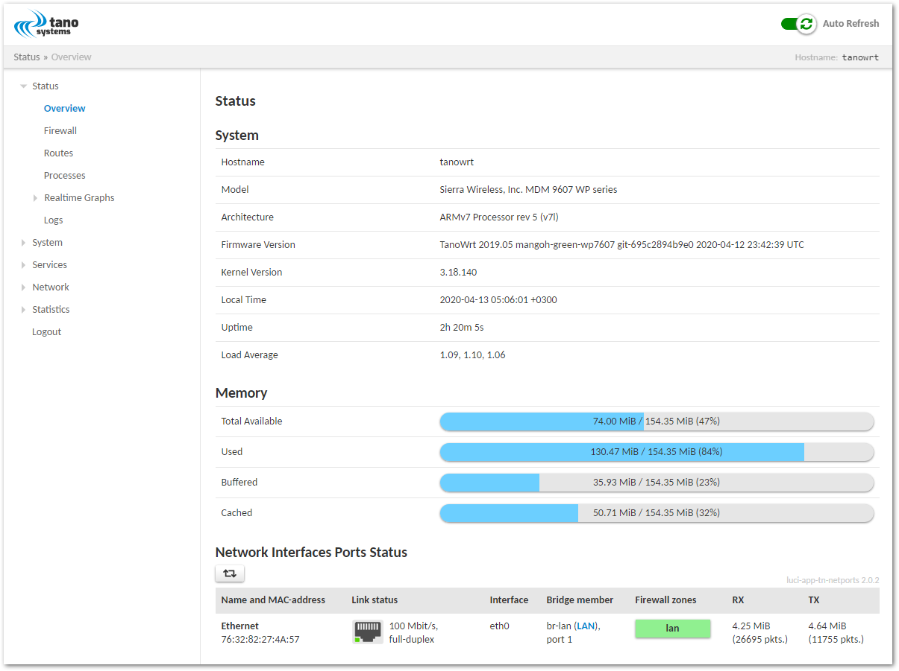

.. SPDX-License-Identifier: MIT

.. _machine-mangoh-green-wp7607:

************************************
mangOH Green with WP7607 or WP7607-1
************************************

.. rubric:: Contents
.. contents::
   :depth: 1
   :local:

.. _sec-mangoh-green-wp7607-board:

Board Overview
==============

The mangOH Green is an open-source hardware development platform for CF3
modules that incorporates several hardware interfaces and standardized IoT
Expansion Card slots for expanded functionality.

Block Diagram
-------------

.. container:: flex

   .. _fig-mangoh-green-block-diagram-basic:
   .. figure:: images/mangoh-green-block-diagram-basic.png
      :width: 300

      mangOH Green Basic Block Diagram

   .. _fig-mangoh-green-block-diagram-detailed:
   .. figure:: images/mangoh-green-block-diagram-detailed.png
      :class: with-border
      :width: 300

      mangOH Green Detailed Block Diagram

Photos
------

.. container:: flex

   .. _fig-mangoh-green-top:
   .. figure:: images/mangoh-green-top.png
      :class: with-border
      :width: 300

      mangOH Green Top View

   .. _fig-mangoh-green-angled:
   .. figure:: images/mangoh-green-angled.png
      :class: with-border
      :width: 300

      mangOH Green Angled View

   .. _fig-mangoh-green-front:
   .. figure:: images/mangoh-green-front.jpg
      :class: with-border
      :width: 300

      mangOH Green Front View

.. _sec-mangoh-green-wp7607-targets:

Build Targets
=============

.. _sec-mangoh-green-wp7607-machines:

Machines
--------

.. _table-mangoh-green-wp7607-machines:
.. table:: Supported Machines

   +-----------------+------------------------------+--------------------------+------------------------------------+------------------------+--------------------------+
   | Board\ [#]_     | Target YAML\ [#]_            | Machine\ [#]_            | Target Recipe(s)\ [#]_             | Running Media\ [#]_    | Installation Media\ [#]_ |
   +=================+==============================+==========================+====================================+========================+==========================+
   | mangOH Green    | ``mangoh-green-wp7607.yml``  | ``mangoh-green-wp7607``  | ``tanowrt-image-full``             | NAND flash             | |ndash|                  |
   | with WP7607     |                              |                          |                                    |                        |                          |
   | or WP7607-1     |                              |                          |                                    |                        |                          |
   +-----------------+------------------------------+--------------------------+------------------------------------+------------------------+--------------------------+

.. [#] Target board.
.. [#] Target YAML-file located in the :file:`kas/targets` directory.
.. [#] Target machine name stored in the ``MACHINE`` BitBake variable for selected Target YAML.
.. [#] Recipes that will be built by default for the target. In :numref:`sec-mangoh-green-wp7607-images`,
       you can find list of supported recipes for the target images, which you can build in addition
       to the default recipes using optional ``--target`` option in build command
       (see :numref:`sec-mangoh-green-wp7607-build`).
.. [#] External or internal data storage where the TanoWrt operating system is running.
.. [#] External storage device for which an installation image is generated. When booting from
       the Installation Media, the TanoWrt system is installed on the Running Media storage.

.. _sec-mangoh-green-wp7607-images:

Images
------

.. _table-mangoh-green-wp7607-images:
.. table:: Supported Images
   :widths: 15, 15, 15, 55

   +---------------------------+------------------------------------+----------------------------+-----------------------------------------------------+
   | Read-Only Root Filesystem | Recipe\ [#]_                       | Supported by Target(s)     | Description                                         |
   | Image                     |                                    |                            |                                                     |
   +===========================+====================================+============================+=====================================================+
   | ``tanowrt-image-full``    | ``tanowrt-image-full``             | *All*                      | Standard TanoWrt image.                             |
   +---------------------------+------------------------------------+----------------------------+-----------------------------------------------------+

.. [#] Image recipe name. This name can be used as argument
       for ``--target`` build command option (see :numref:`sec-mangoh-green-wp7607-build` section).

.. _sec-mangoh-green-wp7607-build:

Build
=====

Please read the common information on how to perform a TanoWrt
images build and preparing the build environment in section ":ref:`sec-build`".

.. seealso:: 

   - See section :numref:`sec-mangoh-green-wp7607-machines` to select the required target YAML file (``<target-yml>``).
   - See section :numref:`sec-mangoh-green-wp7607-images` to select the required root filesystem image recipe (``<target-recipe>``).
   - See section :numref:`sec-mangoh-green-wp7607-artifacts` for detailed information
     about the produced build artifacts.

Examples
--------

Build Default Image for mangOH Green Board with WP7607
~~~~~~~~~~~~~~~~~~~~~~~~~~~~~~~~~~~~~~~~~~~~~~~~~~~~~~~~~~~

.. code-block:: console

   $ kas build targets/kas/mangoh-green-wp7607.yml

.. _sec-mangoh-green-wp7607-partitioning:

Partitioning Layouts
====================

Here is a list of used by system MTD partitions and their descriptions.

+--------+-----------+------------+----------------------------------------+
| MTD    | Name      | Size       | Description                            |
+========+===========+============+========================================+
| mtd11  | aboot     |   1 MiB    | Little Kernel (LK) bootloader          |
+--------+-----------+------------+----------------------------------------+
| mtd12  | boot      |  14 MiB    | Linux kernel                           |
+--------+-----------+------------+----------------------------------------+
| mtd13  | system    |  59 MiB    | Read-only root filesystem (squashfs)   |
+--------+-----------+------------+----------------------------------------+
| mtd14  | lefwkro   |  17.25 MiB | Unused                                 |
+--------+-----------+------------+----------------------------------------+
| mtd15  | swirw     |  15.5 MiB  | Unused                                 |
+--------+-----------+------------+----------------------------------------+
| mtd16  | userapp   | 130 MiB    | Overlay filesystem (ubifs)             |
+--------+-----------+------------+----------------------------------------+

All user data are stored in overlayfs in partition mtd16 (userapp). You can clean
up this partition manually after system is boots up using the command:

.. code-block:: console

   [root@tanowrt ~]# jffs2reset -r -y

or over web-interface LuCI (see :guilabel:`Restore` section in :menuselection:`System --> Backup`).

.. _sec-mangoh-green-wp7607-artifacts:

Produced Build Artifacts
========================

All produced build artifacts are stored in the :file:`~/tanowrt/build/tanowrt-glibc/deploy/images/<MACHINE>` directory.
Refer to table :ref:`table-mangoh-green-wp7607-artifacts` for a description of some common build artifacts.

.. _table-mangoh-green-wp7607-artifacts:
.. table:: Produced Build Artifacts
   :widths: 15, 15, 70

   +---------------------------------------------------------------------+-------------------------------+----------------------------------------------------------------------+
   | Artifact                                                            | Target(s)                     | Description                                                          |
   +=====================================================================+===============================+======================================================================+
   | .. centered:: Bootloader                                                                                                                                                   |
   +---------------------------------------------------------------------+-------------------------------+----------------------------------------------------------------------+
   | :file:`appsboot.mbn`                                                | *All*                         | Bootloader (Little Kernel) binary with fastboot support.             |
   +---------------------------------------------------------------------+-------------------------------+----------------------------------------------------------------------+
   | :file:`boot-yocto-mdm9x28.img`                                      | *All*                         | Image with bootloader and linux kernel.                              |
   +---------------------------------------------------------------------+-------------------------------+----------------------------------------------------------------------+
   | .. centered:: Linux Kernel and DTB                                                                                                                                         |
   +---------------------------------------------------------------------+-------------------------------+----------------------------------------------------------------------+
   | :file:`zImage-<MACHINE>.bin`                                        | *All*                         | Linux kernel compressed binary image.                                |
   +---------------------------------------------------------------------+-------------------------------+----------------------------------------------------------------------+
   | :file:`dtb`                                                         | *All*                         | Folder with compiled Device Tree Blobs (DTB).                        |
   +---------------------------------------------------------------------+-------------------------------+----------------------------------------------------------------------+
   | :file:`masterDTB.4k`                                                | *All*                         | Image with compiled Device Tree Blobs (DTB).                         |
   +---------------------------------------------------------------------+-------------------------------+----------------------------------------------------------------------+
   | .. centered:: Images                                                                                                                                                       |
   +---------------------------------------------------------------------+-------------------------------+----------------------------------------------------------------------+
   | :file:`<rootfs-image>-<MACHINE>.squashfs`                           | *All*                         | Read-only root filesystem image (squashfs).                          |
   +---------------------------------------------------------------------+-------------------------------+----------------------------------------------------------------------+
   | :file:`<rootfs-image>-<MACHINE>.ubi`                                | *All*                         | Read-only root filesystem image (UBI).                               |
   +---------------------------------------------------------------------+-------------------------------+----------------------------------------------------------------------+
   | :file:`<rootfs-image>-<MACHINE>.wp76xx.spk`                         | *All*                         | SPK image contains bootloader, linux kernel, DTB and read-only       |
   |                                                                     |                               | filesystem images. This image can be used for firmware upgrade with  |
   |                                                                     |                               | :command:`swiflash` utility                                          |
   |                                                                     |                               | (see :ref:`sec-mangoh-green-wp7607-flash`).                          |
   +---------------------------------------------------------------------+-------------------------------+----------------------------------------------------------------------+

.. note:: ``<MACHINE>`` in the artifacts path and artifact file names are replaced by
          the actual value of the ``MACHINE`` BitBake variable for the chosen
          `target <sec-mangoh-green-wp7607-targets_>`__. ``<rootfs-image>`` is replaced
          by the actual read-only root filesystem `image <sec-mangoh-green-wp7607-images_>`__ name.

For example, below is the lists of artifacts produced by the ``mangoh-green-wp7607-nand.yml``
and ``mangoh-green-wp7607-sd.yml`` target builds. There are two types of listings here |mdash|
a complete listing, and a reduced listing without the symbolic links display.

.. tabs::

   .. tab:: Reduced

      .. code-block:: console

         [~/tanowrt/build/tanowrt-glibc/deploy/images/mangoh-green-wp7607]$ ls -gGh | grep -v -e "^l"
         total 315M
         -rwxr-xr-x 1 530K Jul 29 10:56 appsboot.mbn
         -rw-r--r-- 1   32 Jul 29 11:00 boot_hash.2k
         -rw-r--r-- 1   32 Jul 29 11:00 boot_hash.4k
         -rw-r--r-- 1   40 Jul 29 11:00 boot_mbnhdr
         -rw-r--r-- 1 6.0M Jul 29 11:00 boot-yocto-mdm9x28-20220729080026.2k.img
         -rw-r--r-- 1 6.1M Jul 29 11:00 boot-yocto-mdm9x28-20220729080026.4k.img
         -rw-r--r-- 1 6.0M Jul 29 11:00 boot-yocto-mdm9x28.2k.img.signed
         -rwxr-xr-x 1 6.0M Jul 29 11:00 boot-yocto-mdm9x28.2k.img.unsigned
         -rw-r--r-- 1 6.1M Jul 29 11:00 boot-yocto-mdm9x28.4k.img.signed
         -rwxr-xr-x 1 6.0M Jul 29 11:00 boot-yocto-mdm9x28.4k.img.unsigned
         drwxr-xr-x 3 4.0K Jul 29 11:00 dtb
         -rw-r--r-- 1   67 Jul 29 11:00 kernel.version
         -rw-r--r-- 1   44 Jul 29 10:56 lk.version
         -rw------- 2 414K Jul 29 11:00 masterDTB.2k
         -rw------- 2 420K Jul 29 11:00 masterDTB.4k
         -rw-r--r-- 2  37M Jul 29 11:00 modules--3.18.140+git0+4e1fa14c28-tn-3.2.7.20.0.6-mangoh-green-wp7607-20220729063515.tgz
         -rw-r--r-- 2 512K Jul 29 11:03 tanowrt-image-full-mangoh-green-wp7607-20220729063515.reset.ubifs.4k.ubi
         -rw-r--r-- 2  45K Jul 29 11:02 tanowrt-image-full-mangoh-green-wp7607-20220729063515.rootfs.manifest
         -rw-r--r-- 2  21M Jul 29 11:03 tanowrt-image-full-mangoh-green-wp7607-20220729063515.rootfs.squashfs
         -rw-r--r-- 2 176K Jul 29 11:03 tanowrt-image-full-mangoh-green-wp7607-20220729063515.rootfs.squashfs.hash
         -rw-r--r-- 2  608 Jul 29 11:03 tanowrt-image-full-mangoh-green-wp7607-20220729063515.rootfs.squashfs.hash.txt
         -rw-r--r-- 2 5.5K Jul 29 11:03 tanowrt-image-full-mangoh-green-wp7607-20220729063515.rootfs.squashfs.rhash
         -rw-r--r-- 2   65 Jul 29 11:03 tanowrt-image-full-mangoh-green-wp7607-20220729063515.rootfs.squashfs.rhash.unsigned
         -rw-r--r-- 2  117 Jul 29 11:03 tanowrt-image-full-mangoh-green-wp7607-20220729063515.rootfs.squashfs.ubinize.cfg
         -rw-r--r-- 2   24 Jul 29 11:03 tanowrt-image-full-mangoh-green-wp7607-20220729063515.rootfs.version
         -rw-r--r-- 2  23M Jul 29 11:03 tanowrt-image-full-mangoh-green-wp7607-20220729063515.squashfs.4k.ubi
         -rw-r--r-- 2 325K Jul 29 11:02 tanowrt-image-full-mangoh-green-wp7607-20220729063515.testdata.json
         -rw-r--r-- 1  30M Jul 29 11:03 tanowrt-image-full-mangoh-green-wp7607-20220729063515.wp76xx.clean.spk
         -rw-r--r-- 1  30M Jul 29 11:03 tanowrt-image-full-mangoh-green-wp7607-20220729063515.wp76xx.spk
         -rwxr-xr-x 2 132M Jul 29 11:00 vmlinux
         -rw-r--r-- 2 5.6M Jul 29 11:00 zImage--3.18.140+git0+4e1fa14c28-tn-3.2.7.20.0.6-mangoh-green-wp7607-20220729063515.bin

   .. tab:: Complete

      .. code-block:: console

         [~/tanowrt/build/tanowrt-glibc/deploy/images/mangoh-green-wp7607]$ ls -gGh
         total 315M
         -rwxr-xr-x 1 530K Jul 29 10:56 appsboot.mbn
         -rw-r--r-- 1   32 Jul 29 11:00 boot_hash.2k
         -rw-r--r-- 1   32 Jul 29 11:00 boot_hash.4k
         -rw-r--r-- 1   40 Jul 29 11:00 boot_mbnhdr
         -rw-r--r-- 1 6.0M Jul 29 11:00 boot-yocto-mdm9x28-20220729080026.2k.img
         -rw-r--r-- 1 6.1M Jul 29 11:00 boot-yocto-mdm9x28-20220729080026.4k.img
         lrwxrwxrwx 1   40 Jul 29 11:00 boot-yocto-mdm9x28.2k.img -> boot-yocto-mdm9x28-20220729080026.2k.img
         -rw-r--r-- 1 6.0M Jul 29 11:00 boot-yocto-mdm9x28.2k.img.signed
         -rwxr-xr-x 1 6.0M Jul 29 11:00 boot-yocto-mdm9x28.2k.img.unsigned
         lrwxrwxrwx 1   40 Jul 29 11:00 boot-yocto-mdm9x28.4k.img -> boot-yocto-mdm9x28-20220729080026.4k.img
         -rw-r--r-- 1 6.1M Jul 29 11:00 boot-yocto-mdm9x28.4k.img.signed
         -rwxr-xr-x 1 6.0M Jul 29 11:00 boot-yocto-mdm9x28.4k.img.unsigned
         lrwxrwxrwx 1   40 Jul 29 11:00 boot-yocto-mdm9x28.img -> boot-yocto-mdm9x28-20220729080026.4k.img
         lrwxrwxrwx 1   25 Jul 29 11:00 boot-yocto-mdm9x28.img.unsigned -> boot-yocto-mdm9x28.4k.img
         drwxr-xr-x 3 4.0K Jul 29 11:00 dtb
         -rw-r--r-- 1   67 Jul 29 11:00 kernel.version
         -rw-r--r-- 1   44 Jul 29 10:56 lk.version
         -rw------- 2 414K Jul 29 11:00 masterDTB.2k
         -rw------- 2 420K Jul 29 11:00 masterDTB.4k
         -rw-r--r-- 2  37M Jul 29 11:00 modules--3.18.140+git0+4e1fa14c28-tn-3.2.7.20.0.6-mangoh-green-wp7607-20220729063515.tgz
         lrwxrwxrwx 2   88 Jul 29 11:00 modules-mangoh-green-wp7607.tgz -> modules--3.18.140+git0+4e1fa14c28-tn-3.2.7.20.0.6-mangoh-green-wp7607-20220729063515.tgz
         -rw-r--r-- 2 512K Jul 29 11:03 tanowrt-image-full-mangoh-green-wp7607-20220729063515.reset.ubifs.4k.ubi
         -rw-r--r-- 2  45K Jul 29 11:02 tanowrt-image-full-mangoh-green-wp7607-20220729063515.rootfs.manifest
         -rw-r--r-- 2  21M Jul 29 11:03 tanowrt-image-full-mangoh-green-wp7607-20220729063515.rootfs.squashfs
         -rw-r--r-- 2 176K Jul 29 11:03 tanowrt-image-full-mangoh-green-wp7607-20220729063515.rootfs.squashfs.hash
         -rw-r--r-- 2  608 Jul 29 11:03 tanowrt-image-full-mangoh-green-wp7607-20220729063515.rootfs.squashfs.hash.txt
         -rw-r--r-- 2 5.5K Jul 29 11:03 tanowrt-image-full-mangoh-green-wp7607-20220729063515.rootfs.squashfs.rhash
         -rw-r--r-- 2   65 Jul 29 11:03 tanowrt-image-full-mangoh-green-wp7607-20220729063515.rootfs.squashfs.rhash.unsigned
         -rw-r--r-- 2  117 Jul 29 11:03 tanowrt-image-full-mangoh-green-wp7607-20220729063515.rootfs.squashfs.ubinize.cfg
         -rw-r--r-- 2   24 Jul 29 11:03 tanowrt-image-full-mangoh-green-wp7607-20220729063515.rootfs.version
         -rw-r--r-- 2  23M Jul 29 11:03 tanowrt-image-full-mangoh-green-wp7607-20220729063515.squashfs.4k.ubi
         -rw-r--r-- 2 325K Jul 29 11:02 tanowrt-image-full-mangoh-green-wp7607-20220729063515.testdata.json
         -rw-r--r-- 1  30M Jul 29 11:03 tanowrt-image-full-mangoh-green-wp7607-20220729063515.wp76xx.clean.spk
         -rw-r--r-- 1  30M Jul 29 11:03 tanowrt-image-full-mangoh-green-wp7607-20220729063515.wp76xx.spk
         lrwxrwxrwx 2   45 Jul 29 11:03 tanowrt-image-full-mangoh-green-wp7607.4k.default -> tanowrt-image-full-mangoh-green-wp7607.4k.ubi
         lrwxrwxrwx 2   54 Jul 29 11:03 tanowrt-image-full-mangoh-green-wp7607.4k.ubi -> tanowrt-image-full-mangoh-green-wp7607.squashfs.4k.ubi
         lrwxrwxrwx 2   49 Jul 29 11:03 tanowrt-image-full-mangoh-green-wp7607.default -> tanowrt-image-full-mangoh-green-wp7607.4k.default
         lrwxrwxrwx 2   69 Jul 29 11:02 tanowrt-image-full-mangoh-green-wp7607.manifest -> tanowrt-image-full-mangoh-green-wp7607-20220729063515.rootfs.manifest
         lrwxrwxrwx 2   69 Jul 29 11:03 tanowrt-image-full-mangoh-green-wp7607.squashfs -> tanowrt-image-full-mangoh-green-wp7607-20220729063515.rootfs.squashfs
         lrwxrwxrwx 2   69 Jul 29 11:03 tanowrt-image-full-mangoh-green-wp7607.squashfs.4k.ubi -> tanowrt-image-full-mangoh-green-wp7607-20220729063515.squashfs.4k.ubi
         lrwxrwxrwx 2   67 Jul 29 11:02 tanowrt-image-full-mangoh-green-wp7607.testdata.json -> tanowrt-image-full-mangoh-green-wp7607-20220729063515.testdata.json
         lrwxrwxrwx 2   54 Jul 29 11:03 tanowrt-image-full-mangoh-green-wp7607.ubi -> tanowrt-image-full-mangoh-green-wp7607.squashfs.4k.ubi
         lrwxrwxrwx 2   68 Jul 29 11:03 tanowrt-image-full-mangoh-green-wp7607.version -> tanowrt-image-full-mangoh-green-wp7607-20220729063515.rootfs.version
         lrwxrwxrwx 1   70 Jul 29 11:03 tanowrt-image-full-mangoh-green-wp7607.wp76xx.clean.spk -> tanowrt-image-full-mangoh-green-wp7607-20220729063515.wp76xx.clean.spk
         lrwxrwxrwx 1   64 Jul 29 11:03 tanowrt-image-full-mangoh-green-wp7607.wp76xx.spk -> tanowrt-image-full-mangoh-green-wp7607-20220729063515.wp76xx.spk
         -rwxr-xr-x 2 132M Jul 29 11:00 vmlinux
         lrwxrwxrwx 2   87 Jul 29 11:00 zImage -> zImage--3.18.140+git0+4e1fa14c28-tn-3.2.7.20.0.6-mangoh-green-wp7607-20220729063515.bin
         -rw-r--r-- 2 5.6M Jul 29 11:00 zImage--3.18.140+git0+4e1fa14c28-tn-3.2.7.20.0.6-mangoh-green-wp7607-20220729063515.bin
         lrwxrwxrwx 2   87 Jul 29 11:00 zImage-mangoh-green-wp7607.bin -> zImage--3.18.140+git0+4e1fa14c28-tn-3.2.7.20.0.6-mangoh-green-wp7607-20220729063515.bin

.. _sec-mangoh-green-wp7607-flash:

Writing Images
==============

Note that when flashing the :file:`<rootfs-image>-<MACHINE>.wp76xx.spk` images
(see :ref:`sec-mangoh-green-wp7607-artifacts` section), user data in overlayfs
are not cleared. This allows flashing of a new system while keeping the user
configuration. However, it can also cause issues with the new firmware as it
may not update some important files. See "Used Flash Partitions" section for
extra information about clearing overlayfs data.

To write the built image to the device, follow these steps:

1. Power off the mangOH Green board.
2. Turn SW401-7 (TP1_BOOT) DIP switch to ON state.
3. Connect mangOH Green board with your PC via micro USB cable (connector CN311).
4. Power on mangOH Green board.
5. Run the :ref:`swiflash <sec-hsl-swi-install-swiflash>` utility on your PC as follows:

   .. code-block:: console

      $ swiflash -m wp76xx -i <path-to-image> -p <port>

   Where:

   .. option:: -i <path-to-image>

       Path to image file in the CWE (SPK) format.

   .. option:: -p <port>

       USB port that will be used to firmware downloading.
       You can use any path from :file:`/dev/serial/by-path`
       or :file:`/dev/serial/by-id`.

   Example:

   .. code-block:: console

      $ swiflash -m wp76xx \
          -p /dev/serial/by-id/usb-Sierra_Wireless__Incorporated_Sierra_Wireless_WP7607_VN91720016071042 \
          -i ~/tanowrt/build/tanowrt-glibc/deploy/images/mangoh-green-wp7607/tanowrt-image-full-mangoh-green-wp7607.wp76xx.spk

6. Wait until the flashing is complete.
7. Power off mangOH Green board.
8. Turn SW401-7 (TP1_BOOT) DIP switch back to OFF state.
9. Power on mangOH Green board.
10. Flashed system will be booting.

.. _sec-mangoh-green-wp7607-booting:

Booting and Running
===================

1. Power on board.
2. TanoWrt will be booting from internal NAND.
3. Log in to system using default :ref:`credentials <sec-access-creds>`.

.. note:: We recommend to upgrade your WP76xx modem firmware to release 16 from
          `here <https://source.sierrawireless.com/resources/airprime/software/wp76xx/wp76xx-firmware-latest-release-components>`_.

.. _sec-mangoh-green-wp7607-serial:

Serial Console
==============

At startup, the bootloader and Linux kernel log messages are outputed
to the serial port UART2 (RS232 DB9 connector CN700 on board).

The default serial console settings for mangOH Green with WP7607 for bootloader
and kernel are described in the table below.

+-----------------+-------------------+
| Parameter       | Value             |
+=================+===================+
| Baudrate        | 115200            |
+-----------------+-------------------+
| Data bits       | 8                 |
+-----------------+-------------------+
| Stop bits       | 1                 |
+-----------------+-------------------+
| Parity          | none              |
+-----------------+-------------------+
| Flow control    | none              |
+-----------------+-------------------+

.. _sec-mangoh-green-wp7607-network-config:

Default Network Configuration
=============================

By default configured and enabled only ``eth0`` interface with static IPv4 address 192.168.10.1
with enabled :term:`DHCP` server on it.

.. _sec-mangoh-green-wp7607-webui:

Web User Interface
==================

The WebUI can be accessed via any Ethernet port bridged to LAN network
(1 or 2) or via USB RNDIS connection through HTTP(s) protocol.
You must see something like this in browser:

.. _fig-mangoh-green-wp7607-luci-login:
.. figure:: /common/images/luci/page-login.png
   :width: 900

   LuCI WebUI Login Page

.. _fig-mangoh-green-luci-status:

   LuCI WebUI Overview Page

.. _sec-mangoh-green-wp7607-upgrade:

Firmware Upgrade
================

.. attention:: Default for TanoWrt :ref:`firmware upgrade <sec-firmware-upgrade>`
               method is not supported for mangOH Green with WP7607 target.

               mangOH Green with WP7607 has its own upgrade system.

Limitations
===========

This layer has very little support for the modem hardware. Using this layer you
can only set up a PPP connection using the internal modem AT command port. This
is all the capabilities of this layer for using modem hardware.

For support more sophisticated features of the modem hardware, an additional
**meta-tanowrt-hsl-swi-extras** layer is required. Extra **meta-tanowrt-hsl-swi-extras**
layer is a TanoWrt hardware support layer (HSL) for the Sierra Wireless modules
contains recipes for proprietary/commercial software. Extra **meta-tanowrt-hsl-swi-extras**
layer provides support for the following extra features:

- Partial or full firmware upgrade via WebUI

  .. _fig-mangoh-green-luci-fwu-upgrade:
  .. figure:: images/mangoh-green-luci-fwu-upgrade.png
      :width: 800

- Control and monitor via WebUI or/and ubus

  .. _fig-mangoh-green-luci-mdm-status:
  .. figure:: images/mangoh-green-luci-mdm-status.png
      :width: 800

- Modem data connection (supported LTE/UMTS/GSM modes)
- Support for GNSS subsystem (WebUI and ubus)
- Receiving and sending SMS over WebUI or/and ubus with notifications (full UCS2 alphabet support)
- `Legato Framework <https://legato.io/>`_
- *and much more...*

Sources of **meta-tanowrt-hsl-swi-extras** layer cannot be published publicly
due to Qualcomm Inc. and Sierra Wireless Inc. proprietary licenses restrictions but
can be provided commercially. Please contact `Tano Systems LLC <https://tano-systems.com>`_
for details.

Additional Information
======================

Here are sections with various additional information about the
mangOH Green with WP7607 and the operation of TanoWrt on it.

.. toctree::
   :maxdepth: 1

   extra/setting-up-modem.rst

References
==========

1. https://mangoh.io/mangoh-green
2. https://www.sierrawireless.com/products-and-solutions/embedded-solutions/products/wp7607/
3. https://www.sierrawireless.com/products-and-solutions/embedded-solutions/products/wp7607-1/
