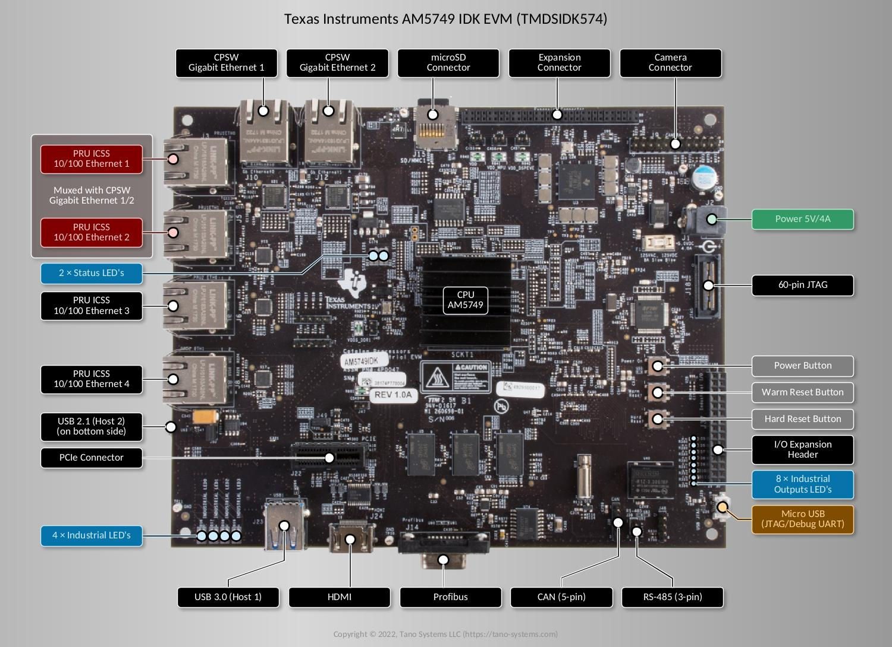
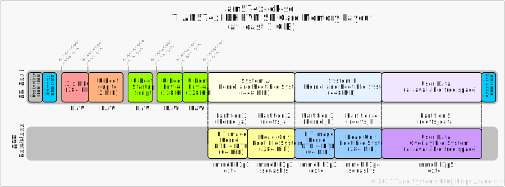
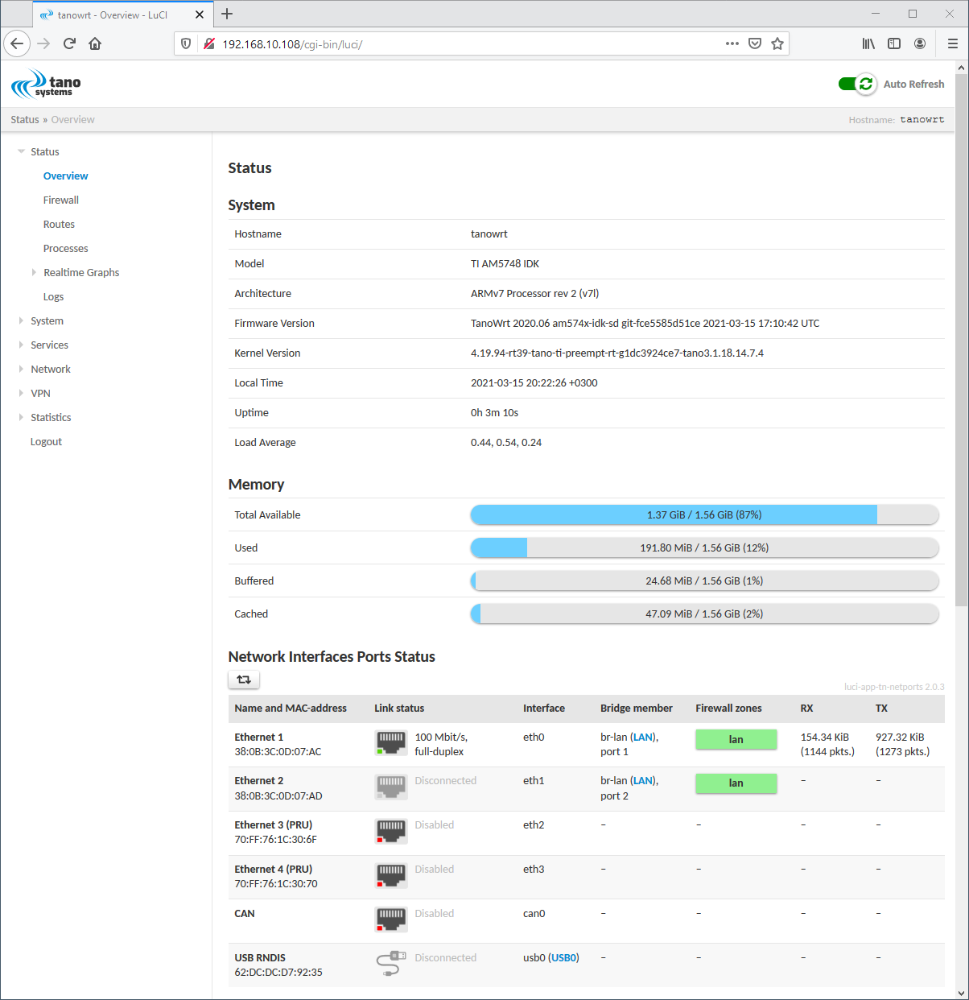

.. SPDX-License-Identifier: MIT

.. _machine-am574x-idk:

***************************
AM574x IDK EVM (TMDSIDK574)
***************************

.. rubric:: Contents
.. contents::
   :depth: 1
   :local:

.. _sec-am574x-idk-board:

Board Overview
==============

The AM574x Industrial Development Kit (IDK) is a development platform for evaluating
the industrial communication and control capabilities of Sitara AM574x/2x processors
for applications in factory automation, drives, robotics, grid infrastructure, and more.
AM574x/2x processors include dual PRU-ICSS (Programmable Real-time Unit for Industrial
Communications) subsystems which can be used for industrial Ethernet protocols such
as Profinet, EtherCAT, Ethernet/IP, and others. The TMDXIDK574 breaks out six ports
of Ethernet, four of which can be used concurrently: 2x Gb Ethernet ports and
2 x 10/100 Ethernet ports from the PRU-ICSS subsystems.

.. _fig-am574x-idk:

   AM574x IDK EVM Interfaces and Connectors

Block Diagram
-------------

.. _fig-am574x-idk-block-diagram:
.. figure:: images/am574x-idk-block-diagram.png
   :width: 300
   :class: with-border

   AM574x IDK EVM Block Diagram

Photos
------

.. container:: flex

   .. _fig-am374x-idk-angled:
   .. figure:: images/am574x-idk-angled.jpg
      :width: 300
      :class: with-border

      AM574x IDK EVM Angled View

   .. _fig-am374x-idk-top:
   .. figure:: images/am574x-idk-top.jpg
      :width: 300
      :class: with-border

      AM574x IDK EVM Top View

   .. _fig-am374x-idk-bottom:
   .. figure:: images/am574x-idk-bottom.jpg
      :width: 300
      :class: with-border

      AM574x IDK EVM Bottom View

Specification
-------------

.. table:: AM574x IDK EVM Specification

   +--------------+------------------------------------------------------------------------------------+
   | Model        | AM574x IDK EVM                                                                     |
   +==============+====================================================================================+
   | Processor    || Texas Instruments AM5748                                                          |
   |              || 2 |times| ARM Cortex-A15                                                          |
   |              |  frequency up to 1.5 GHz                                                           |
   |              || 2 |times| Dual-core Programmable Real-Time Unit and Industrial                    |
   |              |    Communication Subsystem (PRU-ICSS)                                              |
   |              || 2 |times| C66x floating-point VLIW DSP cores                                      |
   |              || 2 |times| ARM Cortex-M4 coprocessors                                              |
   +--------------+------------------------------------------------------------------------------------+
   | GPU          || Dual-core PowerVR® SGX544 3D GPU                                                  |
   +--------------+------------------------------------------------------------------------------------+
   | PMIC         || TPS6590379 power management IC                                                    |
   +--------------+------------------------------------------------------------------------------------+
   | Memory       || 2 GiB DDR3L SDRAM                                                                 |
   +--------------+------------------------------------------------------------------------------------+
   | Storage      || microSD card                                                                      |
   |              || 256 Mbit (32 MiB) SPI NOR Flash (S25FL256S)                                       |
   |              || 256 KiB EEPROM (CAT24C256WI-G)                                                    |
   |              || 16 GB eMMC NAND (Micron MTFC16GAKAECN-2M WT)                                      |
   +--------------+------------------------------------------------------------------------------------+
   | Debug        || Optional 60-pin MIPI connector to support high-performance external               |
   |              |  emulators and, optionally, emulation trace.                                       |
   |              || Embedded XDS100V2 USB emulation through the Micro USB AB connector                |
   +--------------+------------------------------------------------------------------------------------+
   | USB          || 1 |times| USB 3.0/2.1 Host (USB 3.0 A-type connector)                             |
   |              || 1 |times| USB 2.1 Host/Device (USB 2.1 Micro-AB connector)                        |
   |              || 1 |times| Micro USB AB (USB to JTAG and USB to UART)                              |
   +--------------+------------------------------------------------------------------------------------+
   | PCIe         || 1 |times| x1 PCIe female connector                                                |
   +--------------+------------------------------------------------------------------------------------+
   | Ethernet     || up to 4 |times| 100 Mbit Industrial Ethernet attached to the PRU-ICSS subsystem   |
   |              || up to 2 |times| 1000 Mbit connected to the integrated Ethernet switch             |
   +--------------+------------------------------------------------------------------------------------+
   | Video        || 1 |times| HDMI Standard A-type connector                                          |
   +--------------+------------------------------------------------------------------------------------+
   | Industrial   || 1 |times| Profibus (DB9F connector)                                               |
   | Interfaces   || 1 |times| DCAN (5-pin header)                                                     |
   |              || 1 |times| RS-485 (3-pin header)                                                   |
   +--------------+------------------------------------------------------------------------------------+
   | Other        || 3.3V Power                                                                        |
   | Connectors   || 5V Power                                                                          |
   |              || Camera connector (24-pin header)                                                  |
   |              || LCD connector                                                                     |
   |              || Industrial 24V inputs                                                             |
   |              || Industrial outputs                                                                |
   |              || GPIO                                                                              |
   |              || SPI                                                                               |
   |              || CAN                                                                               |
   |              || UART                                                                              |
   +--------------+------------------------------------------------------------------------------------+
   | Power Source | DC Jack                                                                            |
   +--------------+------------------------------------------------------------------------------------+
   | Power        | 5V/4A DC input jack                                                                |
   +--------------+------------------------------------------------------------------------------------+

.. _sec-am574x-idk-targets:

Build Targets
=============

.. _sec-am574x-idk-machines:

Machines
--------

.. _table-am574x-idk-machines:
.. table:: Supported Machines

   +------------------+------------------------------+--------------------------+------------------------------------+------------------------+--------------------------+
   | Board\ [#]_      | Target YAML\ [#]_            | Machine\ [#]_            | Target Recipe(s)\ [#]_             | Running Media\ [#]_    | Installation Media\ [#]_ |
   +==================+==============================+==========================+====================================+========================+==========================+
   | AM574x IDK EVM   | ``am574x-idk-sd.yml``        | ``am574x-idk-sd``        | ``tanowrt-image-full-swu``         | microSD card           | |ndash|                  |
   |                  +------------------------------+--------------------------+------------------------------------+------------------------+--------------------------+
   |                  | ``am574x-idk-emmc.yml``      | ``am574x-idk-emmc``      | ``tanowrt-image-full-swu-factory`` | internal eMMC          | microSD card             |
   +------------------+------------------------------+--------------------------+------------------------------------+------------------------+--------------------------+

.. [#] Target board.
.. [#] Target YAML-file located in the :file:`kas/targets` directory.
.. [#] Target machine name stored in the ``MACHINE`` BitBake variable for selected Target YAML.
.. [#] Recipes that will be built by default for the target. In :numref:`sec-am574x-idk-images`,
       you can find list of supported recipes for the target images, which you can build in addition
       to the default recipes using optional ``--target`` option in build command
       (see :numref:`sec-am574x-idk-build`).
.. [#] External or internal data storage where the TanoWrt operating system is running.
.. [#] External storage device for which an installation image is generated. When booting from
       the Installation Media, the TanoWrt system is installed on the Running Media storage.

.. _sec-am574x-idk-images:

Images
------

.. _table-am574x-idk-images:
.. table:: Supported Images
   :widths: 15, 15, 15, 55

   +---------------------------+------------------------------------+----------------------------+-----------------------------------------------------+
   | Read-Only Root Filesystem | Recipe\ [#]_                       | Supported by Target(s)     | Description                                         |
   | Image                     |                                    |                            |                                                     |
   +===========================+====================================+============================+=====================================================+
   | ``tanowrt-image-full``    | ``tanowrt-image-full``             | *All*                      | Standard TanoWrt image.                             |
   |                           +------------------------------------+----------------------------+-----------------------------------------------------+
   |                           | ``tanowrt-image-full-swu``         | *All*                      | Standard TanoWrt image                              |
   |                           |                                    |                            | and :ref:`firmware upgrade <sec-firmware-upgrade>`  |
   |                           |                                    |                            | image. When building this image,                    |
   |                           |                                    |                            | ``tanowrt-image-full`` will also be built           |
   |                           |                                    |                            | as dependency.                                      |
   |                           +------------------------------------+----------------------------+-----------------------------------------------------+
   |                           | ``tanowrt-image-full-swu-factory`` | ``am574x-idk-emmc.yml``    | Factory installation image for standard TanoWrt     |
   |                           |                                    |                            | image. When building this image,                    |
   |                           |                                    |                            | ``tanowrt-image-full``                              |
   |                           |                                    |                            | and ``tanowrt-image-full-swu`` will also be built   |
   |                           |                                    |                            | as dependencies.                                    |
   +---------------------------+------------------------------------+----------------------------+-----------------------------------------------------+

.. [#] Image recipe name. This name can be used as argument
       for ``--target`` build command option (see :numref:`sec-am574x-idk-build` section).

.. _sec-am574x-idk-build:

Build
=====

Please read the common information on how to perform a TanoWrt
images build and preparing the build environment in section ":ref:`sec-build`".

.. seealso:: 

   - See section :numref:`sec-am574x-idk-machines` to select the required target YAML file (``<target-yml>``).
   - See section :numref:`sec-am574x-idk-images` to select the required root filesystem image recipe (``<target-recipe>``).
   - See section :numref:`sec-am574x-idk-artifacts` for detailed information
     about the produced build artifacts.

Examples
--------

Build Default Images for AM574x IDK EVM Board
~~~~~~~~~~~~~~~~~~~~~~~~~~~~~~~~~~~~~~~~~~~~~~~

.. rubric:: For microSD Card

.. code-block:: console

   $ kas build targets/kas/am574x-idk-sd.yml

Default images will be produced to boot and run from the microSD
card on the AM574x IDK EVM target board.

.. rubric:: For Internal eMMC Flash

.. code-block:: console

   $ kas build targets/kas/am574x-idk-emmc.yml

An initial factory installation image will be generated,
intended to run from the SD card. The installer image
will install the default image to the internal eMMC flash
memory and further the AM574x IDK EVM board will boot
and run from the eMMC flash memory.

.. _sec-am574x-idk-partitioning:

Partitioning Layouts
====================

microSD
-------

The partitioning and data layout of the microSD card image for the AM574x IDK EVM board
are shown in the figure below.

.. _fig-am574x-idk-layout-sd:

    AM574x IDK EVM Partitions Layout for microSD Card

eMMC
----

The partitioning and data layout of the eMMC image for the AM574x IDK EVM board
are shown in the figure below.

.. _fig-am574x-idk-layout-emmc:
.. figure:: images/am574x-idk-layout-emmc.svg
    :width: 1000

    AM574x IDK EVM Partitions Layout for eMMC

The ROM2 (Boot Partition 1, :file:`/dev/mmcblk1boot0`) and ROM3
(Boot Partition 2, :file:`/dev/mmcblk1boot1`) eMMC hardware partitions are
currently not used.

.. _sec-am574x-idk-artifacts:

Produced Build Artifacts
========================

All produced build artifacts are stored in the :file:`~/tanowrt/build/tanowrt-glibc/deploy/images/<MACHINE>` directory.
Refer to table :ref:`table-am574x-idk-artifacts` for a description of some common (not all) build artifacts.

.. _table-am574x-idk-artifacts:
.. table:: Produced Build Artifacts
   :widths: 15, 15, 70

   +---------------------------------------------------------------------+-------------------------------+----------------------------------------------------------------------+
   | Artifact                                                            | Target(s)                     | Description                                                          |
   +=====================================================================+===============================+======================================================================+
   | .. centered:: Bootloader (SPL)                                                                                                                                             |
   +---------------------------------------------------------------------+-------------------------------+----------------------------------------------------------------------+
   | :file:`MLO-sdcard-defconfig`                                        | *All*                         | MLO binary blob for microSD card images.                             |
   +---------------------------------------------------------------------+-------------------------------+----------------------------------------------------------------------+
   | :file:`MLO-emmc-defconfig`                                          | ``am574x-idk-emmc.yml``       | MLO binary blob for eMMC images.                                     |
   +---------------------------------------------------------------------+-------------------------------+----------------------------------------------------------------------+
   | .. centered:: Bootloader (U-Boot)                                                                                                                                          |
   +---------------------------------------------------------------------+-------------------------------+----------------------------------------------------------------------+
   | :file:`startup-<MACHINE>.img`                                       | *All*                         | U-Boot startup script.                                               |
   +---------------------------------------------------------------------+-------------------------------+----------------------------------------------------------------------+
   | :file:`startup-factory-<MACHINE>.img`                               | ``am574x-idk-emmc.yml``       | U-Boot startup script for factory installation image.                |
   +---------------------------------------------------------------------+-------------------------------+----------------------------------------------------------------------+
   | :file:`u-boot-initial-env-<MACHINE>-sdcard-defconfig`               | *All*                         | U-Boot initial environment image for microSD card image.             |
   +---------------------------------------------------------------------+-------------------------------+----------------------------------------------------------------------+
   | :file:`u-boot-initial-env-<MACHINE>-emmc-defconfig`                 | ``am574x-idk-emmc.yml``       | U-Boot initial environment image for internal eMMC flash.            |
   +---------------------------------------------------------------------+-------------------------------+----------------------------------------------------------------------+
   | :file:`u-boot-<MACHINE>.bin-sdcard-defconfig`                       | *All*                         | U-Boot binary image for booting from microSD card.                   |
   +---------------------------------------------------------------------+-------------------------------+----------------------------------------------------------------------+
   | :file:`u-boot-<MACHINE>.bin-emmc-defconfig`                         | ``am574x-idk-emmc.yml``       | U-Boot binary image for booting from internal eMMC flash.            |
   +---------------------------------------------------------------------+-------------------------------+----------------------------------------------------------------------+
   | .. centered:: Linux Kernel and DTB                                                                                                                                         |
   +---------------------------------------------------------------------+-------------------------------+----------------------------------------------------------------------+
   | :file:`fitImage-<MACHINE>.bin`                                      | *All*                         | Flattened Image Tree (FIT) image with Linux kernel                   |
   |                                                                     |                               | and Device Tree Blobs (DTB).                                         |
   +---------------------------------------------------------------------+-------------------------------+----------------------------------------------------------------------+
   | :file:`fitImage-<MACHINE>.ext4`                                     | *All*                         | FIT image packed into an ext4 file system image.                     |
   +---------------------------------------------------------------------+-------------------------------+----------------------------------------------------------------------+
   | :file:`am574x-idk.dtb`                                              | *All*                         | Target Device Tree Blob (DTB).                                       |
   +---------------------------------------------------------------------+-------------------------------+----------------------------------------------------------------------+
   | :file:`fitImage-tanowrt-image-initramfs-swu-factory-<MACHINE>.ext4` | ``am574x-idk-emmc.yml``       | FIT image for SWU factory installation image with                    |
   |                                                                     |                               | initramfs image.                                                     |
   +---------------------------------------------------------------------+-------------------------------+----------------------------------------------------------------------+
   | .. centered:: Images                                                                                                                                                       |
   +---------------------------------------------------------------------+-------------------------------+----------------------------------------------------------------------+
   | :file:`<rootfs-image>-<MACHINE>.sdcard.img`                         | ``am574x-idk-sd.yml``         | SD card image including all required partitions for booting          |
   |                                                                     |                               | and running the system. This image is ready to be written            |
   |                                                                     |                               | to the SD card using the :command:`dd` utility or similar            |
   |                                                                     |                               | (see :ref:`sec-am574x-idk-flash`).                                   |
   +---------------------------------------------------------------------+-------------------------------+----------------------------------------------------------------------+
   | :file:`<rootfs-image>-swu-factory-<MACHINE>.sdcard.img`             | ``am574x-idk-emmc.yml``       | SD card factory installation image. This image is ready              |
   |                                                                     |                               | to be written to the SD card using the :command:`dd` utility         |
   |                                                                     |                               | or similar (see :ref:`sec-am574x-idk-flash`).                        |
   +---------------------------------------------------------------------+-------------------------------+----------------------------------------------------------------------+
   | :file:`tanowrt-image-initramfs-swu-factory-<MACHINE>.cpio.gz`       | ``am574x-idk-emmc.yml``       | Root filesystem initramfs image for factory installtion              |
   |                                                                     |                               | image. This image is included in                                     |
   |                                                                     |                               | :file:`fitImage-tanowrt-image-initramfs-swu-factory-<MACHINE>.ext4`. |
   +---------------------------------------------------------------------+-------------------------------+----------------------------------------------------------------------+
   | :file:`<rootfs-image>-<MACHINE>.squashfs-lzo`                       | *All*                         | Root filesystem image (squashfs with LZO compression).               |
   +---------------------------------------------------------------------+-------------------------------+----------------------------------------------------------------------+
   | :file:`<rootfs-image>-swu-<MACHINE>.swu`                            | *All*                         | :ref:`Firmware upgrade <sec-firmware-upgrade>` image.                |
   +---------------------------------------------------------------------+-------------------------------+----------------------------------------------------------------------+

.. note:: ``<MACHINE>`` in the artifacts path and artifact file names are replaced by
          the actual value of the ``MACHINE`` BitBake variable for the chosen
          `target <sec-am574x-idk-targets_>`__. ``<rootfs-image>`` is replaced
          by the actual read-only root filesystem `image <sec-am574x-idk-images_>`__ name.

For example, below is the lists of artifacts produced by the ``am574x-idk-emmc.yml``
and ``am574x-idk-sd.yml`` target builds. There are two types of listings here |mdash|
a complete listing, and a reduced listing without the symbolic links display.

Build Artifacts Listings for ``am574x-idk-sd.yml`` Target
---------------------------------------------------------

.. tabs::

   .. tab:: Reduced

      .. code-block:: console

         [~/tanowrt/build/tanowrt-glibc/deploy/images/am574x-idk-sd]$ ls -gGh | grep -v -e "^l"
         total 214M
         -rw-r--r-- 2  125K Jul 27 13:12 am571x-idk--4.19.94-rt39+git0+a242ccf3f1-tano3.2.20.20.8.6-am574x-idk-sd-20220727100754.dtb
         -rw-r--r-- 2   91K Jul 27 13:12 am572x-idk--4.19.94-rt39+git0+a242ccf3f1-tano3.2.20.20.8.6-am574x-idk-sd-20220727100754.dtb
         -rw-r--r-- 2   88K Jul 27 13:12 am574x-idk--4.19.94-rt39+git0+a242ccf3f1-tano3.2.20.20.8.6-am574x-idk-sd-20220727100754.dtb
         -rw-r--r-- 2   89K Jul 27 13:12 am57xx-beagle-x15--4.19.94-rt39+git0+a242ccf3f1-tano3.2.20.20.8.6-am574x-idk-sd-20220727100754.dtb
         -rw-r--r-- 2   89K Jul 27 13:12 am57xx-beagle-x15-revb1--4.19.94-rt39+git0+a242ccf3f1-tano3.2.20.20.8.6-am574x-idk-sd-20220727100754.dtb
         -rw-r--r-- 2   89K Jul 27 13:12 am57xx-beagle-x15-revc--4.19.94-rt39+git0+a242ccf3f1-tano3.2.20.20.8.6-am574x-idk-sd-20220727100754.dtb
         -rw-r--r-- 2  131K Jul 27 13:12 am57xx-evm--4.19.94-rt39+git0+a242ccf3f1-tano3.2.20.20.8.6-am574x-idk-sd-20220727100754.dtb
         -rw-r--r-- 2  5.1M Jul 27 13:12 fitImage--4.19.94-rt39+git0+a242ccf3f1-tano3.2.20.20.8.6-am574x-idk-sd-20220727100754.bin
         -rw-r--r-- 2  7.2M Jul 27 13:12 fitImage-4.19.94-rt39+gitAUTOINC+a242ccf3f1-tano3.2.20.20.8.6-am574x-idk-sd.ext4
         -rw-r--r-- 2  7.2M Jul 27 13:12 fitImage-am574x-idk-sd.ext4
         -rw-r--r-- 2  6.2K Jul 27 13:12 fitImage-its--4.19.94-rt39+git0+a242ccf3f1-tano3.2.20.20.8.6-am574x-idk-sd-20220727100754.its
         -rw-r--r-- 2  4.5M Jul 27 13:12 fitImage-linux.bin--4.19.94-rt39+git0+a242ccf3f1-tano3.2.20.20.8.6-am574x-idk-sd-20220727100754.bin
         -rw-r--r-- 2  103K Jul 27 13:09 MLO-am574x-idk-sd-2020.01+gitAUTOINC+6b5b982e98-r36.tano3-sdcard-defconfig-2020.01+gitAUTOINC+6b5b982e98-r36.tano3
         -rw-r--r-- 2  384K Jul 27 13:09 MLO-am574x-idk-sd-sdcard-defconfig-x3
         -rw-r--r-- 2  512K Jul 27 13:09 MLO-am574x-idk-sd-sdcard-defconfig-x4
         -rw-r--r-- 2  6.5M Jul 27 13:12 modules--4.19.94-rt39+git0+a242ccf3f1-tano3.2.20.20.8.6-am574x-idk-sd-20220727100754.tgz
         -rw-r--r-- 2  2.9K Jul 27 13:09 startup.img
         -rw-r--r-- 2    16 Jul 27 13:09 startup.img.version
         -rw-r--r-- 2  104K Jul 27 13:46 tanowrt-image-full-am574x-idk-sd-20220727100754.rootfs.manifest
         -rw-r--r-- 2  932M Jul 27 13:46 tanowrt-image-full-am574x-idk-sd-20220727100754.rootfs.sdcard.img
         -rw-r--r-- 2   41M Jul 27 13:46 tanowrt-image-full-am574x-idk-sd-20220727100754.rootfs.squashfs-lzo
         -rw-r--r-- 2    24 Jul 27 13:47 tanowrt-image-full-am574x-idk-sd-20220727100754.rootfs.version
         -rw-r--r-- 2  389K Jul 27 13:46 tanowrt-image-full-am574x-idk-sd-20220727100754.testdata.json
         -rw-r--r-- 2  5.4K Jul 27 13:46 tanowrt-image-full.env
         -rw-r--r-- 2  3.0K Jul 27 13:46 tanowrt-image-full-sdimage-ti-swu-a-b.wks
         -rw-r--r-- 2   49M Jul 27 13:47 tanowrt-image-full-swu-am574x-idk-sd-20220727100754.swu
         -rw-r--r-- 2   410 Jul 27 13:09 u-boot-initial-env-am574x-idk-sd-sdcard-defconfig-2020.01+gitAUTOINC+6b5b982e98-r36.tano3
         -rw-r--r-- 2  128K Jul 27 13:09 u-boot-initial-env-am574x-idk-sd-sdcard-defconfig-2020.01+gitAUTOINC+6b5b982e98-r36.tano3.bin
         -rw-r--r-- 2 1012K Jul 27 13:09 u-boot-sdcard-defconfig-2020.01+gitAUTOINC+6b5b982e98-r36.tano3.img
         -rwxr-xr-x 2  103K Jul 27 13:09 u-boot-spl.bin-am574x-idk-sd-2020.01+gitAUTOINC+6b5b982e98-r36.tano3-sdcard-defconfig

   .. tab:: Complete

      .. code-block:: console

         [~/tanowrt/build/tanowrt-glibc/deploy/images/am574x-idk-sd]$ ls -gGh
         total 214M
         -rw-r--r-- 2  125K Jul 27 13:12 am571x-idk--4.19.94-rt39+git0+a242ccf3f1-tano3.2.20.20.8.6-am574x-idk-sd-20220727100754.dtb
         lrwxrwxrwx 2    91 Jul 27 13:12 am571x-idk-am574x-idk-sd.dtb -> am571x-idk--4.19.94-rt39+git0+a242ccf3f1-tano3.2.20.20.8.6-am574x-idk-sd-20220727100754.dtb
         lrwxrwxrwx 2    91 Jul 27 13:12 am571x-idk.dtb -> am571x-idk--4.19.94-rt39+git0+a242ccf3f1-tano3.2.20.20.8.6-am574x-idk-sd-20220727100754.dtb
         -rw-r--r-- 2   91K Jul 27 13:12 am572x-idk--4.19.94-rt39+git0+a242ccf3f1-tano3.2.20.20.8.6-am574x-idk-sd-20220727100754.dtb
         lrwxrwxrwx 2    91 Jul 27 13:12 am572x-idk-am574x-idk-sd.dtb -> am572x-idk--4.19.94-rt39+git0+a242ccf3f1-tano3.2.20.20.8.6-am574x-idk-sd-20220727100754.dtb
         lrwxrwxrwx 2    91 Jul 27 13:12 am572x-idk.dtb -> am572x-idk--4.19.94-rt39+git0+a242ccf3f1-tano3.2.20.20.8.6-am574x-idk-sd-20220727100754.dtb
         -rw-r--r-- 2   88K Jul 27 13:12 am574x-idk--4.19.94-rt39+git0+a242ccf3f1-tano3.2.20.20.8.6-am574x-idk-sd-20220727100754.dtb
         lrwxrwxrwx 2    91 Jul 27 13:12 am574x-idk-am574x-idk-sd.dtb -> am574x-idk--4.19.94-rt39+git0+a242ccf3f1-tano3.2.20.20.8.6-am574x-idk-sd-20220727100754.dtb
         lrwxrwxrwx 2    91 Jul 27 13:12 am574x-idk.dtb -> am574x-idk--4.19.94-rt39+git0+a242ccf3f1-tano3.2.20.20.8.6-am574x-idk-sd-20220727100754.dtb
         -rw-r--r-- 2   89K Jul 27 13:12 am57xx-beagle-x15--4.19.94-rt39+git0+a242ccf3f1-tano3.2.20.20.8.6-am574x-idk-sd-20220727100754.dtb
         lrwxrwxrwx 2    98 Jul 27 13:12 am57xx-beagle-x15-am574x-idk-sd.dtb -> am57xx-beagle-x15--4.19.94-rt39+git0+a242ccf3f1-tano3.2.20.20.8.6-am574x-idk-sd-20220727100754.dtb
         lrwxrwxrwx 2    98 Jul 27 13:12 am57xx-beagle-x15.dtb -> am57xx-beagle-x15--4.19.94-rt39+git0+a242ccf3f1-tano3.2.20.20.8.6-am574x-idk-sd-20220727100754.dtb
         -rw-r--r-- 2   89K Jul 27 13:12 am57xx-beagle-x15-revb1--4.19.94-rt39+git0+a242ccf3f1-tano3.2.20.20.8.6-am574x-idk-sd-20220727100754.dtb
         lrwxrwxrwx 2   104 Jul 27 13:12 am57xx-beagle-x15-revb1-am574x-idk-sd.dtb -> am57xx-beagle-x15-revb1--4.19.94-rt39+git0+a242ccf3f1-tano3.2.20.20.8.6-am574x-idk-sd-20220727100754.dtb
         lrwxrwxrwx 2   104 Jul 27 13:12 am57xx-beagle-x15-revb1.dtb -> am57xx-beagle-x15-revb1--4.19.94-rt39+git0+a242ccf3f1-tano3.2.20.20.8.6-am574x-idk-sd-20220727100754.dtb
         -rw-r--r-- 2   89K Jul 27 13:12 am57xx-beagle-x15-revc--4.19.94-rt39+git0+a242ccf3f1-tano3.2.20.20.8.6-am574x-idk-sd-20220727100754.dtb
         lrwxrwxrwx 2   103 Jul 27 13:12 am57xx-beagle-x15-revc-am574x-idk-sd.dtb -> am57xx-beagle-x15-revc--4.19.94-rt39+git0+a242ccf3f1-tano3.2.20.20.8.6-am574x-idk-sd-20220727100754.dtb
         lrwxrwxrwx 2   103 Jul 27 13:12 am57xx-beagle-x15-revc.dtb -> am57xx-beagle-x15-revc--4.19.94-rt39+git0+a242ccf3f1-tano3.2.20.20.8.6-am574x-idk-sd-20220727100754.dtb
         -rw-r--r-- 2  131K Jul 27 13:12 am57xx-evm--4.19.94-rt39+git0+a242ccf3f1-tano3.2.20.20.8.6-am574x-idk-sd-20220727100754.dtb
         lrwxrwxrwx 2    91 Jul 27 13:12 am57xx-evm-am574x-idk-sd.dtb -> am57xx-evm--4.19.94-rt39+git0+a242ccf3f1-tano3.2.20.20.8.6-am574x-idk-sd-20220727100754.dtb
         lrwxrwxrwx 2    91 Jul 27 13:12 am57xx-evm.dtb -> am57xx-evm--4.19.94-rt39+git0+a242ccf3f1-tano3.2.20.20.8.6-am574x-idk-sd-20220727100754.dtb
         lrwxrwxrwx 2    89 Jul 27 13:12 fitImage -> fitImage--4.19.94-rt39+git0+a242ccf3f1-tano3.2.20.20.8.6-am574x-idk-sd-20220727100754.bin
         -rw-r--r-- 2  5.1M Jul 27 13:12 fitImage--4.19.94-rt39+git0+a242ccf3f1-tano3.2.20.20.8.6-am574x-idk-sd-20220727100754.bin
         -rw-r--r-- 2  7.2M Jul 27 13:12 fitImage-4.19.94-rt39+gitAUTOINC+a242ccf3f1-tano3.2.20.20.8.6-am574x-idk-sd.ext4
         lrwxrwxrwx 2    89 Jul 27 13:12 fitImage-am574x-idk-sd.bin -> fitImage--4.19.94-rt39+git0+a242ccf3f1-tano3.2.20.20.8.6-am574x-idk-sd-20220727100754.bin
         -rw-r--r-- 2  7.2M Jul 27 13:12 fitImage-am574x-idk-sd.ext4
         -rw-r--r-- 2  6.2K Jul 27 13:12 fitImage-its--4.19.94-rt39+git0+a242ccf3f1-tano3.2.20.20.8.6-am574x-idk-sd-20220727100754.its
         lrwxrwxrwx 2    93 Jul 27 13:12 fitImage-its-am574x-idk-sd -> fitImage-its--4.19.94-rt39+git0+a242ccf3f1-tano3.2.20.20.8.6-am574x-idk-sd-20220727100754.its
         -rw-r--r-- 2  4.5M Jul 27 13:12 fitImage-linux.bin--4.19.94-rt39+git0+a242ccf3f1-tano3.2.20.20.8.6-am574x-idk-sd-20220727100754.bin
         lrwxrwxrwx 2    99 Jul 27 13:12 fitImage-linux.bin-am574x-idk-sd -> fitImage-linux.bin--4.19.94-rt39+git0+a242ccf3f1-tano3.2.20.20.8.6-am574x-idk-sd-20220727100754.bin
         lrwxrwxrwx 2   114 Jul 27 13:09 MLO -> MLO-am574x-idk-sd-2020.01+gitAUTOINC+6b5b982e98-r36.tano3-sdcard-defconfig-2020.01+gitAUTOINC+6b5b982e98-r36.tano3
         lrwxrwxrwx 2   114 Jul 27 13:09 MLO-am574x-idk-sd -> MLO-am574x-idk-sd-2020.01+gitAUTOINC+6b5b982e98-r36.tano3-sdcard-defconfig-2020.01+gitAUTOINC+6b5b982e98-r36.tano3
         -rw-r--r-- 2  103K Jul 27 13:09 MLO-am574x-idk-sd-2020.01+gitAUTOINC+6b5b982e98-r36.tano3-sdcard-defconfig-2020.01+gitAUTOINC+6b5b982e98-r36.tano3
         -rw-r--r-- 2  384K Jul 27 13:09 MLO-am574x-idk-sd-sdcard-defconfig-x3
         -rw-r--r-- 2  512K Jul 27 13:09 MLO-am574x-idk-sd-sdcard-defconfig-x4
         lrwxrwxrwx 2   114 Jul 27 13:09 MLO-sdcard-defconfig -> MLO-am574x-idk-sd-2020.01+gitAUTOINC+6b5b982e98-r36.tano3-sdcard-defconfig-2020.01+gitAUTOINC+6b5b982e98-r36.tano3
         lrwxrwxrwx 2    37 Jul 27 13:09 MLO-sdcard-defconfig-x3 -> MLO-am574x-idk-sd-sdcard-defconfig-x3
         lrwxrwxrwx 2    37 Jul 27 13:09 MLO-sdcard-defconfig-x4 -> MLO-am574x-idk-sd-sdcard-defconfig-x4
         -rw-r--r-- 2  6.5M Jul 27 13:12 modules--4.19.94-rt39+git0+a242ccf3f1-tano3.2.20.20.8.6-am574x-idk-sd-20220727100754.tgz
         lrwxrwxrwx 2    88 Jul 27 13:12 modules-am574x-idk-sd.tgz -> modules--4.19.94-rt39+git0+a242ccf3f1-tano3.2.20.20.8.6-am574x-idk-sd-20220727100754.tgz
         lrwxrwxrwx 2    11 Jul 27 13:09 startup-am574x-idk-sd.img -> startup.img
         lrwxrwxrwx 2    19 Jul 27 13:09 startup-am574x-idk-sd.img.version -> startup.img.version
         -rw-r--r-- 2  2.9K Jul 27 13:09 startup.img
         -rw-r--r-- 2    16 Jul 27 13:09 startup.img.version
         -rw-r--r-- 2  104K Jul 27 13:46 tanowrt-image-full-am574x-idk-sd-20220727100754.rootfs.manifest
         -rw-r--r-- 2  932M Jul 27 13:46 tanowrt-image-full-am574x-idk-sd-20220727100754.rootfs.sdcard.img
         -rw-r--r-- 2   41M Jul 27 13:46 tanowrt-image-full-am574x-idk-sd-20220727100754.rootfs.squashfs-lzo
         -rw-r--r-- 2    24 Jul 27 13:47 tanowrt-image-full-am574x-idk-sd-20220727100754.rootfs.version
         -rw-r--r-- 2  389K Jul 27 13:46 tanowrt-image-full-am574x-idk-sd-20220727100754.testdata.json
         lrwxrwxrwx 2    63 Jul 27 13:46 tanowrt-image-full-am574x-idk-sd.manifest -> tanowrt-image-full-am574x-idk-sd-20220727100754.rootfs.manifest
         lrwxrwxrwx 2    65 Jul 27 13:46 tanowrt-image-full-am574x-idk-sd.sdcard.img -> tanowrt-image-full-am574x-idk-sd-20220727100754.rootfs.sdcard.img
         lrwxrwxrwx 2    67 Jul 27 13:46 tanowrt-image-full-am574x-idk-sd.squashfs-lzo -> tanowrt-image-full-am574x-idk-sd-20220727100754.rootfs.squashfs-lzo
         lrwxrwxrwx 2    61 Jul 27 13:46 tanowrt-image-full-am574x-idk-sd.testdata.json -> tanowrt-image-full-am574x-idk-sd-20220727100754.testdata.json
         lrwxrwxrwx 2    62 Jul 27 13:47 tanowrt-image-full-am574x-idk-sd.version -> tanowrt-image-full-am574x-idk-sd-20220727100754.rootfs.version
         -rw-r--r-- 2  5.4K Jul 27 13:46 tanowrt-image-full.env
         -rw-r--r-- 2  3.0K Jul 27 13:46 tanowrt-image-full-sdimage-ti-swu-a-b.wks
         -rw-r--r-- 2   49M Jul 27 13:47 tanowrt-image-full-swu-am574x-idk-sd-20220727100754.swu
         lrwxrwxrwx 2    55 Jul 27 13:47 tanowrt-image-full-swu-am574x-idk-sd.swu -> tanowrt-image-full-swu-am574x-idk-sd-20220727100754.swu
         lrwxrwxrwx 2    67 Jul 27 13:09 u-boot-am574x-idk-sd.img -> u-boot-sdcard-defconfig-2020.01+gitAUTOINC+6b5b982e98-r36.tano3.img
         lrwxrwxrwx 2    67 Jul 27 13:09 u-boot-am574x-idk-sd.img-sdcard-defconfig -> u-boot-sdcard-defconfig-2020.01+gitAUTOINC+6b5b982e98-r36.tano3.img
         lrwxrwxrwx 2    67 Jul 27 13:09 u-boot.img -> u-boot-sdcard-defconfig-2020.01+gitAUTOINC+6b5b982e98-r36.tano3.img
         lrwxrwxrwx 2    67 Jul 27 13:09 u-boot.img-sdcard-defconfig -> u-boot-sdcard-defconfig-2020.01+gitAUTOINC+6b5b982e98-r36.tano3.img
         lrwxrwxrwx 2    89 Jul 27 13:09 u-boot-initial-env-am574x-idk-sd-sdcard-defconfig -> u-boot-initial-env-am574x-idk-sd-sdcard-defconfig-2020.01+gitAUTOINC+6b5b982e98-r36.tano3
         -rw-r--r-- 2   410 Jul 27 13:09 u-boot-initial-env-am574x-idk-sd-sdcard-defconfig-2020.01+gitAUTOINC+6b5b982e98-r36.tano3
         -rw-r--r-- 2  128K Jul 27 13:09 u-boot-initial-env-am574x-idk-sd-sdcard-defconfig-2020.01+gitAUTOINC+6b5b982e98-r36.tano3.bin
         lrwxrwxrwx 2    93 Jul 27 13:09 u-boot-initial-env-am574x-idk-sd-sdcard-defconfig.bin -> u-boot-initial-env-am574x-idk-sd-sdcard-defconfig-2020.01+gitAUTOINC+6b5b982e98-r36.tano3.bin
         lrwxrwxrwx 2    89 Jul 27 13:09 u-boot-initial-env-sdcard-defconfig -> u-boot-initial-env-am574x-idk-sd-sdcard-defconfig-2020.01+gitAUTOINC+6b5b982e98-r36.tano3
         lrwxrwxrwx 2    93 Jul 27 13:09 u-boot-initial-env-sdcard-defconfig.bin -> u-boot-initial-env-am574x-idk-sd-sdcard-defconfig-2020.01+gitAUTOINC+6b5b982e98-r36.tano3.bin
         -rw-r--r-- 2 1012K Jul 27 13:09 u-boot-sdcard-defconfig-2020.01+gitAUTOINC+6b5b982e98-r36.tano3.img
         lrwxrwxrwx 2    85 Jul 27 13:09 u-boot-spl.bin -> u-boot-spl.bin-am574x-idk-sd-2020.01+gitAUTOINC+6b5b982e98-r36.tano3-sdcard-defconfig
         lrwxrwxrwx 2    85 Jul 27 13:09 u-boot-spl.bin-am574x-idk-sd -> u-boot-spl.bin-am574x-idk-sd-2020.01+gitAUTOINC+6b5b982e98-r36.tano3-sdcard-defconfig
         -rwxr-xr-x 2  103K Jul 27 13:09 u-boot-spl.bin-am574x-idk-sd-2020.01+gitAUTOINC+6b5b982e98-r36.tano3-sdcard-defconfig
         lrwxrwxrwx 2    85 Jul 27 13:09 u-boot-spl.bin-am574x-idk-sd-sdcard-defconfig -> u-boot-spl.bin-am574x-idk-sd-2020.01+gitAUTOINC+6b5b982e98-r36.tano3-sdcard-defconfig
         lrwxrwxrwx 2    85 Jul 27 13:09 u-boot-spl.bin-sdcard-defconfig -> u-boot-spl.bin-am574x-idk-sd-2020.01+gitAUTOINC+6b5b982e98-r36.tano3-sdcard-defconfig

Build Artifacts Listings for ``am574x-idk-emmc.yml`` Target
-----------------------------------------------------------

.. tabs::

   .. tab:: Reduced

      .. code-block:: console

         [~/tanowrt/build/tanowrt-glibc/deploy/images/am574x-idk-emmc]$ ls -gGh | grep -v -e "^l"
         total 229M
         -rw-r--r-- 2  125K Jul 27 13:06 am571x-idk--4.19.94-rt39+git0+a242ccf3f1-tano3.2.20.20.8.6-am574x-idk-emmc-20220727085953.dtb
         -rw-r--r-- 2   91K Jul 27 13:06 am572x-idk--4.19.94-rt39+git0+a242ccf3f1-tano3.2.20.20.8.6-am574x-idk-emmc-20220727085953.dtb
         -rw-r--r-- 2   88K Jul 27 13:06 am574x-idk--4.19.94-rt39+git0+a242ccf3f1-tano3.2.20.20.8.6-am574x-idk-emmc-20220727085953.dtb
         -rw-r--r-- 2   89K Jul 27 13:06 am57xx-beagle-x15--4.19.94-rt39+git0+a242ccf3f1-tano3.2.20.20.8.6-am574x-idk-emmc-20220727085953.dtb
         -rw-r--r-- 2   89K Jul 27 13:06 am57xx-beagle-x15-revb1--4.19.94-rt39+git0+a242ccf3f1-tano3.2.20.20.8.6-am574x-idk-emmc-20220727085953.dtb
         -rw-r--r-- 2   89K Jul 27 13:06 am57xx-beagle-x15-revc--4.19.94-rt39+git0+a242ccf3f1-tano3.2.20.20.8.6-am574x-idk-emmc-20220727085953.dtb
         -rw-r--r-- 2  131K Jul 27 13:06 am57xx-evm--4.19.94-rt39+git0+a242ccf3f1-tano3.2.20.20.8.6-am574x-idk-emmc-20220727085953.dtb
         -rw-r--r-- 2  5.1M Jul 27 13:06 fitImage--4.19.94-rt39+git0+a242ccf3f1-tano3.2.20.20.8.6-am574x-idk-emmc-20220727085953.bin
         -rw-r--r-- 2  7.2M Jul 27 13:06 fitImage-4.19.94-rt39+gitAUTOINC+a242ccf3f1-tano3.2.20.20.8.6-am574x-idk-emmc.ext4
         -rw-r--r-- 2  7.2M Jul 27 13:06 fitImage-am574x-idk-emmc.ext4
         -rw-r--r-- 2  6.2K Jul 27 13:06 fitImage-its--4.19.94-rt39+git0+a242ccf3f1-tano3.2.20.20.8.6-am574x-idk-emmc-20220727085953.its
         -rw-r--r-- 2  7.1K Jul 27 13:06 fitImage-its-tanowrt-image-initramfs-swu-factory-am574x-idk-emmc--4.19.94-rt39+git0+a242ccf3f1-tano3.2.20.20.8.6-am574x-idk-emmc-20220727085953.its
         -rw-r--r-- 2  4.5M Jul 27 13:06 fitImage-linux.bin--4.19.94-rt39+git0+a242ccf3f1-tano3.2.20.20.8.6-am574x-idk-emmc-20220727085953.bin
         -rw-r--r-- 2   16M Jul 27 13:06 fitImage-tanowrt-image-initramfs-swu-factory-4.19.94-rt39+gitAUTOINC+a242ccf3f1-tano3.2.20.20.8.6-am574x-idk-emmc.ext4
         -rw-r--r-- 2   13M Jul 27 13:06 fitImage-tanowrt-image-initramfs-swu-factory-am574x-idk-emmc--4.19.94-rt39+git0+a242ccf3f1-tano3.2.20.20.8.6-am574x-idk-emmc-20220727085953.bin
         -rw-r--r-- 2   16M Jul 27 13:06 fitImage-tanowrt-image-initramfs-swu-factory-am574x-idk-emmc.ext4
         -rw-r--r-- 2   98K Jul 27 12:33 MLO-am574x-idk-emmc-2020.01+gitAUTOINC+6b5b982e98-r36.tano3-emmc-defconfig-2020.01+gitAUTOINC+6b5b982e98-r36.tano3
         -rw-r--r-- 2  103K Jul 27 12:33 MLO-am574x-idk-emmc-2020.01+gitAUTOINC+6b5b982e98-r36.tano3-sdcard-defconfig-2020.01+gitAUTOINC+6b5b982e98-r36.tano3
         -rw-r--r-- 2  384K Jul 27 12:33 MLO-am574x-idk-emmc-emmc-defconfig-x3
         -rw-r--r-- 2  512K Jul 27 12:33 MLO-am574x-idk-emmc-emmc-defconfig-x4
         -rw-r--r-- 2  384K Jul 27 12:33 MLO-am574x-idk-emmc-sdcard-defconfig-x3
         -rw-r--r-- 2  512K Jul 27 12:33 MLO-am574x-idk-emmc-sdcard-defconfig-x4
         -rw-r--r-- 2  6.5M Jul 27 13:06 modules--4.19.94-rt39+git0+a242ccf3f1-tano3.2.20.20.8.6-am574x-idk-emmc-20220727085953.tgz
         -rw-r--r-- 2  1.8K Jul 27 12:34 startup-factory.img
         -rw-r--r-- 2    16 Jul 27 12:34 startup-factory.img.version
         -rw-r--r-- 2  2.9K Jul 27 12:34 startup.img
         -rw-r--r-- 2    16 Jul 27 12:34 startup.img.version
         -rw-r--r-- 2  105K Jul 27 13:06 tanowrt-image-full-am574x-idk-emmc-20220727085953.rootfs.manifest
         -rw-r--r-- 2   40M Jul 27 13:07 tanowrt-image-full-am574x-idk-emmc-20220727085953.rootfs.squashfs-lzo
         -rw-r--r-- 2    24 Jul 27 13:07 tanowrt-image-full-am574x-idk-emmc-20220727085953.rootfs.version
         -rw-r--r-- 2  388K Jul 27 13:06 tanowrt-image-full-am574x-idk-emmc-20220727085953.testdata.json
         -rw-r--r-- 2   48M Jul 27 13:07 tanowrt-image-full-swu-am574x-idk-emmc-20220727085953.swu
         -rw-r--r-- 2   69M Jul 27 13:07 tanowrt-image-full-swu-factory-am574x-idk-emmc-20220727085953.sdcard.img
         -rw-r--r-- 2  6.0K Jul 27 12:34 tanowrt-image-full-swu-factory.env
         -rw-r--r-- 2  2.2K Jul 27 12:34 tanowrt-image-full-swu-factory-sdimage-ti-swu-factory.wks
         -rw-r--r-- 2  7.4M Jul 27 13:06 tanowrt-image-initramfs-swu-factory-am574x-idk-emmc-20220727085953.rootfs.cpio.gz
         -rw-r--r-- 2  3.7K Jul 27 13:06 tanowrt-image-initramfs-swu-factory-am574x-idk-emmc-20220727085953.rootfs.manifest
         -rw-r--r-- 2    24 Jul 27 13:06 tanowrt-image-initramfs-swu-factory-am574x-idk-emmc-20220727085953.rootfs.version
         -rw-r--r-- 2  395K Jul 27 13:06 tanowrt-image-initramfs-swu-factory-am574x-idk-emmc-20220727085953.testdata.json
         -rw-r--r-- 2  562K Jul 27 12:33 u-boot-emmc-defconfig-2020.01+gitAUTOINC+6b5b982e98-r36.tano3.img
         -rw-r--r-- 2   412 Jul 27 12:33 u-boot-initial-env-am574x-idk-emmc-emmc-defconfig-2020.01+gitAUTOINC+6b5b982e98-r36.tano3
         -rw-r--r-- 2  128K Jul 27 12:33 u-boot-initial-env-am574x-idk-emmc-emmc-defconfig-2020.01+gitAUTOINC+6b5b982e98-r36.tano3.bin
         -rw-r--r-- 2   410 Jul 27 12:33 u-boot-initial-env-am574x-idk-emmc-sdcard-defconfig-2020.01+gitAUTOINC+6b5b982e98-r36.tano3
         -rw-r--r-- 2  128K Jul 27 12:33 u-boot-initial-env-am574x-idk-emmc-sdcard-defconfig-2020.01+gitAUTOINC+6b5b982e98-r36.tano3.bin
         -rw-r--r-- 2 1012K Jul 27 12:33 u-boot-sdcard-defconfig-2020.01+gitAUTOINC+6b5b982e98-r36.tano3.img
         -rwxr-xr-x 2   98K Jul 27 12:33 u-boot-spl.bin-am574x-idk-emmc-2020.01+gitAUTOINC+6b5b982e98-r36.tano3-emmc-defconfig
         -rwxr-xr-x 2  103K Jul 27 12:33 u-boot-spl.bin-am574x-idk-emmc-2020.01+gitAUTOINC+6b5b982e98-r36.tano3-sdcard-defconfig

   .. tab:: Complete

      .. code-block:: console

         [~/tanowrt/build/tanowrt-glibc/deploy/images/am574x-idk-emmc]$ ls -gGh
         total 229M
         -rw-r--r-- 2  125K Jul 27 13:06 am571x-idk--4.19.94-rt39+git0+a242ccf3f1-tano3.2.20.20.8.6-am574x-idk-emmc-20220727085953.dtb
         lrwxrwxrwx 2    93 Jul 27 13:06 am571x-idk-am574x-idk-emmc.dtb -> am571x-idk--4.19.94-rt39+git0+a242ccf3f1-tano3.2.20.20.8.6-am574x-idk-emmc-20220727085953.dtb
         lrwxrwxrwx 2    93 Jul 27 13:06 am571x-idk.dtb -> am571x-idk--4.19.94-rt39+git0+a242ccf3f1-tano3.2.20.20.8.6-am574x-idk-emmc-20220727085953.dtb
         -rw-r--r-- 2   91K Jul 27 13:06 am572x-idk--4.19.94-rt39+git0+a242ccf3f1-tano3.2.20.20.8.6-am574x-idk-emmc-20220727085953.dtb
         lrwxrwxrwx 2    93 Jul 27 13:06 am572x-idk-am574x-idk-emmc.dtb -> am572x-idk--4.19.94-rt39+git0+a242ccf3f1-tano3.2.20.20.8.6-am574x-idk-emmc-20220727085953.dtb
         lrwxrwxrwx 2    93 Jul 27 13:06 am572x-idk.dtb -> am572x-idk--4.19.94-rt39+git0+a242ccf3f1-tano3.2.20.20.8.6-am574x-idk-emmc-20220727085953.dtb
         -rw-r--r-- 2   88K Jul 27 13:06 am574x-idk--4.19.94-rt39+git0+a242ccf3f1-tano3.2.20.20.8.6-am574x-idk-emmc-20220727085953.dtb
         lrwxrwxrwx 2    93 Jul 27 13:06 am574x-idk-am574x-idk-emmc.dtb -> am574x-idk--4.19.94-rt39+git0+a242ccf3f1-tano3.2.20.20.8.6-am574x-idk-emmc-20220727085953.dtb
         lrwxrwxrwx 2    93 Jul 27 13:06 am574x-idk.dtb -> am574x-idk--4.19.94-rt39+git0+a242ccf3f1-tano3.2.20.20.8.6-am574x-idk-emmc-20220727085953.dtb
         -rw-r--r-- 2   89K Jul 27 13:06 am57xx-beagle-x15--4.19.94-rt39+git0+a242ccf3f1-tano3.2.20.20.8.6-am574x-idk-emmc-20220727085953.dtb
         lrwxrwxrwx 2   100 Jul 27 13:06 am57xx-beagle-x15-am574x-idk-emmc.dtb -> am57xx-beagle-x15--4.19.94-rt39+git0+a242ccf3f1-tano3.2.20.20.8.6-am574x-idk-emmc-20220727085953.dtb
         lrwxrwxrwx 2   100 Jul 27 13:06 am57xx-beagle-x15.dtb -> am57xx-beagle-x15--4.19.94-rt39+git0+a242ccf3f1-tano3.2.20.20.8.6-am574x-idk-emmc-20220727085953.dtb
         -rw-r--r-- 2   89K Jul 27 13:06 am57xx-beagle-x15-revb1--4.19.94-rt39+git0+a242ccf3f1-tano3.2.20.20.8.6-am574x-idk-emmc-20220727085953.dtb
         lrwxrwxrwx 2   106 Jul 27 13:06 am57xx-beagle-x15-revb1-am574x-idk-emmc.dtb -> am57xx-beagle-x15-revb1--4.19.94-rt39+git0+a242ccf3f1-tano3.2.20.20.8.6-am574x-idk-emmc-20220727085953.dtb
         lrwxrwxrwx 2   106 Jul 27 13:06 am57xx-beagle-x15-revb1.dtb -> am57xx-beagle-x15-revb1--4.19.94-rt39+git0+a242ccf3f1-tano3.2.20.20.8.6-am574x-idk-emmc-20220727085953.dtb
         -rw-r--r-- 2   89K Jul 27 13:06 am57xx-beagle-x15-revc--4.19.94-rt39+git0+a242ccf3f1-tano3.2.20.20.8.6-am574x-idk-emmc-20220727085953.dtb
         lrwxrwxrwx 2   105 Jul 27 13:06 am57xx-beagle-x15-revc-am574x-idk-emmc.dtb -> am57xx-beagle-x15-revc--4.19.94-rt39+git0+a242ccf3f1-tano3.2.20.20.8.6-am574x-idk-emmc-20220727085953.dtb
         lrwxrwxrwx 2   105 Jul 27 13:06 am57xx-beagle-x15-revc.dtb -> am57xx-beagle-x15-revc--4.19.94-rt39+git0+a242ccf3f1-tano3.2.20.20.8.6-am574x-idk-emmc-20220727085953.dtb
         -rw-r--r-- 2  131K Jul 27 13:06 am57xx-evm--4.19.94-rt39+git0+a242ccf3f1-tano3.2.20.20.8.6-am574x-idk-emmc-20220727085953.dtb
         lrwxrwxrwx 2    93 Jul 27 13:06 am57xx-evm-am574x-idk-emmc.dtb -> am57xx-evm--4.19.94-rt39+git0+a242ccf3f1-tano3.2.20.20.8.6-am574x-idk-emmc-20220727085953.dtb
         lrwxrwxrwx 2    93 Jul 27 13:06 am57xx-evm.dtb -> am57xx-evm--4.19.94-rt39+git0+a242ccf3f1-tano3.2.20.20.8.6-am574x-idk-emmc-20220727085953.dtb
         lrwxrwxrwx 2    91 Jul 27 13:06 fitImage -> fitImage--4.19.94-rt39+git0+a242ccf3f1-tano3.2.20.20.8.6-am574x-idk-emmc-20220727085953.bin
         -rw-r--r-- 2  5.1M Jul 27 13:06 fitImage--4.19.94-rt39+git0+a242ccf3f1-tano3.2.20.20.8.6-am574x-idk-emmc-20220727085953.bin
         -rw-r--r-- 2  7.2M Jul 27 13:06 fitImage-4.19.94-rt39+gitAUTOINC+a242ccf3f1-tano3.2.20.20.8.6-am574x-idk-emmc.ext4
         lrwxrwxrwx 2    91 Jul 27 13:06 fitImage-am574x-idk-emmc.bin -> fitImage--4.19.94-rt39+git0+a242ccf3f1-tano3.2.20.20.8.6-am574x-idk-emmc-20220727085953.bin
         -rw-r--r-- 2  7.2M Jul 27 13:06 fitImage-am574x-idk-emmc.ext4
         -rw-r--r-- 2  6.2K Jul 27 13:06 fitImage-its--4.19.94-rt39+git0+a242ccf3f1-tano3.2.20.20.8.6-am574x-idk-emmc-20220727085953.its
         lrwxrwxrwx 2    95 Jul 27 13:06 fitImage-its-am574x-idk-emmc -> fitImage-its--4.19.94-rt39+git0+a242ccf3f1-tano3.2.20.20.8.6-am574x-idk-emmc-20220727085953.its
         -rw-r--r-- 2  7.1K Jul 27 13:06 fitImage-its-tanowrt-image-initramfs-swu-factory-am574x-idk-emmc--4.19.94-rt39+git0+a242ccf3f1-tano3.2.20.20.8.6-am574x-idk-emmc-20220727085953.its
         lrwxrwxrwx 2   147 Jul 27 13:06 fitImage-its-tanowrt-image-initramfs-swu-factory-am574x-idk-emmc-am574x-idk-emmc -> fitImage-its-tanowrt-image-initramfs-swu-factory-am574x-idk-emmc--4.19.94-rt39+git0+a242ccf3f1-tano3.2.20.20.8.6-am574x-idk-emmc-20220727085953.its
         -rw-r--r-- 2  4.5M Jul 27 13:06 fitImage-linux.bin--4.19.94-rt39+git0+a242ccf3f1-tano3.2.20.20.8.6-am574x-idk-emmc-20220727085953.bin
         lrwxrwxrwx 2   101 Jul 27 13:06 fitImage-linux.bin-am574x-idk-emmc -> fitImage-linux.bin--4.19.94-rt39+git0+a242ccf3f1-tano3.2.20.20.8.6-am574x-idk-emmc-20220727085953.bin
         -rw-r--r-- 2   16M Jul 27 13:06 fitImage-tanowrt-image-initramfs-swu-factory-4.19.94-rt39+gitAUTOINC+a242ccf3f1-tano3.2.20.20.8.6-am574x-idk-emmc.ext4
         -rw-r--r-- 2   13M Jul 27 13:06 fitImage-tanowrt-image-initramfs-swu-factory-am574x-idk-emmc--4.19.94-rt39+git0+a242ccf3f1-tano3.2.20.20.8.6-am574x-idk-emmc-20220727085953.bin
         lrwxrwxrwx 2   143 Jul 27 13:06 fitImage-tanowrt-image-initramfs-swu-factory-am574x-idk-emmc-am574x-idk-emmc -> fitImage-tanowrt-image-initramfs-swu-factory-am574x-idk-emmc--4.19.94-rt39+git0+a242ccf3f1-tano3.2.20.20.8.6-am574x-idk-emmc-20220727085953.bin
         -rw-r--r-- 2   16M Jul 27 13:06 fitImage-tanowrt-image-initramfs-swu-factory-am574x-idk-emmc.ext4
         lrwxrwxrwx 2   114 Jul 27 12:33 MLO -> MLO-am574x-idk-emmc-2020.01+gitAUTOINC+6b5b982e98-r36.tano3-emmc-defconfig-2020.01+gitAUTOINC+6b5b982e98-r36.tano3
         lrwxrwxrwx 2   114 Jul 27 12:33 MLO-am574x-idk-emmc -> MLO-am574x-idk-emmc-2020.01+gitAUTOINC+6b5b982e98-r36.tano3-emmc-defconfig-2020.01+gitAUTOINC+6b5b982e98-r36.tano3
         -rw-r--r-- 2   98K Jul 27 12:33 MLO-am574x-idk-emmc-2020.01+gitAUTOINC+6b5b982e98-r36.tano3-emmc-defconfig-2020.01+gitAUTOINC+6b5b982e98-r36.tano3
         -rw-r--r-- 2  103K Jul 27 12:33 MLO-am574x-idk-emmc-2020.01+gitAUTOINC+6b5b982e98-r36.tano3-sdcard-defconfig-2020.01+gitAUTOINC+6b5b982e98-r36.tano3
         -rw-r--r-- 2  384K Jul 27 12:33 MLO-am574x-idk-emmc-emmc-defconfig-x3
         -rw-r--r-- 2  512K Jul 27 12:33 MLO-am574x-idk-emmc-emmc-defconfig-x4
         -rw-r--r-- 2  384K Jul 27 12:33 MLO-am574x-idk-emmc-sdcard-defconfig-x3
         -rw-r--r-- 2  512K Jul 27 12:33 MLO-am574x-idk-emmc-sdcard-defconfig-x4
         lrwxrwxrwx 2   114 Jul 27 12:33 MLO-emmc-defconfig -> MLO-am574x-idk-emmc-2020.01+gitAUTOINC+6b5b982e98-r36.tano3-emmc-defconfig-2020.01+gitAUTOINC+6b5b982e98-r36.tano3
         lrwxrwxrwx 2    37 Jul 27 12:33 MLO-emmc-defconfig-x3 -> MLO-am574x-idk-emmc-emmc-defconfig-x3
         lrwxrwxrwx 2    37 Jul 27 12:33 MLO-emmc-defconfig-x4 -> MLO-am574x-idk-emmc-emmc-defconfig-x4
         lrwxrwxrwx 2   116 Jul 27 12:33 MLO-sdcard-defconfig -> MLO-am574x-idk-emmc-2020.01+gitAUTOINC+6b5b982e98-r36.tano3-sdcard-defconfig-2020.01+gitAUTOINC+6b5b982e98-r36.tano3
         lrwxrwxrwx 2    39 Jul 27 12:33 MLO-sdcard-defconfig-x3 -> MLO-am574x-idk-emmc-sdcard-defconfig-x3
         lrwxrwxrwx 2    39 Jul 27 12:33 MLO-sdcard-defconfig-x4 -> MLO-am574x-idk-emmc-sdcard-defconfig-x4
         -rw-r--r-- 2  6.5M Jul 27 13:06 modules--4.19.94-rt39+git0+a242ccf3f1-tano3.2.20.20.8.6-am574x-idk-emmc-20220727085953.tgz
         lrwxrwxrwx 2    90 Jul 27 13:06 modules-am574x-idk-emmc.tgz -> modules--4.19.94-rt39+git0+a242ccf3f1-tano3.2.20.20.8.6-am574x-idk-emmc-20220727085953.tgz
         lrwxrwxrwx 2    11 Jul 27 12:34 startup-am574x-idk-emmc.img -> startup.img
         lrwxrwxrwx 2    19 Jul 27 12:34 startup-am574x-idk-emmc.img.version -> startup.img.version
         lrwxrwxrwx 2    19 Jul 27 12:34 startup-factory-am574x-idk-emmc.img -> startup-factory.img
         lrwxrwxrwx 2    27 Jul 27 12:34 startup-factory-am574x-idk-emmc.img.version -> startup-factory.img.version
         -rw-r--r-- 2  1.8K Jul 27 12:34 startup-factory.img
         -rw-r--r-- 2    16 Jul 27 12:34 startup-factory.img.version
         -rw-r--r-- 2  2.9K Jul 27 12:34 startup.img
         -rw-r--r-- 2    16 Jul 27 12:34 startup.img.version
         -rw-r--r-- 2  105K Jul 27 13:06 tanowrt-image-full-am574x-idk-emmc-20220727085953.rootfs.manifest
         -rw-r--r-- 2   40M Jul 27 13:07 tanowrt-image-full-am574x-idk-emmc-20220727085953.rootfs.squashfs-lzo
         -rw-r--r-- 2    24 Jul 27 13:07 tanowrt-image-full-am574x-idk-emmc-20220727085953.rootfs.version
         -rw-r--r-- 2  388K Jul 27 13:06 tanowrt-image-full-am574x-idk-emmc-20220727085953.testdata.json
         lrwxrwxrwx 2    65 Jul 27 13:06 tanowrt-image-full-am574x-idk-emmc.manifest -> tanowrt-image-full-am574x-idk-emmc-20220727085953.rootfs.manifest
         lrwxrwxrwx 2    69 Jul 27 13:07 tanowrt-image-full-am574x-idk-emmc.squashfs-lzo -> tanowrt-image-full-am574x-idk-emmc-20220727085953.rootfs.squashfs-lzo
         lrwxrwxrwx 2    63 Jul 27 13:06 tanowrt-image-full-am574x-idk-emmc.testdata.json -> tanowrt-image-full-am574x-idk-emmc-20220727085953.testdata.json
         lrwxrwxrwx 2    64 Jul 27 13:07 tanowrt-image-full-am574x-idk-emmc.version -> tanowrt-image-full-am574x-idk-emmc-20220727085953.rootfs.version
         -rw-r--r-- 2   48M Jul 27 13:07 tanowrt-image-full-swu-am574x-idk-emmc-20220727085953.swu
         lrwxrwxrwx 2    57 Jul 27 13:07 tanowrt-image-full-swu-am574x-idk-emmc.swu -> tanowrt-image-full-swu-am574x-idk-emmc-20220727085953.swu
         -rw-r--r-- 2   69M Jul 27 13:07 tanowrt-image-full-swu-factory-am574x-idk-emmc-20220727085953.sdcard.img
         lrwxrwxrwx 2    72 Jul 27 13:07 tanowrt-image-full-swu-factory-am574x-idk-emmc.sdcard.img -> tanowrt-image-full-swu-factory-am574x-idk-emmc-20220727085953.sdcard.img
         -rw-r--r-- 2  6.0K Jul 27 12:34 tanowrt-image-full-swu-factory.env
         -rw-r--r-- 2  2.2K Jul 27 12:34 tanowrt-image-full-swu-factory-sdimage-ti-swu-factory.wks
         -rw-r--r-- 2  7.4M Jul 27 13:06 tanowrt-image-initramfs-swu-factory-am574x-idk-emmc-20220727085953.rootfs.cpio.gz
         -rw-r--r-- 2  3.7K Jul 27 13:06 tanowrt-image-initramfs-swu-factory-am574x-idk-emmc-20220727085953.rootfs.manifest
         -rw-r--r-- 2    24 Jul 27 13:06 tanowrt-image-initramfs-swu-factory-am574x-idk-emmc-20220727085953.rootfs.version
         -rw-r--r-- 2  395K Jul 27 13:06 tanowrt-image-initramfs-swu-factory-am574x-idk-emmc-20220727085953.testdata.json
         lrwxrwxrwx 2    81 Jul 27 13:06 tanowrt-image-initramfs-swu-factory-am574x-idk-emmc.cpio.gz -> tanowrt-image-initramfs-swu-factory-am574x-idk-emmc-20220727085953.rootfs.cpio.gz
         lrwxrwxrwx 2    82 Jul 27 13:06 tanowrt-image-initramfs-swu-factory-am574x-idk-emmc.manifest -> tanowrt-image-initramfs-swu-factory-am574x-idk-emmc-20220727085953.rootfs.manifest
         lrwxrwxrwx 2    80 Jul 27 13:06 tanowrt-image-initramfs-swu-factory-am574x-idk-emmc.testdata.json -> tanowrt-image-initramfs-swu-factory-am574x-idk-emmc-20220727085953.testdata.json
         lrwxrwxrwx 2    81 Jul 27 13:06 tanowrt-image-initramfs-swu-factory-am574x-idk-emmc.version -> tanowrt-image-initramfs-swu-factory-am574x-idk-emmc-20220727085953.rootfs.version
         lrwxrwxrwx 2    65 Jul 27 12:33 u-boot-am574x-idk-emmc.img -> u-boot-emmc-defconfig-2020.01+gitAUTOINC+6b5b982e98-r36.tano3.img
         lrwxrwxrwx 2    65 Jul 27 12:33 u-boot-am574x-idk-emmc.img-emmc-defconfig -> u-boot-emmc-defconfig-2020.01+gitAUTOINC+6b5b982e98-r36.tano3.img
         lrwxrwxrwx 2    67 Jul 27 12:33 u-boot-am574x-idk-emmc.img-sdcard-defconfig -> u-boot-sdcard-defconfig-2020.01+gitAUTOINC+6b5b982e98-r36.tano3.img
         -rw-r--r-- 2  562K Jul 27 12:33 u-boot-emmc-defconfig-2020.01+gitAUTOINC+6b5b982e98-r36.tano3.img
         lrwxrwxrwx 2    65 Jul 27 12:33 u-boot.img -> u-boot-emmc-defconfig-2020.01+gitAUTOINC+6b5b982e98-r36.tano3.img
         lrwxrwxrwx 2    65 Jul 27 12:33 u-boot.img-emmc-defconfig -> u-boot-emmc-defconfig-2020.01+gitAUTOINC+6b5b982e98-r36.tano3.img
         lrwxrwxrwx 2    67 Jul 27 12:33 u-boot.img-sdcard-defconfig -> u-boot-sdcard-defconfig-2020.01+gitAUTOINC+6b5b982e98-r36.tano3.img
         lrwxrwxrwx 2    89 Jul 27 12:33 u-boot-initial-env-am574x-idk-emmc-emmc-defconfig -> u-boot-initial-env-am574x-idk-emmc-emmc-defconfig-2020.01+gitAUTOINC+6b5b982e98-r36.tano3
         -rw-r--r-- 2   412 Jul 27 12:33 u-boot-initial-env-am574x-idk-emmc-emmc-defconfig-2020.01+gitAUTOINC+6b5b982e98-r36.tano3
         -rw-r--r-- 2  128K Jul 27 12:33 u-boot-initial-env-am574x-idk-emmc-emmc-defconfig-2020.01+gitAUTOINC+6b5b982e98-r36.tano3.bin
         lrwxrwxrwx 2    93 Jul 27 12:33 u-boot-initial-env-am574x-idk-emmc-emmc-defconfig.bin -> u-boot-initial-env-am574x-idk-emmc-emmc-defconfig-2020.01+gitAUTOINC+6b5b982e98-r36.tano3.bin
         lrwxrwxrwx 2    91 Jul 27 12:33 u-boot-initial-env-am574x-idk-emmc-sdcard-defconfig -> u-boot-initial-env-am574x-idk-emmc-sdcard-defconfig-2020.01+gitAUTOINC+6b5b982e98-r36.tano3
         -rw-r--r-- 2   410 Jul 27 12:33 u-boot-initial-env-am574x-idk-emmc-sdcard-defconfig-2020.01+gitAUTOINC+6b5b982e98-r36.tano3
         -rw-r--r-- 2  128K Jul 27 12:33 u-boot-initial-env-am574x-idk-emmc-sdcard-defconfig-2020.01+gitAUTOINC+6b5b982e98-r36.tano3.bin
         lrwxrwxrwx 2    95 Jul 27 12:33 u-boot-initial-env-am574x-idk-emmc-sdcard-defconfig.bin -> u-boot-initial-env-am574x-idk-emmc-sdcard-defconfig-2020.01+gitAUTOINC+6b5b982e98-r36.tano3.bin
         lrwxrwxrwx 2    89 Jul 27 12:33 u-boot-initial-env-emmc-defconfig -> u-boot-initial-env-am574x-idk-emmc-emmc-defconfig-2020.01+gitAUTOINC+6b5b982e98-r36.tano3
         lrwxrwxrwx 2    93 Jul 27 12:33 u-boot-initial-env-emmc-defconfig.bin -> u-boot-initial-env-am574x-idk-emmc-emmc-defconfig-2020.01+gitAUTOINC+6b5b982e98-r36.tano3.bin
         lrwxrwxrwx 2    91 Jul 27 12:33 u-boot-initial-env-sdcard-defconfig -> u-boot-initial-env-am574x-idk-emmc-sdcard-defconfig-2020.01+gitAUTOINC+6b5b982e98-r36.tano3
         lrwxrwxrwx 2    95 Jul 27 12:33 u-boot-initial-env-sdcard-defconfig.bin -> u-boot-initial-env-am574x-idk-emmc-sdcard-defconfig-2020.01+gitAUTOINC+6b5b982e98-r36.tano3.bin
         -rw-r--r-- 2 1012K Jul 27 12:33 u-boot-sdcard-defconfig-2020.01+gitAUTOINC+6b5b982e98-r36.tano3.img
         lrwxrwxrwx 2    85 Jul 27 12:33 u-boot-spl.bin -> u-boot-spl.bin-am574x-idk-emmc-2020.01+gitAUTOINC+6b5b982e98-r36.tano3-emmc-defconfig
         lrwxrwxrwx 2    85 Jul 27 12:33 u-boot-spl.bin-am574x-idk-emmc -> u-boot-spl.bin-am574x-idk-emmc-2020.01+gitAUTOINC+6b5b982e98-r36.tano3-emmc-defconfig
         -rwxr-xr-x 2   98K Jul 27 12:33 u-boot-spl.bin-am574x-idk-emmc-2020.01+gitAUTOINC+6b5b982e98-r36.tano3-emmc-defconfig
         -rwxr-xr-x 2  103K Jul 27 12:33 u-boot-spl.bin-am574x-idk-emmc-2020.01+gitAUTOINC+6b5b982e98-r36.tano3-sdcard-defconfig
         lrwxrwxrwx 2    85 Jul 27 12:33 u-boot-spl.bin-am574x-idk-emmc-emmc-defconfig -> u-boot-spl.bin-am574x-idk-emmc-2020.01+gitAUTOINC+6b5b982e98-r36.tano3-emmc-defconfig
         lrwxrwxrwx 2    87 Jul 27 12:33 u-boot-spl.bin-am574x-idk-emmc-sdcard-defconfig -> u-boot-spl.bin-am574x-idk-emmc-2020.01+gitAUTOINC+6b5b982e98-r36.tano3-sdcard-defconfig
         lrwxrwxrwx 2    85 Jul 27 12:33 u-boot-spl.bin-emmc-defconfig -> u-boot-spl.bin-am574x-idk-emmc-2020.01+gitAUTOINC+6b5b982e98-r36.tano3-emmc-defconfig
         lrwxrwxrwx 2    87 Jul 27 12:33 u-boot-spl.bin-sdcard-defconfig -> u-boot-spl.bin-am574x-idk-emmc-2020.01+gitAUTOINC+6b5b982e98-r36.tano3-sdcard-defconfig

.. _sec-am574x-idk-flash:

Writing Images
==============

.. _sec-am574x-idk-flash-sd:

Writing Image to microSD Card
-----------------------------

No special information about writing images to microSD card
for AM574x IDK EVM board. See common instructions in :ref:`sec-writing-sd-or-usb` section.

.. rubric:: Examples

Writing factory installation image for the ``am574x-idk-emmc.yml`` target to the microSD
card :file:`/dev/mmcblk1`:

.. code-block:: console

   $ dd if=tanowrt-image-full-swu-factory-am574x-idk-emmc.sdcard.img of=/dev/mmcblk1

Writing bootable card image for the ``am574x-idk-sd.yml`` target to the microSD
card :file:`/dev/mmcblk1`:

.. code-block:: console

   $ dd if=tanowrt-image-full-am574x-idk-sd.sdcard.img of=/dev/mmcblk1

.. _sec-am574x-idk-flash-emmc:

Writing Image to eMMC Flash
---------------------------

For the initial flashing of the internal eMMC memory it is recommended to use
the special image of the initial factory installation. If you choose a build target
(see :ref:`sec-am574x-idk-targets` for details) that assumes using the
factory installation image for the initial flashing of the
device, a factory installation image (:file:`<rootfs-image>-swu-factory-<MACHINE>.sdcard.img`)
will be automatically generated during the build process
(see :ref:`sec-am574x-idk-build`).
To write the factory installation image to a SD card, follow the instructions
from :ref:`sec-writing-sd-or-usb` section.

When you boot device from the prepaired SD card with factory installation image the installation
of TanoWrt to the internal eMMC flash memory will be done automatically. The detailed
installation log is available on the :ref:`debug UART <sec-am574x-idk-serial>`.
After the installation is complete, the board will reboots automatically. When the
device is rebooted, the installed system will be booted from the internal eMMC flash memory.

.. caution:: Be aware that during the installation all existing data on the internal eMMC
             flash memory will be permanently lost.

.. _sec-am574x-idk-booting:

Booting and Running
===================

.. _sec-am574x-idk-boot-mode:

Choosing Boot Mode
------------------

The AM574x IDK EVM is configured by default to enable U-Boot/Linux boot from the microSD card.
The secondary boot device selected is QSPI1.

.. _sec-am574x-idk-ethernet-mode:

Choosing Ethernet Mode
----------------------

The AM574x IDK EVM supports up to four 100 Mbit Industrial Ethernet ports attached to the PRU-ICSS
subsystems and up to two Gigabit (1000 Mbit) Ethernet ports connected to the integrated Ethernet switch.
The final number of available ports depends on the configuration options. The default configuration
provides two 100 Mbit Industrial Ethernet ports and two Gigabit (1000 Mbit) Ethernet ports.

Booting from microSD Card
-------------------------

1. Insert the microSD card into the slot on the AM574x IDK EVM board (power is off).
2. Power on board.
3. TanoWrt will be booting from microSD card.
4. Log in to system using default :ref:`credentials <sec-access-creds>`.

.. _sec-am574x-idk-serial:

Serial Console
==============

The debug serial console on the AM574x IDK EVM board is accessible
via the Micro USB connector on board.
The FTDI bridge device provides both XDS100V2 JTAG emulation and UART Console over the USB. Its
USB connector is J19 and it is also a USB Micro-AB connector but it only operates in device (slave) mode
with the FTDI bridge device.

The default serial console settings for AM574x IDK EVM for U-Boot and kernel
are described in the table below.

+-----------------+-------------------+
| Parameter       | Value             |
+=================+===================+
| Baudrate        | 115200            |
+-----------------+-------------------+
| Data bits       | 8                 |
+-----------------+-------------------+
| Stop bits       | 1                 |
+-----------------+-------------------+
| Parity          | none              |
+-----------------+-------------------+
| Flow control    | none              |
+-----------------+-------------------+

.. _sec-am574x-idk-network-config:

Default Network Configuration
=============================

By default Ethernet 1 and 2 ports (``eth0`` and ``eth1`` interfaces) are joined into
a bridge (``br-lan`` interface) with enabled :term:`RSTP` protocol. Bridge (``br-lan``)
configured with static IP address 192.168.0.1/24 with enabled :term:`DHCP` server.

Ethernet ports 1 and 2 (``eth0`` and ``eth1``) have :term:`LLDP` enabled by default.

PRU-ICSS ethernet ports 3 and 4 (``eth2`` and ``eth3`` interfaces) are not
configured by default.

.. _sec-am574x-idk-webui:

Web User Interface
==================

The WebUI can be accessed via Ethernet ports through HTTP(s) protocol.
You must see something like this in browser after you logged in:

.. _fig-am574x-idk-luci-login:
.. figure:: /common/images/luci/page-login.png
   :width: 900

   LuCI WebUI Login Page

.. _fig-am574x-idk-luci-status:

   LuCI WebUI Overview Page

.. _sec-am574x-idk-upgrade:

Firmware Upgrade
================

No special information about firmware upgrade.
Use produced :file:`.swu` :ref:`artifact <table-am574x-idk-artifacts>` for upgrading running system.

.. seealso:: See common instructions in :ref:`sec-firmware-upgrade` section.

Known Issues
============

+-------------+--------------------------+----------------------------------------------------------------------------------------------+
| Code        | Affected Target(s)       | Issue Description                                                                            |
+=============+==========================+==============================================================================================+
| |ndash|     || ``am574x-idk-sd.yml``   | USB-to-Host network interface is not working (``usb0`` interface)                            |
|             || ``am574x-idk-emmc.yml`` |                                                                                              |
+-------------+--------------------------+----------------------------------------------------------------------------------------------+
| |ndash|     || ``am574x-idk-sd.yml``   | Only for kernel 5.4. When trying to bridge PRU-ICSS ethernet interfaces                      |
|             || ``am574x-idk-emmc.yml`` | (``eth2`` or/and ``eth3``), the kernel crashes.                                              |
+-------------+--------------------------+----------------------------------------------------------------------------------------------+

References
==========

1. https://www.ti.com/tool/TMDSIDK574
