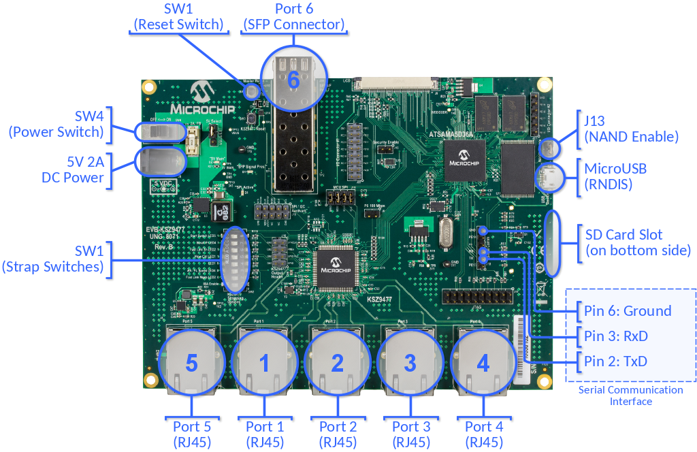
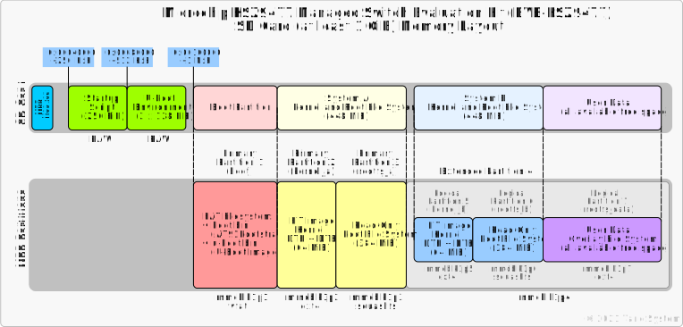
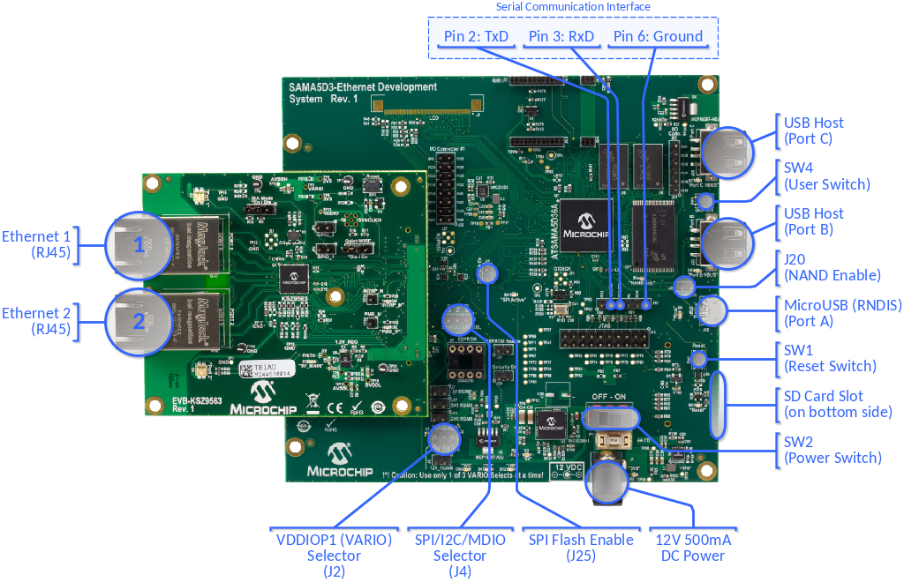

# meta-tanowrt-hsl-atmel

[TanoWrt](https://github.com/tano-systems/meta-tanowrt) hardware support layer for the Microchip (Atmel) SoC based boards.

 

## 1 Supported Hardware

TanoWrt has demonstration support for some devices and development boards based on Microchip (Atmel) processors. All supported devices are listed in the table below.

| Device                                                                                                                                                                                               | Cores x SoC           | RAM          | Supported Storage(s)  |
| ---------------------------------------------------------------------------------------------------------------------------------------------------------------------------------------------------- | --------------------- | ------------ | --------------------- |
| [KSZ9477 Managed Switch Evaluation Kit with SAMA5D36 MPU (EVB-KSZ9477)](#11-ksz9477-managed-switch-evaluation-kit-with-sama5d36-mpu-evb-ksz9477)                                                     | 1 x SAMA5D36, 528 MHz | 256 MiB DDR2 | SD Card, 256 MiB NAND |
| [KSZ9563 Plug-in Evaluation Board (EVB-KSZ9563) on SAMA5D3 Ethernet Development System (DM320114)](#12-ksz9563-plug-in-evaluation-board-evb-ksz9563-on-sama5d3-ethernet-development-system-dm320114) | 1 x SAMA5D36, 528 MHz | 256 MiB DDR2 | SD Card, 256 MiB NAND |

---------------------------------------------------------------------------------------------------

### 1.1 KSZ9477 Managed Switch Evaluation Kit with SAMA5D36 MPU (EVB-KSZ9477)

Official page: https://www.microchip.com/DevelopmentTools/ProductDetails/PartNO/EVB-KSZ9477

The EVB-KSZ9477 evaluation board features the KSZ9477 seven-port managed gigabit Ethernet switch. It has five 10BASE-Te/100BASE-TX/1000BASE-T physical layer transceivers (PHYs) and associated MAC units, one SGMII and one RGMII interfaces. Ports 1 through 5, with integrated MAC and PHY are connected to RJ45 Ethernet jacks with integrated magnetics. The SGMII interface is connected to a small form-factor pluggable (SFP) transceiver receptacle whereas, the RGMII interface is connected to the SAMA5D36A embedded microprocessor (MPU).



The board provides 2 Gbit (256 MiB) DDR2 SDRAM and 2 Gbit (256 MiB) of NAND flash memory.

#### 1.1.1 Machines

For EVB-KSZ9477 board there are a few machines available listed in the table below.

| Machine             | Description                                                |
| ------------------- | ---------------------------------------------------------- |
| `evb-ksz9477-sd`    | TanoWrt for running on SD card                             |
| `evb-ksz9477-nand`  | TanoWrt for running on internal NAND flash                 |

#### 1.1.2 Supported Images

| Image Recipe                     | Machine(s)              | Description                                                           |
| -------------------------------- | ----------------------- | --------------------------------------------------------------------- |
| `tanowrt-image-base`             | *All*                   | TanoWrt base root file system image                                   |
| `tanowrt-image-full`             | *All*                   | TanoWrt full featured root file system image                          |
| `tanowrt-image-full-swu`         | *All*                   | TanoWrt full featured SWU firmware upgrade image                      |
| `tanowrt-image-full-swu-factory` | Only `evb-ksz9477-nand` | Factory installation SD card image for the firmware on the NAND flash |

#### 1.1.3 Boot Source Selection

The EVB-KSZ9477 board does not have any switches or jumpers for selecting the boot source. By default, booting is performed from the SD card. If booting from an SD card fails, NAND flash memory is used for booting.

#### 1.1.4 Hardware Configuration

Ensure that the J13 (NAND Enable) jumper on EVB-KSZ9477 board is shorted (this is needed for installing and running the TanoWrt from the internal NAND flash memory).

To avoid network loops while the bootloader is running and while the operating system is booting (while the STP/RSTP support software is not yet running) it is recommended to set the SW1:1 switch to the "ON" position. Switch SW1:1 is used for automatic start of the switch with the default configuration when the power is turned on.

#### 1.1.5 Build and Run

##### 1.1.5.1 TanoWrt on SD Card (`evb-ksz9477-sd`)

The SD card memory layout for the EVB-KSZ9477 board are shown in the figure below.



###### 1.1.5.1.1 Build SD Card Image

To build TanoWrt image for the SD card use the following command:

```
MACHINE=evb-ksz9477-sd bitbake tanowrt-image-full
```

When the build is complete, the SD card image file will be located in folder (relative to build folder):

```
./tanowrt-glibc/deploy/images/evb-ksz9477-sd/tanowrt-image-full-evb-ksz9477-sd.sdcard.img
```

###### 1.1.5.1.2 Writing Image to the SD Card

Use the `dd` utility to write the generated `.sdcard.img` image to the SD card.

For example:

```
dd if=~/tanowrt/build/tanowrt-glibc/deploy/images/evb-ksz9477-sd/tanowrt-image-full-evb-ksz9477-sd.sdcard.img \
   of=/dev/mmcblk1 \
   bs=1k
```

###### 1.1.5.1.3 Running TanoWrt from SD Card

1. Insert the SD card into the slot on the EVB-KSZ9477 board (power is off).
2. Power on board.
3. System from SD card will be booting.
4. For login use credentials specified in "[Access](#5-access)" section.

###### 1.1.5.1.4 Build Firmware Upgrade Image

To build firmware upgrade SWU image for the EVB-KSZ9477 board running on SD card use following command:

```
MACHINE=evb-ksz9477-sd bitbake tanowrt-image-full-swu
```

When the build is complete, the SWU firmware upgrade image file will be located in folder (relative to build folder):

```
./tanowrt-glibc/deploy/images/evb-ksz9477-sd/tanowrt-image-full-evb-ksz9477-sd.swu
```

This image can be used for upgrading firmware via the LuCI web interface on the EVB-KSZ9477 board running from the SD card.


##### 1.1.5.2 TanoWrt on NAND flash (`evb-ksz9477-nand`)

The internal NAND flash memory layout for the EVB-KSZ9477 board are shown in the figure below.


###### 1.1.5.2.1 Build Installation Image

For the first TanoWrt installation to the NAND flash memory you need to build an installation image for the SD card. Booting from this SD card will install TanoWrt to the internal NADN flash memory.

To build NAND installation SD-card image use the following command:

```
MACHINE=evb-ksz9477-nand bitbake tanowrt-image-full-swu-factory
```

When the build is complete, the NAND installation SD card image file will be located in folder (relative to build folder):

```
./tanowrt-glibc/deploy/images/evb-ksz9477-nand/tanowrt-image-full-swu-factory-evb-ksz9477-nand.sdcard.img
```

###### 1.1.5.2.1 Writing NAND Installation Image to the SD Card

See section [1.1.5.1.2](#11512-writing-image-to-the-sd-card).

###### 1.1.5.2.3 Running NAND Installation

Run NAND installation image from the SD card as described in section [1.1.5.1.3](#11513-running-tanowrt-from-sd-card).

The installation of TanoWrt to the internal NAND flash memory will be done automatically. The detailed installation log is available on the Serial Debug UART. After the installation is complete, the board will shut down automatically.

When the installation is complete, it is necessary to power off the board using the SW4 switch and remove the installation SD card.

On the next power up of the board, TanoWrt will work from the internal NAND flash memory.

**Note:** Be aware that during the installation all existing data on the internal NAND flash memory will be permanently lost.

###### 1.1.5.2.4 Build Firmware Upgrade Image

To build firmware upgrade SWU image use following command:

```
MACHINE=evb-ksz9477-nand bitbake tanowrt-image-full-swu
```

When the build is complete, the SWU firmware upgrade image file will be located in folder (relative to build folder):

```
./tanowrt-glibc/deploy/images/evb-ksz9477-nand/tanowrt-image-full-evb-ksz9477-nand.swu
```

This image can be used for upgrading firmware via the LuCI web interface on the EVB-KSZ9477 board running from the internal NAND flash.

#### 1.1.6 EVB-KSZ9477 Default Network Configuration


By default, network ports 1, 2, 3, 4 and 6 are joined into a bridge (`br-lan` interface) with the RSTP protocol enabled. Bridge `br-lan` is in the LAN firewall zone. By default, the `br-lan` bridge is configured with static IP address 192.168.0.1/24 with enabled DHCP server.

The network port 5 (interface `sw1p5`) is a separate network interface included in the WAN firewall zone with enabled translation (NAT) from LAN zone. The IP address of the `sw1p5` interface is also configured with a DHCP client. A firewall with blocking rules for incoming traffic is enabled on the `sw1p5` interface. Therefore, there is no access to the web configuration interface through this interface.

Also you can connect to the board using USB RNDIS connection (`usb0` interface). RNDIS interface configured with static IP address 172.16.0.1/24 with enabled DHCP server.

All ethernet ports (from 1 to 6) have enabled LLDP for Rx and Tx state by default.

The web-configuration interface can be accessed via any Ethernet port bridged to LAN network (1, 2, 3, 4 or 6) or via USB RNDIS connection through HTTP(s) protocol. You must see something like this in browser:


##### 1.1.6.1 Ethernet MAC Address

Default master MAC address used for the EVB-KSZ9477 board is:

```
00:10:A1:98:97:01
```

The master MAC address is used for the CPU port network interface of the switch and as the self address of the switch. The MAC addresses for the slave network interfaces (ports) of the switch will be generated automatically based on the master MAC address, by incrementing the address of each subsequent port by one.

The master MAC address used by the board can be changed by `setenv` U-Boot command. It is important to change the MAC address if you have multiple switch boards in the network. Each board should have unique MAC address. After changing the MAC address save the changes using `saveenv` U-Boot command.

Example:

```
setenv -f ethaddr 00:10:A1:94:77:04
saveenv
```

After power up or reset, the board starts with the U-Boot and the messages are seen on the debug serial console. The auto boot process can be interrupted by hitting any key. Once interrupted, it shows the U-Boot console prompt.

---------------------------------------------------------------------------------------------------

### 1.2 KSZ9563 Plug-in Evaluation Board (EVB-KSZ9563) on SAMA5D3 Ethernet Development System (DM320114)

Official pages:
- EVB-KSZ9563: https://www.microchip.com/developmenttools/ProductDetails/PartNO/EVB-KSZ9563
- DM320114: https://www.microchip.com/DevelopmentTools/ProductDetails/PartNO/DM320114

The EVB-KSZ9563 Evaluation Board is a plug-in card that interfaces directly with a mating Microchip host processor or controller board, such as the SAMA5D3 Ethernet Development System Board. It features the KSZ9563, a highly integrated networking device that incorporates a layer-2+ managed Gigabit Ethernet switch, two 10BASE-T/100BASE-TX/1000BASE-T physical layer transceivers (PHYs) and associated MAC units, and one MAC port configured as the RGMII interface. The board's two PHY ports are connected to RJ45 Ethernet jacks with integrated magnetics, and the RGMII MAC interface is brought out to a high-speed multi-pin (HS) connector.



Together, the EVB-KSZ9563 and SAMA5D3 Ethernet Development System provide a highly-flexible platform for evaluation of basic PHY/Switch features via static Control-Status Registers (CSR's) and development of firmware for advanced MAC/Switch features that require interaction with upper network layers (e.g., IEEE1588 PTP, AVB, and RSTP/MSTP).

#### 1.2.1 Machines

For SAMA5D3 Ethernet Development System board with EVB-KSZ9563 plug-in board there are a few machines available listed in the table below.

| Machine             | Description                                                |
| ------------------- | ---------------------------------------------------------- |
| `evb-ksz9563-sd`    | TanoWrt for running on SD card                             |
| `evb-ksz9563-nand`  | TanoWrt for running on internal NAND flash                 |

#### 1.2.2 Supported Images

| Image Recipe                     | Machine(s)              | Description                                                           |
| -------------------------------- | ----------------------- | --------------------------------------------------------------------- |
| `tanowrt-image-base`             | *All*                   | TanoWrt base root file system image                                   |
| `tanowrt-image-full`             | *All*                   | TanoWrt full featured root file system image                          |
| `tanowrt-image-full-swu`         | *All*                   | TanoWrt full featured SWU firmware upgrade image                      |
| `tanowrt-image-full-swu-factory` | Only `evb-ksz9563-nand` | Factory installation SD card image for the firmware on the NAND flash |

#### 1.2.3 Boot Source Selection

The SAMA5D3 Ethernet Development System board does not have any switches or jumpers for selecting the boot source. By default, booting is performed from the SD card. If booting from an SD card fails, NAND flash memory is used for booting.

#### 1.2.4 Hardware Configuration

Ensure that the J20 (NAND Enable) jumper on SAMA5D3 EDS board is shorted (this is needed for installing and running the TanoWrt from the internal NAND flash memory).

#### 1.2.5 Build and Run

##### 1.2.5.1 TanoWrt on SD Card (`evb-ksz9563-sd`)

The SD card memory layout for the EVB-KSZ9563 board are shown in the figure below.


###### 1.2.5.1.1 Build SD Card Image

To build TanoWrt image for the SD card use the following command:

```
MACHINE=evb-ksz9563-sd bitbake tanowrt-image-full
```

When the build is complete, the SD card image file will be located in folder (relative to build folder):

```
./tanowrt-glibc/deploy/images/evb-ksz9563-sd/tanowrt-image-full-evb-ksz9563-sd.sdcard.img
```

###### 1.2.5.1.2 Writing Image to the SD Card

Use the `dd` utility to write the generated `.sdcard.img` image to the SD card.

For example:

```
dd if=~/tanowrt/build/tanowrt-glibc/deploy/images/evb-ksz9563-sd/tanowrt-image-full-evb-ksz9563-sd.sdcard.img \
   of=/dev/mmcblk1 \
   bs=1k
```

###### 1.2.5.1.3 Running TanoWrt from SD Card

1. Insert the SD card into the slot on the SAMA5D3 EDS board (power is off).
2. Power on board.
3. System from SD card will be booting.
4. For login use credentials specified in "[Access](#5-access)" section.

###### 1.2.5.1.4 Build Firmware Upgrade Image

To build firmware upgrade SWU image for the EVB-KSZ9563 board running on SD card use following command:

```
MACHINE=evb-ksz9563-sd bitbake tanowrt-image-full-swu
```

When the build is complete, the SWU firmware upgrade image file will be located in folder (relative to build folder):

```
./tanowrt-glibc/deploy/images/evb-ksz9563-sd/tanowrt-image-full-evb-ksz9563-sd.swu
```

This image can be used for upgrading firmware via the LuCI web interface on the SAMA5D3 EDS with EVB-KSZ9563 plugin board running from the SD card.


##### 1.2.5.2 TanoWrt on NAND flash (`evb-ksz9563-nand`)

The internal NAND flash memory layout for the SAMA5D3 EDS board are shown in the figure below.


###### 1.2.5.2.1 Build Installation Image

For the first TanoWrt installation to the NAND flash memory you need to build an installation image for the SD card. Booting from this SD card will install TanoWrt to the internal NADN flash memory.

To build NAND installation SD-card image use the following command:

```
MACHINE=evb-ksz9563-nand bitbake tanowrt-image-full-swu-factory
```

When the build is complete, the NAND installation SD card image file will be located in folder (relative to build folder):

```
./tanowrt-glibc/deploy/images/evb-ksz9563-nand/tanowrt-image-full-swu-factory-evb-ksz9563-nand.sdcard.img
```

###### 1.2.5.2.1 Writing NAND Installation Image to the SD Card

See section [1.2.5.1.2](#12512-writing-image-to-the-sd-card).

###### 1.2.5.2.3 Running NAND Installation

Run NAND installation image from the SD card as described in section [1.2.5.1.3](#12513-running-tanowrt-from-sd-card).

The installation of TanoWrt to the internal NAND flash memory will be done automatically. The detailed installation log is available on the Serial Debug UART. After the installation is complete, the board will shut down automatically.

When the installation is complete, it is necessary to power off the board using the SW2 switch and remove the installation SD card.

On the next power up of the board, TanoWrt will work from the internal NAND flash memory.

**Note:** Be aware that during the installation all existing data on the internal NAND flash memory will be permanently lost.

###### 1.2.5.2.4 Build Firmware Upgrade Image

To build firmware upgrade SWU image use following command:

```
MACHINE=evb-ksz9563-nand bitbake tanowrt-image-full-swu
```

When the build is complete, the SWU firmware upgrade image file will be located in folder (relative to build folder):

```
./tanowrt-glibc/deploy/images/evb-ksz9563-nand/tanowrt-image-full-evb-ksz9563-nand.swu
```

This image can be used for upgrading firmware via the LuCI web interface on the SAMA5D3 EDS board with EVB-KSZ9563 plugin board running from the internal NAND flash.

#### 1.2.6 SAMA5D3 EDS with EVB-KSZ9563 Default Network Configuration

By default, network ports 1 and 2 are joined into a bridge (`br-lan` interface) with the RSTP protocol enabled. Bridge `br-lan` is in the LAN firewall zone. By default, the `br-lan` bridge is configured with static IP address 192.168.0.1/24 with enabled DHCP server.

Also you can connect to the board using USB RNDIS connection (`usb0` interface). RNDIS interface configured with static IP address 172.16.0.1/24 with enabled DHCP server.

Default network configuration for the EVB-KSZ9463 has no WAN interface.

Ethernet ports 1 and 2 have enabled LLDP for Rx and Tx state by default.

The web-configuration interface can be accessed via Ethernet ports 1 and 2 or via USB RNDIS connection through HTTP(s) protocol. You must see something like this in browser:


---------------------------------------------------------------------------------------------------

## 2 Build Prerequisites

Follow the instructions outlined in "[Prerequisites](../README.md#1-Prerequisites)" section of the root README.md.

## 3 Initialize Repositories

Create a working directory (this document uses `~/tanowrt` for example):
```shell
mkdir -p ~/tanowrt
```

Go to the created working directory and execute repo tool:
```shell
cd ~/tanowrt
repo init -u https://github.com/tano-systems/meta-tanowrt \
          -m meta-tanowrt-hsl-atmel/manifests/tanowrt.xml \
          -b dunfell
```

Synchronize all repositories by executing a command:
```shell
repo sync
```

## 4 Initialize Build Environment

Go to the working directory (`~/tanowrt`):
```shell
cd ~/tanowrt
```

You should see the following working directory tree:
```
.
├── bitbake
├── meta -> openembedded-core/meta
├── meta-atmel
├── meta-openembedded
├── meta-qt5
├── meta-swupdate
├── meta-tanowrt
├── oe-init-build-env -> openembedded-core/oe-init-build-env
├── openembedded-core
└── scripts -> openembedded-core/scripts
```

The first time you need to add layers and create `local.conf` from the template. To do this, run the command:
```shell
TEMPLATECONF=meta-tanowrt/meta-tanowrt-hsl-atmel/templates . ./oe-init-build-env
```

If you want to build image with Qt5 support (e.g. `tanowrt-image-qt5`) you need to use `meta-tanowrt/meta-tanowrt-hsl-atmel/templates/qt5` path in `TEMPLATECONF`:
```shell
TEMPLATECONF=meta-tanowrt/meta-tanowrt-hsl-atmel/templates/qt5 . ./oe-init-build-env
```

This command automatically creates a `build` subdirectory with the required configuration (`local.conf` and `bblayers.conf`) based on the specified template.

If the `build` subdirectory with configuration has already been created, this command can be used to initialize build environment (without specifying a template directory):
```shell
. ./oe-init-build-env
```

After executing `oe-init-build-env` script, the current directory will be automatically changed to `build` subdirectory of the working directory. Any build commands must be always run from the `build` subdirectory.

Depending on your processor, set these two options in the `~/tanowrt/build/conf/local.conf` file which control how much parallelism BitBake should use:
```
BB_NUMBER_THREADS = "8"
PARALLEL_MAKE = "-j 8"
```

## 5 Access

The following credentials are used to access the operating system (terminal) and the LuCI web-configuration interface:
* User name: `root`
* Password: `root`

## 6 Dependencies

This layer depends on the [meta-tanowrt](../meta-tanowrt/README.md) layer (TanoWrt Linux distribution core layer) with all its dependencies.

Additional dependencies are listed here:

* meta-atmel  
  URI: <https://github.com/linux4sam/meta-atmel.git>  
  Branch: dunfell

The current exact revisions of all listed dependencies are given in [manifests/deps.xml](manifests/deps.xml).

## 7 License

All metadata is MIT licensed unless otherwise stated. Source code included in tree for individual recipes is under the LICENSE stated in each recipe (.bb file) unless otherwise stated.

## 8 Maintainers

Anton Kikin <a.kikin@tano-systems.com>
