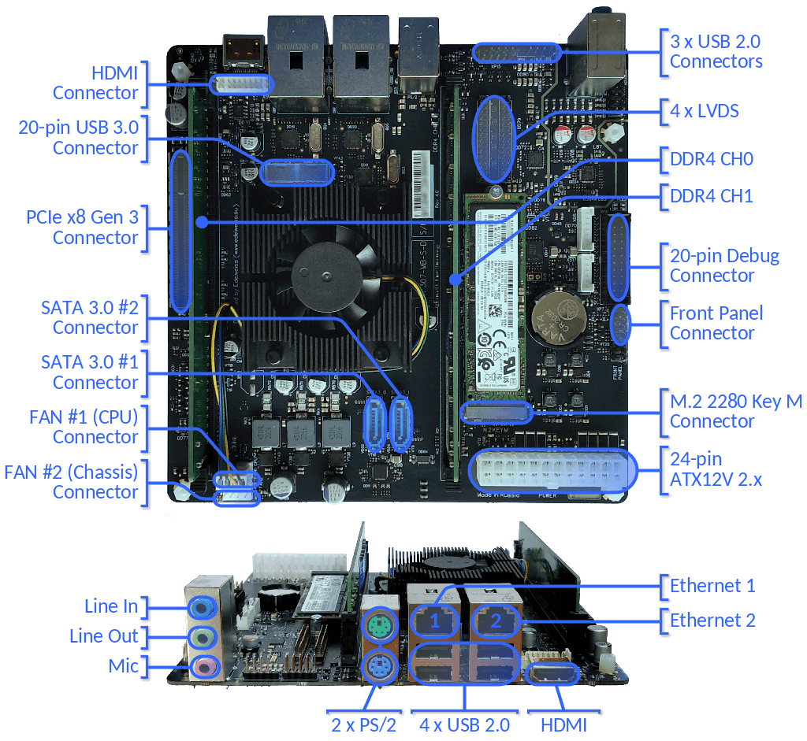

# meta-tanowrt-hsl-baikal

[TanoWrt](https://github.com/tano-systems/meta-tanowrt) hardware support layer for the Baikal Electronics SoC boards.


## 1 Supported Hardware

TanoWrt has demonstration support for some devices and development boards based on Baikal Electronics processors. All supported devices are listed in the table below.

| Device                                          | Cores x SoC                    | RAM               | Supported Storage(s)   |
| ----------------------------------------------- | ------------------------------ | ----------------- | ---------------------- |
| [Baikal MBM 1.0/2.0](#11-mbm-board)             | 8 x Baikal-M BE-M1000, 1.5 GHz | up to 64 GiB DDR4 | USB, HDD, NVMe         |

**Note:** *Support for HDD and NVMe storages is under development. Currently supported running TanoWrt only from USB flash drive.*

---------------------------------------------------------------------------------------------------

### 1.1 Baikal MBM 1.0/2.0 Boards

Official page: https://edelweiss-tech.ru/product/komplektuyushchie-edelveys/platy-edelveys/plata-na-baykal-m/

The image below shows the MBM 2.0 board (TF307). The MBM 1.0 board has a similar design and only minor differences.



#### 1.1.1 Machines

For MBM 1.0/2.0 boards there are a few machines available listed in the table below.

| Machine           | Description                                                |
| ----------------- | ---------------------------------------------------------- |
| `mbm10`           | TanoWrt for MBM 1.0 Board running from USB flash drive     |
| `mbm20`           | TanoWrt for MBM 2.0 Board running from USB flash drive     |

#### 1.1.2 Supported Images

| Image Recipe                     | Machine(s)             | Description                                                                     |
| -------------------------------- | ---------------------- | ------------------------------------------------------------------------------- |
| `tanowrt-image-base`             | *All*                  | TanoWrt base root file system image                                             |
| `tanowrt-image-full`             | *All*                  | TanoWrt full featured root file system image                                    |
| `tanowrt-image-full-swu`         | *All*                  | TanoWrt full featured SWU firmware upgrade image                                |

##### 1.1.2.1 Images with Qt5

| Image Recipe                     | Machine(s)             | Description                                                               |
| -------------------------------- | ---------------------- | ------------------------------------------------------------------------- |
| `tanowrt-image-qt5`              | *All*                  | TanoWrt full featured image with Qt5                                      |
| `tanowrt-image-qt5-swu`          | *All*                  | TanoWrt full featured with Qt5 SWU firmware upgrade image                 |

---------------------------------------------------------------------------------------------------

#### 1.1.3 Build and Run

##### 1.1.3.1 TanoWrt on USB Flash

###### 1.1.3.1.1 Build USB Flash Image

To build TanoWrt image for the USB flash drive use the following command:

```
MACHINE=mbm20 bitbake tanowrt-image-full
```

When the build is complete, the USB flash image file will be located in folder (relative to build folder):

```
./tanowrt-glibc/deploy/images/mbm10/tanowrt-image-full-mbm20.wic
```

###### 1.1.3.1.2 Writing Image to the USB Flash

Use the `dd` utility to write the generated `.wic` image to the USB flash drive.

For example:

```
dd if=~/tanowrt/build/tanowrt-glibc/deploy/images/mbm20/tanowrt-image-full-mbm20.wic \
   of=/dev/sdc
```

###### 1.1.3.1.3 Running TanoWrt from USB Flash

*TODO: ...*

###### 1.1.3.1.4 Build Firmware Upgrade Image

To build firmware upgrade SWU image use following command:

```
MACHINE=mbm20 bitbake tanowrt-image-full-swu
```

When the build is complete, the SWU firmware upgrade image file will be located in folder (relative to build folder):

```
./tanowrt-glibc/deploy/images/mbm20/tanowrt-image-full-mbm20.swu
```

This image can be used for upgrading firmware via the LuCI web interface on the MBM 2.0 board running from the USB flash drive.

#### 1.1.4 MBM 1.0/2.0 Default Network Configuration

By default, network ports Ethernet 1 (`eth0`) and Ethernet 2 (`eth1`) are joined into a bridge (`br-lan` interface) with the RSTP protocol enabled. Bridge (`br-lan`) configured with static IP address 192.168.0.1/24 with enabled DHCP server.

Ethernet ports 1 (`eth0`) and 2 (`eth1`) have enabled LLDP by default.

The web-configuration interface can be accessed via Ethernet ports through HTTP(S) protocol. You must see something like this in browser:


---------------------------------------------------------------------------------------------------

## 2 Build Prerequisites

Follow the instructions outlined in "[Prerequisites](../README.md#1-Prerequisites)" section of the root README.md.

## 3 Initialize Repositories

Create a working directory (this document uses `~/tanowrt` for example):
```shell
mkdir -p ~/tanowrt
```

Go to the created working directory and execute repo tool:
```shell
cd ~/tanowrt
repo init -u https://github.com/tano-systems/meta-tanowrt \
          -m meta-tanowrt-hsl-baikal/manifests/tanowrt.xml \
          -b hardknott
```

Synchronize all repositories by executing a command:
```shell
repo sync
```

## 4 Initialize Build Environment

Go to the working directory (`~/tanowrt`):
```shell
cd ~/tanowrt
```

You should see the following working directory tree:
```
.
├── bitbake
├── meta -> openembedded-core/meta
├── meta-openembedded
├── meta-qt5
├── meta-swupdate
├── meta-tanowrt
├── oe-init-build-env -> openembedded-core/oe-init-build-env
├── openembedded-core
└── scripts -> openembedded-core/scripts
```

The first time you need to add layers and create `local.conf` from the template. To do this, run the command:
```shell
TEMPLATECONF=meta-tanowrt/meta-tanowrt-hsl-baikal/templates . ./oe-init-build-env
```

If you want to build image with Qt5 support (e.g. `tanowrt-image-qt5`) you need to use `meta-tanowrt/meta-tanowrt-hsl-baikal/templates/qt5` path in `TEMPLATECONF`:
```shell
TEMPLATECONF=meta-tanowrt/meta-tanowrt-hsl-baikal/templates/qt5 . ./oe-init-build-env
```

This command automatically creates a `build` subdirectory with the required configuration (`local.conf` and `bblayers.conf`) based on the specified template.

If the `build` subdirectory with configuration has already been created, this command can be used to initialize build environment (without specifying a template directory):
```shell
. ./oe-init-build-env
```

After executing `oe-init-build-env` script, the current directory will be automatically changed to `build` subdirectory of the working directory. Any build commands must be always run from the `build` subdirectory.

Depending on your processor, set these two options in the `~/tanowrt/build/conf/local.conf` file which control how much parallelism BitBake should use:
```
BB_NUMBER_THREADS = "8"
PARALLEL_MAKE = "-j 8"
```

## 5 Access

The following credentials are used to access the operating system (terminal) and the LuCI web-configuration interface:
* User name: `root`
* Password: `root`

## 6 Dependencies

This layer depends on the [meta-tanowrt](../meta-tanowrt/README.md) layer (TanoWrt Linux distribution core layer) with all its dependencies.

No additional dependencies.

## 7 License

All metadata is MIT licensed unless otherwise stated. Source code included in tree for individual recipes is under the LICENSE stated in each recipe (.bb file) unless otherwise stated.

## 8 Maintainers

Anton Kikin <a.kikin@tano-systems.com>
