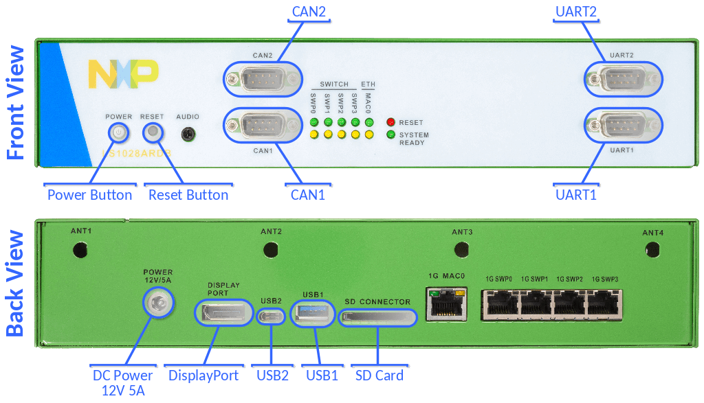
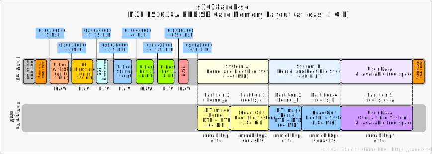

# meta-tanowrt-hsl-nxp

[TanoWrt](https://github.com/tano-systems/meta-tanowrt) hardware support layer for the NXP (Freescale) boards.


## 1 Supported Hardware

TanoWrt has demonstration support for some devices and development boards based on NXP processors. All supported devices are listed in the table below.

| Device                                                                   | Cores x SoC          | RAM          | Supported Storage(s)   |
| ------------------------------------------------------------------------ | -------------------- | ------------ | ---------------------- |
| [NXP LS1028A RDB board](#11-ls1028a-rdb-board)                           | 2 x LS1028A, 1.3 GHz | 4 GiB DDR4   | SD card, 8 GB eMMC     |

---------------------------------------------------------------------------------------------------

### 1.1 LS1028A RDB Board

Official page: https://www.nxp.com/design/qoriq-developer-resources/ls1028a-development-board:LS1028ARDB



#### 1.1.1 Machines

For LS1028A RDB board there are a few machines available listed in the table below.

| Machine           | Description                                                |
| ----------------- | ---------------------------------------------------------- |
| `ls1028ardb-emmc` | TanoWrt for running on internal eMMC flash (recommended)   |
| `ls1028ardb-sd`   | TanoWrt for running on SD card                             |

#### 1.1.2 Supported Images

| Image Recipe                     | Machine(s)             | Description                                                                     |
| -------------------------------- | ---------------------- | ------------------------------------------------------------------------------- |
| `tanowrt-image-base`             | *All*                  | TanoWrt base root file system image                                             |
| `tanowrt-image-full`             | *All*                  | TanoWrt full featured root file system image                                    |
| `tanowrt-image-full-swu`         | *All*                  | TanoWrt full featured SWU firmware upgrade image                                |
| `tanowrt-image-full-swu-factory` | Only `ls1028ardb-emmc` | Factory installation SD card image for the firmware on the internal eMMC flash  |

##### 1.1.2.1 Images with Qt5

| Image Recipe                     | Machine(s)             | Description                                                               |
| -------------------------------- | ---------------------- | ------------------------------------------------------------------------- |
| `tanowrt-image-qt5`              | *All*                  | TanoWrt full featured image with Qt5                                      |
| `tanowrt-image-qt5-swu`          | *All*                  | TanoWrt full featured SWU firmware upgrade image                          |
| `tanowrt-image-qt5-swu-factory`  | Only `ls1028ardb-emmc` | Factory installation SD card image for the `tanowrt-image-qt5-swu` image  |

#### 1.1.3 Boot Source Selection

DIP switches SW2[1:4] on the LS1028A RDB board are used to select the boot source. The DIP switches settings for all supported boot sources are shown in the figure and table below.


| Boot Source       | SW2[1:4] Settings |
| ----------------- | ----------------- |
| SDHC1 (SD Card)   | `1000`            |
| SDHC2 (eMMC)      | `1001`            |
| XSPI (NAND)       | `1101`            |
| XSPI (NOR)        | `1111`            |

Also you can switch the boot source in runtime from the U-Boot command line using the command `qixis_reset`:
- `qixis_reset sd` - switch to SDHC1 (SD Card);
- `qixis_reset emmc` - switch to SDHC2 (eMMC);
- `qixis_reset` - switch to XSPI (NOR).

#### 1.1.4 Build and Run

TanoWrt on LS1028A RDB board can be run from [SD card](#1141-tanowrt-on-sd-card-ls1028ardb-sd) (at least 1 GiB) or from internal [eMMC flash](#1142-tanowrt-on-emmc-flash-ls1028ardb-emmc) (8 GB). Running from internal [NOR flash](#1143-tanowrt-on-nor-flash-ls1028ardb-nor) and internal [NAND flash](#1143-tanowrt-on-nand-flash-ls1028ardb-nand) currently is not supported in TanoWrt.

##### 1.1.4.1 TanoWrt on SD Card (`ls1028ardb-sd`)

The partitioning and data layout of the SD card image for the LS1028A RDB board are shown in the figure below.



###### 1.1.4.1.1 Build SD Card Image

To build TanoWrt image for the SD card use the following command:

```
MACHINE=ls1028ardb-sd bitbake tanowrt-image-full
```

When the build is complete, the SD card image file will be located in folder (relative to build folder):

```
./tanowrt-glibc/deploy/images/ls1028ardb-sd/tanowrt-image-full-ls1028ardb-sd.sdcard.img
```

###### 1.1.4.1.2 Writing Image to the SD Card

Use the `dd` utility to write the generated `.sdcard.img` image to the SD card.

For example:

```
dd if=~/tanowrt/build/tanowrt-glibc/deploy/images/ls1028ardb-sd/tanowrt-image-full-ls1028ardb-sd.sdcard.img \
   of=/dev/mmcblk1 \
   bs=1k
```

###### 1.1.4.1.3 Running TanoWrt from SD Card

1. Power off board.
2. Refer section [1.1.3](#113-boot-source-selection) to select boot source to SDHC1 (SD Card).
3. Insert the prepared SD card into the slot on the LS1028A RDB board
4. Power on board.
5. System from SD card will be booting.
6. For login use credentials specified in "[Access](#6-access-credentials)" section.

After system is booted you can access to the system console over UART1 port.

###### 1.1.4.1.4 Build Firmware Upgrade Image

To build firmware upgrade SWU image use following command:

```
MACHINE=ls1028ardb-sd bitbake tanowrt-image-full-swu
```

When the build is complete, the SWU firmware upgrade image file will be located in folder (relative to build folder):

```
./tanowrt-glibc/deploy/images/ls1028ardb-sd/tanowrt-image-full-ls1028ardb-sd.swu
```

This image can be used for upgrading firmware via the LuCI web interface on the LS1028A RDB board running from the SD card.

##### 1.1.4.2 TanoWrt on eMMC Flash (`ls1028ardb-emmc`)

The partitioning and data layout on the internal eMMC flash for the LS1028A RDB board are shown in the figure below.


The ROM2 (Boot Partition 1, `/dev/mmcblk1boot0`) and ROM3 (Boot Partition 2, `/dev/mmcblk1boot1`) eMMC hardware partitions are currently not used.

###### 1.1.4.2.1 Build Installation Image

For the first TanoWrt installation to the eMMC flash memory you need to build an installation image for the SD card. Booting from this SD card will install TanoWrt to the internal eMMC flash memory.

To build eMMC installation SD-card image use the following command:

```
MACHINE=ls1028ardb-emmc bitbake tanowrt-image-full-swu-factory
```

When the build is complete, the eMMC installation SD card image file will be located in folder (relative to build folder):

```
./tanowrt-glibc/deploy/images/ls1028ardb-emmc/tanowrt-image-full-swu-factory-ls1028ardb-emmc.sdcard.img
```

###### 1.1.4.2.2 Writing eMMC Installation Image to the SD Card

See section [1.1.4.1.2](#11412-writing-image-to-the-sd-card).

###### 1.1.4.2.3 Running eMMC Installation

Run eMMC installation image from the SD card as described in section [1.1.4.1.3](#11413-running-tanowrt-from-sd-card).

The installation of TanoWrt to the internal eMMC flash memory will be done automatically. The detailed installation log is available on the UART1. After the installation is complete, the board will shut down automatically.

To boot installed system from the internal eMMC flash you need to refer section [1.1.3](#113-boot-source-selection) for selecting SDHC2 (eMMC) boot source. Once this has been done, on the next power up of the board, TanoWrt will work from the internal eMMC flash memory.

**Note:** Be aware that during the installation all existing data on the internal eMMC flash memory will be permanently lost.

###### 1.1.4.2.4 Build Firmware Upgrade Image

To build firmware upgrade SWU image use following command:

```
MACHINE=ls1028ardb-emmc bitbake tanowrt-image-full-swu
```

When the build is complete, the SWU firmware upgrade image file will be located in folder (relative to build folder):

```
./tanowrt-glibc/deploy/images/ls1028ardb-emmc/tanowrt-image-full-ls1028ardb-emmc.swu
```

This image can be used for upgrading firmware via the LuCI web interface on the LS1028A RDB board running from the eMMC flash.

##### 1.1.4.3 TanoWrt on NAND Flash (`ls1028ardb-nand`)

*Currently is unsupported.*

##### 1.1.4.4 TanoWrt on NOR Flash (`ls1028ardb-nor`)

*Currently is unsupported.*

#### 1.1.5 LS1028A RDB Default Network Configuration


By default, network ports SWP0, SWP1, SWP2 and SWP3 are joined into a bridge (`br-lan` interface) with the RSTP protocol enabled. Bridge `br-lan` is in the LAN firewall zone. By default, the IP address on the `br-lan` bridge is configured using a DHCP client.

The network port MAC0 (interface `eno0`) is a separate network interface included in the WAN firewall zone with enabled translation (NAT) from LAN zone. The IP address of the `eno0` interface is also configured with a DHCP client. A firewall with blocking rules for incoming traffic is enabled on the `eno0` interface. Therefore, there is no access to the web configuration interface through this interface.

Ethernet ports SWP0 (`swp0`), SWP1 (`swp1`), SWP2 (`swp2`), SWP3 (`swp3`) and MAC0 (`eno0`) have enabled LLDP by default.

The web-configuration interface can be accessed via any of the SWP0–3 ports through HTTP(s) protocol. You must see something like this in browser:


---------------------------------------------------------------------------------------------------

## 2 Build Prerequisites

Follow the instructions outlined in "[Prerequisites](../README.md#1-Prerequisites)" section of the root README.md.

## 3 Initialize Repositories

Create a working directory (this document uses `~/tanowrt` for example):
```shell
mkdir -p ~/tanowrt
```

Go to the created working directory and execute repo tool:
```shell
cd ~/tanowrt
repo init -u https://github.com/tano-systems/meta-tanowrt \
          -m meta-tanowrt-hsl-nxp/manifests/tanowrt.xml \
          -b hardknott
```

Synchronize all repositories by executing a command:
```shell
repo sync
```

## 4 Initialize Build Environment

Go to the working directory (`~/tanowrt`):
```shell
cd ~/tanowrt
```

You should see the following working directory tree:
```
.
├── bitbake
├── meta -> openembedded-core/meta
├── meta-freescale
├── meta-openembedded
├── meta-qt5
├── meta-swupdate
├── meta-tanowrt
├── oe-init-build-env -> openembedded-core/oe-init-build-env
├── openembedded-core
└── scripts -> openembedded-core/scripts
```

The first time you need to add layers and create `local.conf` from the template. To do this, run the command:
```shell
TEMPLATECONF=meta-tanowrt/meta-tanowrt-hsl-nxp/templates . ./oe-init-build-env
```

If you want to build image with Qt5 support (e.g. `tanowrt-image-qt5`) you need to use `meta-tanowrt/meta-tanowrt-hsl-nxp/templates/qt5` path in `TEMPLATECONF`:
```shell
TEMPLATECONF=meta-tanowrt/meta-tanowrt-hsl-nxp/templates/qt5 . ./oe-init-build-env
```

This command automatically creates a `build` subdirectory with the required configuration (`local.conf` and `bblayers.conf`) based on the specified template.

If the `build` subdirectory with configuration has already been created, this command can be used to initialize build environment (without specifying a template directory):
```shell
. ./oe-init-build-env
```

After executing `oe-init-build-env` script, the current directory will be automatically changed to `build` subdirectory of the working directory. Any build commands must be always run from the `build` subdirectory.

Depending on your processor, set these two options in the `~/tanowrt/build/conf/local.conf` file which control how much parallelism BitBake should use:
```
BB_NUMBER_THREADS = "8"
PARALLEL_MAKE = "-j 8"
```

## 5 Freescale EULA

To build any images with this layer you need to read and accept the Freescale EULA located in the `EULA` file at the root of the `meta-freescale` layer (`~/tanowrt/meta-freescale/EULA`).

If you accept the Freescale EULA, you must manually add the following line to `local.conf` file (`~/tanowrt/build/conf/local.conf`):

```
ACCEPT_FSL_EULA = "1"
```

## 6 Access

The following credentials are used to access the operating system (terminal) and the LuCI web-configuration interface:
* User name: `root`
* Password: `root`

## 7 Dependencies

This layer depends on the [meta-tanowrt](../meta-tanowrt/README.md) layer (TanoWrt Linux distribution core layer) with all its dependencies.

Additional dependencies are listed here:

* meta-freescale  
  URI: <git://git.yoctoproject.org/meta-freescale>  
  Branch: hardknott

The current exact revisions of all listed dependencies are given in [manifests/deps.xml](manifests/deps.xml).

## 8 License

All metadata is MIT licensed unless otherwise stated. Source code included in tree for individual recipes is under the LICENSE stated in each recipe (.bb file) unless otherwise stated.

## 9 Maintainers

Anton Kikin <a.kikin@tano-systems.com>
