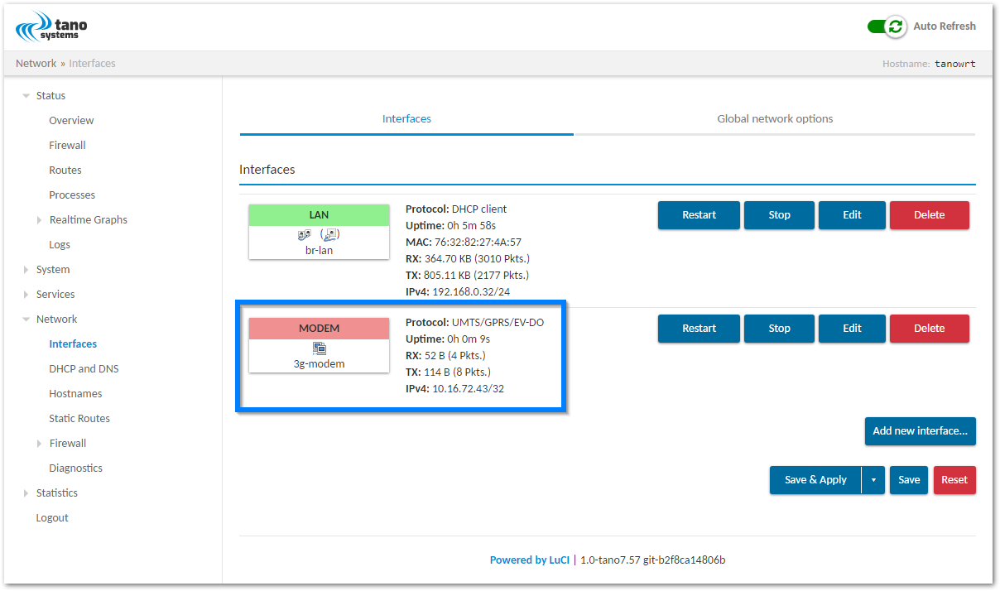
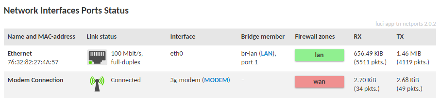
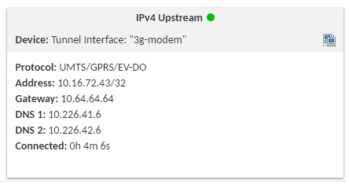

# meta-tanowrt-hsl-swi

[TanoWrt](https://github.com/tano-systems/meta-tanowrt) hardware support layer for the Sierra Wireless LTE modules.

## Supported Modules

<p align="middle">
 
</p>

| Module                                                                                                                                      |
| ------------------------------------------------------------------------------------------------------------------------------------------- |
| Sierra Wireless AirPrime [WP7607](https://www.sierrawireless.com/products-and-solutions/embedded-solutions/products/wp7607/) IoT Module     |
| Sierra Wireless AirPrime [WP7607-1](https://www.sierrawireless.com/products-and-solutions/embedded-solutions/products/wp7607-1/) IoT Module |

Support for the following modules is planned:
- Sierra Wireless AirPrime [WP7702](https://www.sierrawireless.com/products-and-solutions/embedded-solutions/products/wp7702/) LPWA module.

## Supported Carrier Boards

| `MACHINE`             | Board(s)                                                                                                                                                                                                                                                                      |
| --------------------- | ----------------------------------------------------------------------------------------------------------------------------------------------------------------------------------------------------------------------------------------------------------------------------- |
| `mangoh-green-wp7607` | [mangOH Green](https://mangoh.io/mangoh-green) with [WP7607](https://www.sierrawireless.com/products-and-solutions/embedded-solutions/products/wp7607/) or [WP7607-1](https://www.sierrawireless.com/products-and-solutions/embedded-solutions/products/wp7607-1/) LTE module |

In the near future it is planned to implement support for the following carrier boards:
- [mangOH Red](https://mangoh.io/mangoh-red);
- [mangOH Yellow](https://mangoh.io/mangoh-yellow).

## Supported Images

| Image (recipe)       | Description                                   |
| -------------------- | --------------------------------------------- |
| `tanowrt-image-full` | Default full TanoWrt image with base packages |

## Prerequisites

Follow the instructions outlined in "[Prerequisites](../README.md#Prerequisites)" section of the root README.md.

### Install swiflash command line tool

This utility is required for writing (flashing) CWE (SPK) image to the device.

If you using Ubuntu ≥16.04, you can install the tool using the following commands:

```shell
wget https://downloads.sierrawireless.com/tools/swiflash/swiflash_latest.deb -O /tmp/swiflash_latest.deb
sudo apt-get install /tmp/swiflash_latest.deb
```

To install the tool on other systems, follow the instructions outlined [here](https://source.sierrawireless.com/resources/airprime/software/swiflash/).

## Initialize Repositories

Create a working directory (this document uses `~/tanowrt` for example):

```shell
mkdir -p ~/tanowrt
```

Go to the created working directory and execute repo tool:

```shell
cd ~/tanowrt
repo init -u https://github.com/tano-systems/meta-tanowrt \
          -m meta-tanowrt-hsl-swi/manifests/tanowrt.xml \
          -b master
```

Synchronize all repositories by executing a command:

```shell
repo sync
```

## Initialize Build Environment

Go to the working directory (`~/tanowrt`):

```shell
cd ~/tanowrt
```

You should see the following working directory tree:

```
.
├── bitbake
├── LICENSE
├── LICENSE.GPL-2.0-only
├── LICENSE.MIT
├── meta
├── meta-openembedded
├── meta-selftest
├── meta-skeleton
├── meta-swi
├── meta-tanowrt
├── oe-init-build-env
├── README.LSB
├── README.OE-Core
├── README.qemu
└── scripts
```

The first time you need to add layers and create `local.conf` from the template. To do this, run the command:

```shell
TEMPLATECONF=meta-tanowrt/meta-tanowrt-hsl-swi/templates . ./oe-init-build-env
```

This command automatically creates a `build` subdirectory with the required configuration (`local.conf` and `bblayers.conf`) based on the specified template.

If the `build` subdirectory with configuration has already been created, this command can be used to initialize build environment (without specifying a template directory):

```shell
. ./oe-init-build-env
```

After executing `oe-init-build-env` script, the current directory will be automatically changed to `build` subdirectory of the working directory. Any build commands must be always run from the `build` subdirectory.

## Building

To build images for required device run following command:

```shell
MACHINE=<MACHINE> bitbake <imagename>
```

Where `<MACHINE>` should be replaced by one of the [supported machine](#supported-carrier-boards), and `<imagename>` by one of the [supported images](#supported-images).

For example, to build `tanowrt-image-full` image for mangOH Green with WP7607 (or WP7607-1) module run following command:

```shell
MACHINE=mangoh-green-wp7607 bitbake tanowrt-image-full
```

> Please be patient, the complete build may take a long time. Approximate build time (with the fetching of all sources from internet) is **90 minutes** for a virtual machine with 4 cores of Intel Core i7-7700K 4.2 GHz processor, 16 GiB RAM and NVMe drive, and the following parameters in `local.conf`:
>
> ```
> BB_NUMBER_THREADS = "4"
> PARALLEL_MAKE = "-j 4"
> ```

When the build is complete, the following CWE and SPK images are generated, located in the `./tanowrt-glibc/deploy/images/mangoh-green-wp7607/` directory:

| Image                                    | Format  | Description                                                            |
| ---------------------------------------- | ------- | ---------------------------------------------------------------------- |
| `<imagename>-<MACHINE>.wp76xx.spk`       | CWE     | Bootloader, linux kernel and root filesystem                           |
| `<imagename>-<MACHINE>.wp76xx.clean.spk` | CWE     | Bootloader, linux kernel, root filesystem and empty overlay filesystem |

Where `<imagename>` is replaced by the name of the image built, and `<MACHINE>` is replaced by `MACHINE` value. For example, if the `tanowrt-image-full` image was built for `mangoh-green-wp7607` machine, then image `<imagename>-<MACHINE>.wp76xx.spk` will be named `tanowrt-image-full-mangoh-green-wp7607.wp76xx.spk`.

## Running on Hardware

### mangOH Green (`mangoh-green-wp7607`)

<p align="middle">
 
</p>

#### Flashing Image to Device

Note that when flashing the `<imagename>-<MACHINE>.wp76xx.spk` images (see "[Building](#building)" section), user data in overlayfs are not cleared. This allows flashing of a new system while keeping the user configuration. However, it can also cause issues with the new firmware as it may not update some important files. **So we recommend that you always flash the image `<imagename>-<MACHINE>.wp76xx.clean.spk`**, especially at the first flashing of a new device where there was another system different from TanoWrt.

To write the builded image to the device, follow these steps:

1.  Power off mangOH Green board.
2.  Turn SW401-7 (TP1_BOOT) DIP switch to ON state.
3.  Connect mangOH Green board with your PC via micro-USB cable (connector CN311).
4.  Power on mangOH Green board.
5.  Run the [swiflash](#install-swiflash-command-line-tool) utility on your PC as follows:

    ```shell
    swiflash -m wp76xx -i <path-to-image> -p <port>
    ```

    Here:
    - `<path-to-image>` — path to image file in the CWE (SPK) format;
    - `<port>` — USB port that will be used to firmware downloading. You can use any path from "/dev/serial/by-path" or "/dev/serial/by-id".

    Example:

    ```shell
    swiflash -m wp76xx \
        -p /dev/serial/by-id/usb-Sierra_Wireless__Incorporated_Sierra_Wireless_WP7607_VN91720016071042 \
        -i ~/tanowrt/build/tanowrt-glibc/deploy/images/mangoh-green-wp7607/tanowrt-image-full-mangoh-green-wp7607.wp76xx.clean.spk
    ```

6.  Wait until the flashing is complete.
7.  Power off mangOH Green board.
8.  Turn SW401-7 (TP1_BOOT) DIP switch back to OFF state.
9.  Power on mangOH Green board.
10. Flashed system will be booting.

#### Booting

At startup, the bootloader and Linux kernel log messages are outputed to the serial port UART2 (RS232 DB9 connector CN700 on board) with the following parameters:

- Baud rate: 115200
- Data bits: 8
- Stop bits: 1
- Parity: none
- Flow control: none

When the system boot is complete, a terminal will be accessible on the UART2 port. For login use credentials described in the "[Access](#access)" section.

## Default Network Configuration

By default configured and enabled only `eth0` interface with static IPv4 address 192.168.10.1 with enabled DHCP server on it.

The web-configuration interface can be accessed via `eth0` interface through HTTP(s) protocol. You must see something like this in browser:


Modem data connection interface `3g-modem` disabled by default. You need to manually [configure](#setup-modem-data-connection) it for enabling (see next section).

## Setting Up a Modem Data Connection

1.  Connect the mangOH Green board (connector CN1100) to your PC with ethernet cable (RJ45 connectors at both ends).
2.  Go to the web interface (default IP is 192.168.10.1) of the mangOH Green board and login using credentials described in the "[Access](#access)" section.
3.  Go to network interfaces configuration page ("Network -> Interfaces" in main menu)
4.  Click the "Edit" button on the "MODEM" interface line:

	

5.  Verify interface settings in the opened modal window:

	- Modem device should be set to "/dev/ttyAT";
	- Service type should be set to "UMTS/GPRS".

	

6.  Enter the valid values for the APN (Access Point Name) and authentification options (PAP/CHAP username and password). The correct values for this options depends on your mobile operator. Here is a list of APN and authentification values for primary mobile operators in the Russian Federation:

	| Mobile Operator | APN                   | User name    | Password     |
	| --------------- | --------------------- | ------------ | ------------ |
	| MTS             | `internet.mts.ru`     | *keep empty* | *keep empty* |
	| Megafon         | `internet`            | `gdata`      | `gdata`      |
	| Beeline         | `internet.beeline.ru` | `beeline`    | `beeline`    |
	| Tele2           | `internet.tele2.ru`   | *keep empty* | *keep empty* |
	| Yota            | `internet.yota`       | *keep empty* | *keep empty* |

7.  If your SIM card is locked by a PIN code, enter the PIN in the corresponding field.
8.  If you need to automatically start the interface at system startup, enable "Bring up on boot" checkbox.
9.  Click the "Save" button
10. Click the "Save & Apply" button

	

11. Wait between 5 to 20 seconds for the connection to be established.
12. The interface of the connected modem on the "Network interfaces" page should look as shown in the screenshot:

	

13. You can also see the connection status for the modem interface on the main page of the web-interface in the section "Network Interfaces Ports Status":

	

14. A new "IPv4 Upstream" interface for modem should also appear in the "Network" section of the main page:

	


## Used Flash Partitions

Here is a list of used by system MTD partitions and their descriptions.

| MTD   | Name    |     Size | Description                          |
| ----- | ------- | -------: | ------------------------------------ |
| mtd11 | aboot   |    1 MiB | Little Kernel (LK) bootloader        |
| mtd12 | boot    |   15 MiB | Linux kernel                         |
| mtd13 | system  |   30 MiB | Read-only root filesystem (squashfs) |
| mtd14 | lefwkro | 8.75 MiB | *Unused*                             |
| mtd15 | swirw   |   25 MiB | *Unused*                             |
| mtd16 | userapp |  131 MiB | Overlay filesystem (ubifs)           |

All user data are stored in overlayfs in partition mtd16 (userapp). Data in this partition cleared when flashing to device `<imagename>-<MACHINE>.wp76xx.clean.spk` [images](#building). You can also clean up this partition manually using the command:
```
jffs2reset -r -y
```
or over web-interface LuCI (see "Restore" section in "System -> Backup").

## Access

The following credentials are used to access the operating system (terminal) and the LuCI web-configuration interface:
* User name: `root`
* Password: `root`

## Limitations

This layer has very little support for the modem hardware. Using this layer you can only set up a PPP connection using the internal modem AT command port. This is all the capabilities of this layer for using modem hardware.

For support more sophisticated features of the modem hardware, an additional `meta-tanowrt-hsl-swi-extras` layer is required. Extra `meta-tanowrt-hsl-swi-extras` layer is a [TanoWrt](https://github.com/tano-systems/meta-tanowrt) hardware support layer for the Sierra Wireless modules contains recipes for proprietary/commercial software. Extra `meta-tanowrt-hsl-swi-extras` layer provides support for the following features:
- partial or full firmware update over web-interface (LuCI);
- control and monitor over web-interface (LuCI) or/and ubus modem data connection (supported LTE/UMTS/GSM modes);
- control and monitor over web-interface (LuCI) or/and ubus GNSS subsystem;
- receiving and sending SMS over web-interface (LuCI) or/and ubus with notifications (full UCS2 alphabet support);
- [Legato Framework](https://legato.io/);
- *and much more...*

Sources of `meta-tanowrt-hsl-swi-extras` layer cannot be published publicly due to Qualcomm Inc. and Sierra Wireless Inc. proprietary licenses restrictions but can be provided commercially. Please contact Tano Systems LLC for details.

## Dependencies

This layer depends on the [meta-tanowrt](../meta-tanowrt/README.md) layer (TanoWrt Linux distribution core layer) with all its dependencies.

Additional dependencies are listed here:

* meta-swi/common  
  URI: <https://gitlab.com/legato.io/meta-swi.git>  
  Subdirectory: common  
  Branch: yocto-2.7-ref  
* meta-swi/meta-swi-mdm9x28  
  URI: <https://gitlab.com/legato.io/meta-swi.git>  
  Subdirectory: meta-swi-mdm9x28  
  Branch: yocto-2.7-ref  
* meta-swi/meta-swi-mdm9xxx  
  URI: <https://gitlab.com/legato.io/meta-swi.git>  
  Subdirectory: meta-swi-mdm9xxx  
  Branch: yocto-2.7-ref  

The current exact revisions of all listed dependencies are given in [manifests/deps.xml](manifests/deps.xml).

## License

All metadata is MIT licensed unless otherwise stated. Source code included in tree for individual recipes is under the LICENSE stated in each recipe (.bb file) unless otherwise stated.

## Maintainers

Anton Kikin <a.kikin@tano-systems.com>
