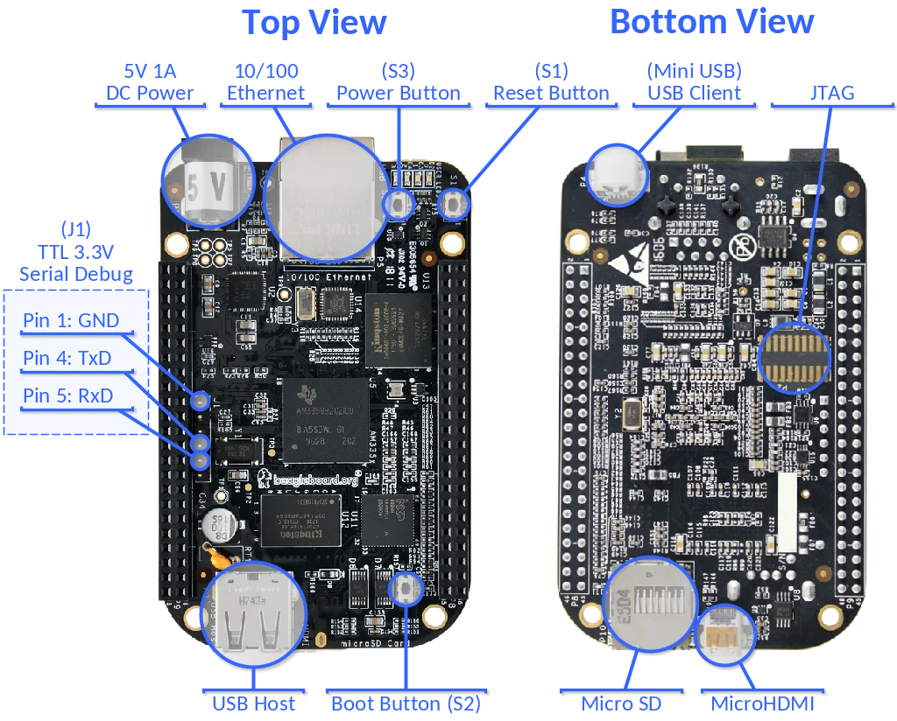
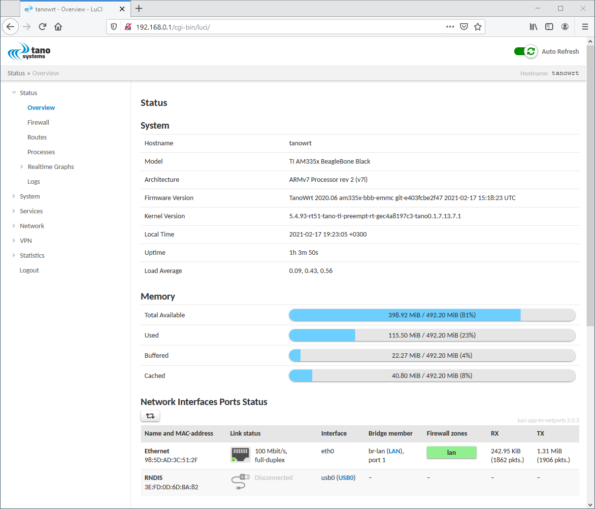
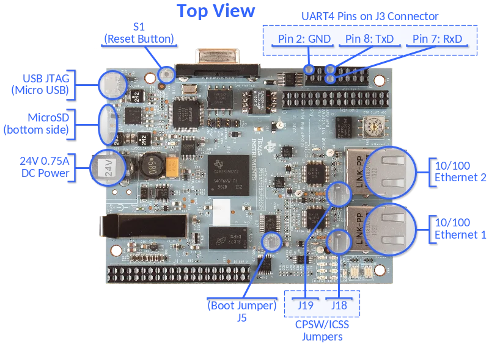
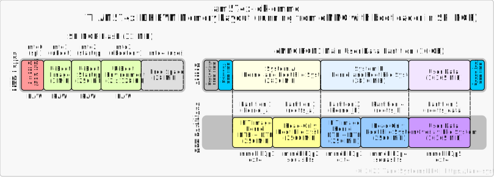

# meta-tanowrt-hsl-ti

[TanoWrt](https://github.com/tano-systems/meta-tanowrt) hardware support layer for the Texas Instruments (TI) SoC based boards.


This layer contains various parts (recipes, files, etc.) from the [meta-arago](http://arago-project.org/git/meta-arago.git) and [meta-processor-sdk](http://arago-project.org/git/projects/meta-processor-sdk.git) layers.

## 1 Supported Hardware

TanoWrt has demonstration support for some devices and development boards based on TI SoCs. All supported devices are listed in the table below.

| Device                                                                   | Cores x SoC         | RAM          | Supported Storage(s)   |
| ------------------------------------------------------------------------ | ------------------- | ------------ | ---------------------- |
| [BeagleBone Black](#11-beaglebone-black)                                 | 1 x AM3358, 1 GHz   | 512 MiB DDR3 | MicroSD, 4 GB eMMC     |
| [TI AM3359 ICEv2 EVM](#12-ti-am3359-icev2-evm-tmdsice3359) (TMDSICE3359) | 1 x AM3359, 800 MHz | 256 MiB DDR3 | MicroSD                |
| [TI AM574x IDK EVM](#13-ti-am574x-idk-evm-tmdsidk574) (TMDSIDK574)       | 2 x AM5748, 1.5 GHz | 2 GiB DDR3   | MicroSD, 16 GB eMMC    |

---------------------------------------------------------------------------------------------------

### 1.1 BeagleBone Black

Official page: https://beagleboard.org/black



#### 1.1.1 Machines

For BeagleBone Black board there are a few machines available listed in the table below.

| Machine           | Description                                                |
| ----------------- | ---------------------------------------------------------- |
| `am335x-bbb-emmc` | TanoWrt for running on internal eMMC flash (recommended)   |
| `am335x-bbb-sd`   | TanoWrt for running on SD card                             |

#### 1.1.2 Supported Images

| Image Recipe                     | Machine(s)             | Description                                                           |
| -------------------------------- | ---------------------- | --------------------------------------------------------------------- |
| `tanowrt-image-base`             | *All*                  | TanoWrt base root file system image                                   |
| `tanowrt-image-full`             | *All*                  | TanoWrt full featured root file system image                          |
| `tanowrt-image-full-swu`         | *All*                  | TanoWrt full featured SWU firmware upgrade image                      |
| `tanowrt-image-full-swu-factory` | Only `am335x-bbb-emmc` | Factory installation SD card image for the firmware on the eMMC flash |

#### 1.1.3 Build and Run

TanoWrt on BeagleBone Black board can be run from MicroSD card (at least 1 GiB) or from internal eMMC flash (3648 MiB).

##### 1.1.3.1 TanoWrt on eMMC Flash (`am335x-bbb-emmc`)

The partitioning and data layout on the internal eMMC flash for the BeagleBone Black board are shown in the figure below.


The ROM2 (Boot Partition 1, `/dev/mmcblk1boot0`) and ROM3 (Boot Partition 2, `/dev/mmcblk1boot1`) eMMC hardware partitions are currently not used. TI AM335x devices do not support booting from eMMC boot partitions. Only boot from user area is supported.

In the future, it is planned to use SPL (MLO) to select the partition depending on the Boot Partition [179] register value from the EXTCSD area. On boot partitions it is planned to store redundant U-Boot and startup script images.

###### 1.1.3.1.1 Build Installation Image

For the first TanoWrt installation to the eMMC flash memory you need to build an installation image for the SD card. Booting from this SD card will install TanoWrt to the internal eMMC flash memory.

To build eMMC installation SD-card image use the following command:

```
MACHINE=am335x-bbb-emmc bitbake tanowrt-image-full-swu-factory
```

When the build is complete, the eMMC installation SD card image file will be located in folder (relative to build folder):

```
./tanowrt-glibc/deploy/images/am335x-bbb-emmc/tanowrt-image-full-swu-factory-am335x-bbb-emmc.sdcard.img
```

###### 1.1.3.1.2 Writing eMMC Installation Image to the SD Card

See section [1.1.2.2.2](#11322-writing-image-to-the-sd-card).

###### 1.1.3.1.3 Running eMMC Installation

Run eMMC installation image from the SD card as described in section [1.1.2.2.3](#11323-running-tanowrt-from-sd-card).

The installation of TanoWrt to the internal eMMC flash memory will be done automatically. The detailed installation log is available on the Serial Debug UART. After the installation is complete, the board will shut down automatically. On the next power up of the board, TanoWrt will work from the internal eMMC flash memory.

**Note:** Be aware that during the installation all existing data on the internal eMMC flash memory will be permanently lost.

###### 1.1.3.1.4 Build Firmware Upgrade Image

To build firmware upgrade SWU image use following command:

```
MACHINE=am335x-bbb-emmc bitbake tanowrt-image-full-swu
```

When the build is complete, the SWU firmware upgrade image file will be located in folder (relative to build folder):

```
./tanowrt-glibc/deploy/images/am335x-bbb-emmc/tanowrt-image-full-am335x-bbb-emmc.swu
```

This image can be used for upgrading firmware via the LuCI web interface on the BeagleBone Black board running from the eMMC flash.

##### 1.1.3.2 TanoWrt on MicroSD Card (`am335x-bbb-sd`)

The partitioning and data layout of the SD card image for the BeagleBone Black board are shown in the figure below.


###### 1.1.3.2.1 Build SD Card Image

To build TanoWrt image for the SD card use the following command:

```
MACHINE=am335x-bbb-sd bitbake tanowrt-image-full
```

When the build is complete, the SD card image file will be located in folder (relative to build folder):

```
./tanowrt-glibc/deploy/images/am335x-bbb-sd/tanowrt-image-full-am335x-bbb-sd.sdcard.img
```

###### 1.1.3.2.2 Writing Image to the SD Card

Use the `dd` utility to write the generated `.sdcard.img` image to the SD card.

For example:

```
dd if=~/tanowrt/build/tanowrt-glibc/deploy/images/am335x-bbb-sd/tanowrt-image-full-am335x-bbb-sd.sdcard.img \
   of=/dev/mmcblk1 \
   bs=1k
```

###### 1.1.3.2.3 Running TanoWrt from SD Card

1. Insert the SD card into the slot on the BeagleBone Black board (power is off).
2. Press and hold the S2 button.
3. Power on board.
4. Wait 1–3 seconds and release S2 button.
5. System from SD card will be booting.
6. For login use credentials specified in "[Access](#7-access-credentials)" section.

The procedure described above is only required if the internal eMMC drive contains a working firmware, because when the board is powered on, it first attempts to boot from the internal eMMC. If you want to always boot from the SD card, you need to erase the eMMC flash boot area. For example, this can be done by using the U-Boot command:

```
mmc dev 1; mmc erase 0 400
```

or with a command in the Linux terminal:

```
dd if=/dev/zero of=/dev/mmcblk1 bs=1k count=512
```

**Note:** Be aware that these commands will make the existing firmware on the eMMC flash memory **INOPERABLE**.

###### 1.1.3.2.4 Build Firmware Upgrade Image

To build firmware upgrade SWU image use following command:

```
MACHINE=am335x-bbb-sd bitbake tanowrt-image-full-swu
```

When the build is complete, the SWU firmware upgrade image file will be located in folder (relative to build folder):

```
./tanowrt-glibc/deploy/images/am335x-bbb-sd/tanowrt-image-full-am335x-bbb-sd.swu
```

This image can be used for upgrading firmware via the LuCI web interface on the BeagleBone Black board running from the SD card.


#### 1.1.4 BeagleBone Black Default Network Configuration

By default Ethernet port (`eth0` interface) are joined into a bridge (`br-lan` interface). Bridge (`br-lan`) configured with static IP address 192.168.0.1/24 with enabled DHCP server.

Also you can connect to the board using USB RNDIS connection (`usb0` interface). RNDIS interface configured with static IP address 172.16.0.1/24 with enabled DHCP server.

The Ethernet port (`eth0`) has enabled LLDP by default.

The web-configuration interface can be accessed via Ethernet port through HTTP(s) protocol. You must see something like this in browser:



---------------------------------------------------------------------------------------------------

### 1.2 TI AM3359 ICEv2 EVM (TMDSICE3359)

Official page: http://www.ti.com/tool/TMDSICE3359



#### 1.2.1 Machines

Only one machine is supported for this board:

| Machine             | Description                                            |
| ------------------- | ------------------------------------------------------ |
| `am335x-icev2-sd`   | TanoWrt for running on SD card                         |

#### 1.2.2 Supported Images

| Image Recipe                     | Machine(s)  | Description                                                                               |
| -------------------------------- | ----------- | ----------------------------------------------------------------------------------------- |
| `tanowrt-image-base`             | *All*       | TanoWrt base root file system image                                                       |
| `tanowrt-image-full`             | *All*       | TanoWrt full featured root file system image                                              |
| `tanowrt-image-full-swu`         | *All*       | TanoWrt full featured SWU firmware upgrade image (recommended)                            |

#### 1.2.3 Build and Run (`am335x-icev2-sd`)

TanoWrt can be run only from SD card (at least 1 GiB) on TI AM3359 ICEv2 EVM board.

The partitioning and data layout of the SD card image for the TI AM3359 ICEv2 EVM board are shown in the figure below.


##### 1.2.3.1 Build SD Card Image

To build TI AM3359 ICEv2 EVM board TanoWrt image for the SD card use the following command:

```
MACHINE=am335x-icev2-sd bitbake tanowrt-image-full
```

When the build is complete, the SD card image file will be located in folder (relative to build folder):

```
./tanowrt-glibc/deploy/images/am335x-icev2-sd/tanowrt-image-full-am335x-icev2-sd.sdcard.img
```

##### 1.2.3.2 Writing Image to the SD Card

Use the `dd` utility to write the generated `.sdcard.img` image to the SD card.

For example:

```
dd if=~/tanowrt/build/tanowrt-glibc/deploy/images/am335x-icev2-sd/tanowrt-image-full-am335x-icev2-sd.sdcard.img \
   of=/dev/mmcblk1 \
   bs=1k
```

##### 1.2.3.3 Hardware Preparation and Configuration

###### 1.2.3.3.1 Erasing SPI NOR Flash Contents

TI AM3359 ICEv2 EVM board has SPI NOR flash. By default this storage contains a demonstration bootloader. Booting from an SD card is only possible when there is no bootloader in the SPI NOR flash. If you have an bootloader in the SPI NOR flash you must erase SPI NOR flash contents. Follow these [instructions](http://software-dl.ti.com/processor-sdk-linux/esd/docs/latest/linux/How_to_Guides/Host/AM335x_ICEv2_flash_erase.html#am335x-icev2-flash-erase) to erase flash contents:

1. Make sure pins 1 and 2 of Jumper J5 (sysboot) are connected on the board
2. Make sure that USB cable is connected from the AM3359 ICE board to your host development machine
3. Launch Code Composer Studio (CCS)
    - If you do not have CCS, download it here: [CCS Download](http://processors.wiki.ti.com/index.php/Download_CCS)
4. Create a target configuration file in CCS to connect to the AM3359 ICE board:
    - Click "File -> New -> Target Configuration File"
    - Filename: `AM3359-ice-v2.ccxml`. Check "Use shared location" to be available to anyone who uses the workspace. Click "Finish". A window opens up which is to configure the connection details
      - Connection: Texas Instruments XDS100v2 USB Debug Probe
      - Device: ICE_AM3359
      - Click "Save"
5. Launch your AM3359 ICE Target Configuration:
    - Click "Window -> Show View -> Target Configurations"
    - Right click on the `AM3359-ice-v2.ccxml` file and the click "Launch Selected Configuration"
    - This should switch your current perspective to the "CCS Debug" perspective. If it doesn't, click "View -> Debug" to get to the "CCS Debug" perspective
6. Connect the debugger to the CortexA8 core:
    - Right click on "Texas Instruments XDS100v2 USB Debug Probe_0/CortxA8" listed in the "Debug view" and select "Connect Target".
7. Load the SPI flash programmer into the CortexA8 core:
    - Download the SPI flash programmer and unzip it: [Isdk_spi_flasher.zip](http://processors.wiki.ti.com/index.php/File:Isdk_spi_flasher.zip)
    - Highlight the "Texas Instruments XDS100v2 USB Debug Probe_0/CortxA8" by clicking on it
    - Click "Run -> Load -> Load Program"
    - Browse to the `isdk_spi_flasher.out` file (that you just downloaded and unzipped) and click "OK"
8. Run the SPI flash programmer on the CortexA8:
    - Highlight the "Texas Instruments XDS100v2 USB Debug Probe_0/CortxA8" by clicking on it
    - Click "Run -> Resume"
9. At this point the SPI flash programmer is running on the CortexA8 and we just need to follow the prompts to clear the flash:
    - If it isn't opened already, open the "Console view" by clicking "Window -> Show View -> Console"
    - The program will give you the following prompts, type the responses and press "Enter":

      ```
      Enter Operation [1 - Flash] [2 - Erase]: 2
      Enter the offset [in Hex]: 0
      Enter size to be erased in Kilo bytes: 64
      ```

###### 1.2.3.3.2 Choosing Boot Mode

Short pin 2 and 3 on J5 (sysboot) for choosing MMC/SD boot mode.

###### 1.2.3.3.3 Choosing Ethernet Mode

Jumpers J18 and J19 must be set to control the Ethernet ports using CPSW (gigabit switch) or PRU-ICSS mode. For PRU-ICSS mode, short pins 2 and 3. For CPSW mode, short pins 1 and 2.

##### 1.2.3.4 Running TanoWrt from SD Card on TI AM3359 ICEv2 EVM

1. Insert the SD card into the slot on the EVM board (power is off).
2. Power on board.
3. System from SD card will be booting.
4. For login use credentials specified in "[Access](#7-access-credentials)" section.

##### 1.2.3.5 Build Firmware Upgrade Image

To build firmware upgrade SWU image use following command:

```
MACHINE=am335x-icev2-sd bitbake tanowrt-image-full-swu
```

When the build is complete, the SWU firmware upgrade image file will be located in folder (relative to build folder):

```
./tanowrt-glibc/deploy/images/am335x-icev2-sd/tanowrt-image-full-am335x-icev2-sd.swu
```

This image can be used for upgrading firmware via the LuCI web interface on the TI AM3359 ICEv2 EVM board running from the SD card.


#### 1.2.4 TI AM3359 ICEv2 EVM Default Network Configuration

By default Ethernet 1 and 2 ports (`eth0` and `eth1` interfaces) are joined into a bridge (`br-lan` interface) with enabled RSTP protocol. Bridge (`br-lan`) configured with static IP address 192.168.0.1/24 with enabled DHCP server.

Ethernet ports 1 and 2 (`eth0` and `eth1`) have LLDP enabled by default.

The web-configuration interface can be accessed via Ethernet port through HTTP(s) protocol. You must see something like this in browser:


##### 1.2.5 Configuring PPP Connection over UART4 on TI AM3359 ICEv2 EVM

By default, the pppd service is running on the UART4 port ready for connection via null-modem cable with PC. UART4 signals are routed to J3 connector (Host Expansion Connector 2) of ICEv2 board. To connect the null-modem cable you need to use the following pins of the J3 connector:
- pin 2 — Ground;
- pin 7 — RX;
- pin 8 — TX.

To establish a connection on the PC side you need to run the pppd service with the following command:

```shell
pppd nodetach local lock noauth nocrtscts passive <IP-address-1>:<IP-address-2> <Serial-device> 115200 &
```

where:
- `<IP-address-1>` — IP-address of your PC (e.g. `172.16.0.100`) for PPP connection;
- `<IP-address-2>` — IP-address of the ICEv2 board (e.g. `172.16.0.1`) for PPP connection;
- `<Serial-device>` — Serial device name (e.g. `/dev/ttyS1`);
- `115200` — Serial port baud rate. If you need to change the baud rate, you should also do it on the ICEv2 board in the configuration file `/etc/config/network` (section `config interface 'uart4'`, option `pppd_options`) and execute command `ubus call network reload`.

For example, if your PC has a serial device named `/dev/ttyS1`, the IP addresses of the PPP connection should be assigned to `172.16.0.100` (your PC) and `172.16.0.1` (ICEv2 board), then pppd should be started with the following command:

```shell
pppd nodetach local lock noauth nocrtscts passive 172.16.0.100:172.16.0.1 /dev/ttyS1 115200 &
```

After executing this command on your PC you should see the `ppp0` interface with the assigned IP address `172.16.0.100`:

```shell
# ifconfig ppp0
ppp0: flags=4305<UP,POINTOPOINT,RUNNING,NOART,MULTICAST>  mtu 1500
          inet addr:172.16.0.100  netmask 255.255.255.255  destination 172.16.0.1
          ppp  txqueuelen 3  (Point-to-Point Protocol)
          RX packets 14  bytes 293 (293.0 B)
          RX errors 0  dropped 0  overruns 0  frame 0
          TX packets 11  bytes 119 (119.0 B)
          TX errors 0  dropped 0 overruns 0  carrier 0  collisions 0
```

Now you can access ICEv2 board from your PC using IP address `172.16.0.1`. For example, you can test it with the `ping` command:

```shell
# ping 172.16.0.1
PING 172.16.0.1 (172.16.0.1): 56 data bytes
64 bytes from 172.16.0.1: seq=0 ttl=64 time=21.212 ms
64 bytes from 172.16.0.1: seq=1 ttl=64 time=22.162 ms
64 bytes from 172.16.0.1: seq=2 ttl=64 time=22.233 ms
64 bytes from 172.16.0.1: seq=3 ttl=64 time=22.186 ms
64 bytes from 172.16.0.1: seq=4 ttl=64 time=20.161 ms
^C
--- 172.16.0.1 ping statistics ---
5 packets transmitted, 5 packets received, 0% packet loss
round-trip min/avg/max = 20.161/21.590/22.233 ms
```

##### 1.2.6 Enabling TI UIO on TI AM3359 ICEv2 EVM

First of all, you must enable TI UIO build feature (see "[TI UIO Support](#62-ti-uio-support)" section) and do a complete image build.

When an image with TI UIO support is built, it is necessary to enable this feature by loading the required devicetree (`.dtb`) file at startup. To do this, you need to stop booting U-Boot (press any key) when the message `Hit any key to stop autoboot` is displayed in the UART and enter following commands:

```
setenv ti_uio 1
saveenv
boot
```

When Linux boots with the TI UIO feature enabled, you should see `uio*` devices in the `/dev` directory:

```
[root@tanowrt ~]# ls /dev/uio*
/dev/uio0             /dev/uio4             /dev/uio_pruss_0_mem
/dev/uio1             /dev/uio5             /dev/uio_pruss_1_mem
/dev/uio2             /dev/uio6             /dev/uio_pruss_mem
/dev/uio3             /dev/uio7             /dev/uio_pruss_mem2
```

If you later want to boot without the TI UIO feature enabled, you need to set back `ti_uio` environment variable to `0`. To do this, run the following commands in U-Boot prompt:

```
setenv ti_uio 0
saveenv
```

or in the Linux terminal:

```
fw_setenv ti_uio 0
```

and reboot board.

---------------------------------------------------------------------------------------------------

### 1.3 TI AM574x IDK EVM (TMDSIDK574)

Official page: https://www.ti.com/tool/TMDSIDK574


#### 1.3.1 Machines

For TI AM574x IDK EVM board there are a few machines available listed in the table below.

| Machine           | Description                                                |
| ----------------- | ---------------------------------------------------------- |
| `am574x-idk-emmc` | TanoWrt for running on internal eMMC flash (recommended)   |
| `am574x-idk-sd`   | TanoWrt for running on SD card                             |

#### 1.3.2 Supported Images

| Image Recipe                     | Machine(s)             | Description                                                                               |
| -------------------------------- | ---------------------- | ----------------------------------------------------------------------------------------- |
| `tanowrt-image-base`             | *All*                  | TanoWrt base root file system image                                                       |
| `tanowrt-image-full`             | *All*                  | TanoWrt full featured root file system image                                              |
| `tanowrt-image-full-swu`         | *All*                  | TanoWrt full featured SWU firmware upgrade image (recommended)                            |
| `tanowrt-image-full-swu-factory` | Only `am574x-idk-emmc` | Factory installation SD card image for the firmware on the eMMC flash drive (recommended) |

#### 1.3.3 Build and Run

TanoWrt on TI AM574x IDK EVM board can be run from MicroSD card (at least 1 GiB) or from internal eMMC flash (16 GB).

##### 1.3.3.1 TanoWrt on eMMC Flash (`am574x-idk-emmc`)

The partitioning and data layout on the internal eMMC flash for the TI AM574x IDK EVM board are shown in the figure below.



The ROM2 (Boot Partition 1, `/dev/mmcblk1boot0`) and ROM3 (Boot Partition 2, `/dev/mmcblk1boot1`) eMMC hardware partitions are currently not used.

###### 1.3.3.1.1 Build Installation Image

For the first TanoWrt installation to the eMMC flash memory you need to build an installation image for the SD card. Booting from this SD card will install TanoWrt to the internal eMMC flash memory.

To build eMMC installation SD-card image use the following command:

```
MACHINE=am574x-idk-emmc bitbake tanowrt-image-full-swu-factory
```

When the build is complete, the eMMC installation SD card image file will be located in folder (relative to build folder):

```
./tanowrt-glibc/deploy/images/am574x-idk-emmc/tanowrt-image-full-swu-factory-am574x-idk-emmc.sdcard.img
```

###### 1.3.3.1.2 Writing eMMC Installation Image to the SD Card

See section [1.3.2.2.2](#13322-writing-image-to-the-sd-card).

###### 1.3.3.1.3 Running eMMC Installation

Run eMMC installation image from the SD card as described in section [1.3.2.2.3](#13323-running-tanowrt-from-sd-card).

The installation of TanoWrt to the internal eMMC flash memory will be done automatically. The detailed installation log is available on the UART. After the installation is complete, the board will shut down automatically. On the next power up of the board, TanoWrt will work from the internal eMMC flash memory.

**Note:** Be aware that during the installation all existing data on the internal eMMC flash memory will be permanently lost.

###### 1.3.3.1.4 Build Firmware Upgrade Image

To build firmware upgrade SWU image use following command:

```
MACHINE=am574x-idk-emmc bitbake tanowrt-image-full-swu
```

When the build is complete, the SWU firmware upgrade image file will be located in folder (relative to build folder):

```
./tanowrt-glibc/deploy/images/am574x-idk-emmc/tanowrt-image-full-am574x-idk-emmc.swu
```

This image can be used for upgrading firmware via the LuCI web interface on the TI AM574x IDK EVM board running from the eMMC flash.

##### 1.3.3.2 TanoWrt on SD Card (`am574x-idk-sd`)

The partitioning and data layout of the SD card image for the TI AM574x IDK EVM board are shown in the figure below.


###### 1.3.3.2.1 Build SD Card Image

To build TanoWrt image for the SD card use the following command:

```
MACHINE=am574x-idk-sd bitbake tanowrt-image-full
```

When the build is complete, the SD card image file will be located in folder (relative to build folder):

```
./tanowrt-glibc/deploy/images/am574x-idk-sd/tanowrt-image-full-am574x-idk-sd.sdcard.img
```

###### 1.3.3.2.2 Writing Image to the SD Card

Use the `dd` utility to write the generated `.sdcard.img` image to the SD card.

For example:

```
dd if=~/tanowrt/build/tanowrt-glibc/deploy/images/am574x-idk-sd/tanowrt-image-full-am574x-idk-sd.sdcard.img \
   of=/dev/mmcblk1 \
   bs=1k
```

###### 1.3.3.2.3 Running TanoWrt from SD Card

1. Insert the SD card into the slot on the EVM board (power is off).
2. Power on board.
3. System from SD card will be booting.
4. For login use credentials specified in "[Access](#7-access-credentials)" section.

###### 1.3.3.2.4 Build Firmware Upgrade Image

To build firmware upgrade SWU image use following command:

```
MACHINE=am574x-idk-sd bitbake tanowrt-image-full-swu
```

When the build is complete, the SWU firmware upgrade image file will be located in folder (relative to build folder):

```
./tanowrt-glibc/deploy/images/am574x-idk-sd/tanowrt-image-full-am574x-idk-sd.swu
```

This image can be used for upgrading firmware via the LuCI web interface on the TI AM574x IDK EVM board running from the SD card.

##### 1.3.4 TI AM574x IDK EVM Default Network Configuration

By default Ethernet 1 and 2 ports (`eth0` and `eth1` interfaces) are joined into a bridge (`br-lan` interface) with enabled RSTP protocol. Bridge (`br-lan`) configured with static IP address 192.168.0.1/24 with enabled DHCP server.

Ethernet ports 1 and 2 (`eth0` and `eth1`) have LLDP enabled by default.

ICSS PRU ethernet ports 3 and 4 (`eth2` and `eth3` interfaces) are not configured by default.

The web-configuration interface can be accessed via Ethernet ports through HTTP(s) protocol. You must see something like this in browser:


---------------------------------------------------------------------------------------------------

## 2 Supported Linux Kernels

Each of the supported machines can be built with one of the following kernels:
- 5.4.x (TI staging kernel);
- 4.19.94-rt39 (from [TI Processor SDK Linux 06.03.00.106](http://software-dl.ti.com/processor-sdk-linux/esd/docs/latest/linux/index.html)).

By default, the following kernels are built, depending on the machine:

| Machine(s)                           | Default Kernel          |
| ------------------------------------ | ----------------------- |
| `am335x-bbb-sd`, `am335x-bbb-emmc`   | Staging (5.4.x)         |
| `am335x-icev2-sd`                    | Staging (5.4.x)         |
| `am574x-idk-sd`, `am574x-idk-emmc`   | Processor SDK (4.19.x)  |

See "[Choosing a Kernel Version to Build](#61-choosing-a-kernel-version-to-build)" section for details about choosing kernel version to build.

## 3 Build Prerequisites

Follow the instructions outlined in "[Prerequisites](../README.md#1-Prerequisites)" section of the root README.md.

### 3.1 Install Additional Packages

To build some packages from the meta-ti layer, you may need to install additional packages on the host system:

```shell
sudo apt-get install dos2unix doxygen libc6:i386 libncurses5:i386 libstdc++6:i386 libz1:i386
```

## 4 Initialize Repositories

Create a working directory (this document uses `~/tanowrt` for example):
```shell
mkdir -p ~/tanowrt
```

Go to the created working directory and execute repo tool:
```shell
cd ~/tanowrt
repo init -u https://github.com/tano-systems/meta-tanowrt \
          -m meta-tanowrt-hsl-ti/manifests/tanowrt.xml \
          -b dunfell
```

Synchronize all repositories by executing a command:
```shell
repo sync
```

## 5 Initialize Build Environment

Go to the working directory (`~/tanowrt`):
```shell
cd ~/tanowrt
```
You should see the following working directory tree:
```
.
├── bitbake
├── meta -> openembedded-core/meta
├── meta-arm
├── meta-openembedded
├── meta-qt5
├── meta-swupdate
├── meta-tanowrt
├── meta-ti
├── oe-init-build-env -> openembedded-core/oe-init-build-env
├── openembedded-core
└── scripts -> openembedded-core/scripts
```

The first time you need to add layers and create `local.conf` from the template. To do this, run the command:
```shell
TEMPLATECONF=meta-tanowrt/meta-tanowrt-hsl-ti/templates . ./oe-init-build-env
```

This command automatically creates a `build` subdirectory with the required configuration (`local.conf` and `bblayers.conf`) based on the specified template.

If the `build` subdirectory with configuration has already been created, this command can be used to initialize build environment (without specifying a template directory):
```shell
. ./oe-init-build-env
```

After executing `oe-init-build-env` script, the current directory will be automatically changed to `build` subdirectory of the working directory. Any build commands must be always run from the `build` subdirectory.

Depending on your processor, set these two options in the `~/tanowrt/build/conf/local.conf` file which control how much parallelism BitBake should use:
```
BB_NUMBER_THREADS = "8"
PARALLEL_MAKE = "-j 8"
```

## 6 Build Customization

Optionally you can customize some build options in `local.conf` configuration file.

### 6.1 Choosing a Kernel Version to Build

To choose the kernel version, you can use the variable `TANOWRT_HSL_TI_SDK_KERNEL` in the `local.conf` (see "[Initialize Build Environment](#5-initialize-build-environment)" section) file to determine which kernel should be used for the build. The variable `TANOWRT_HSL_TI_SDK_KERNEL` can be assigned one of the following values:
- `0` — use TI staging kernel;
- `1` — use kernel from TI Processor SDK Linux.

See "[Supported Linux Kernels](#2-supported-linux-kernels)" section for list of available kernel version for specific supported targets.

### 6.2 TI UIO Support

By default TI UIO support is disabled. To enable TI UIO support to build add this to your `local.conf`:

```
ENABLE_TI_UIO_DEVICES = "1"
TANOWRT_HSL_TI_SDK_KERNEL = "1"
```

**Note:** Currently this feature is supported only for kernel from TI Processor SDK (4.19). So you must also set `TANOWRT_HSL_TI_SDK_KERNEL` to `1` in the `local.conf` file.

## 7 Access Credentials

The following credentials are used to access the operating system (terminal) and the LuCI web-configuration interface:
* User name: `root`
* Password: `root`

## 8 Issues

### 8.1 Known issues

| ID       | Machine(s)                         | Description                                                                                          |
| -------- | ---------------------------------- | ---------------------------------------------------------------------------------------------------- |
| HSL-TI-1 | `am574x-idk-sd`, `am574x-idk-emmc` | USB RNDIS is not working (`usb0` interface)                                                          |
| HSL-TI-2 | `am574x-idk-sd`, `am574x-idk-emmc` | kernel 5.4: When trying to bridge PRU ethernet interfaces (`eth2` or/and `eth3`), the kernel crashes |

## 9 Dependencies

This layer depends on the [meta-tanowrt](../meta-tanowrt/README.md) layer (TanoWrt Linux distribution core layer) with all its dependencies.

Additional dependencies are listed here:

* meta-arm  
  URI: <git://git.yoctoproject.org/meta-arm>  
  Branch: dunfell

* meta-ti  
  URI: <git://git.yoctoproject.org/meta-ti>  
  Branch: dunfell

The current exact revisions of all listed dependencies are given in [manifests/deps.xml](manifests/deps.xml).

## 10 License

All metadata is MIT licensed unless otherwise stated. Source code included in tree for individual recipes is under the LICENSE stated in each recipe (.bb file) unless otherwise stated.

## 11 Maintainers

Anton Kikin <a.kikin@tano-systems.com>
