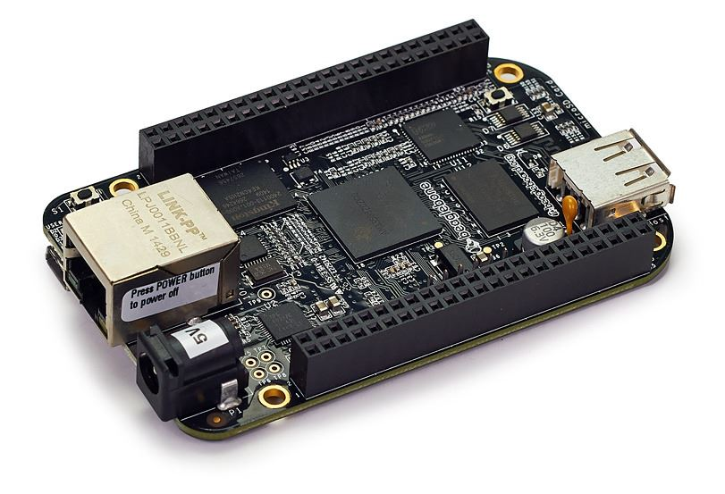
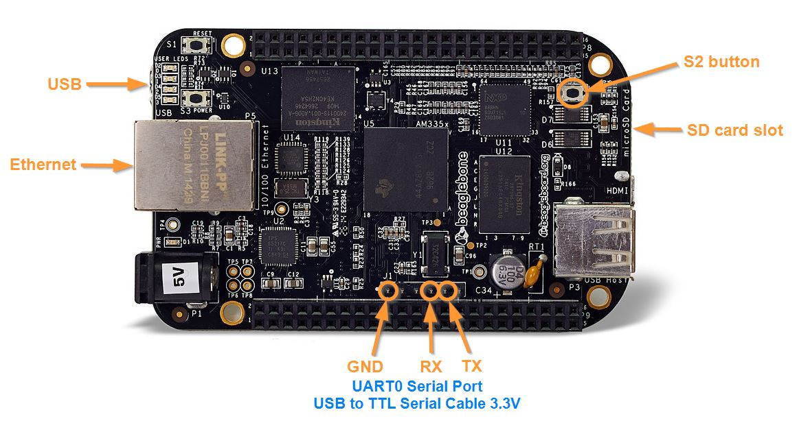
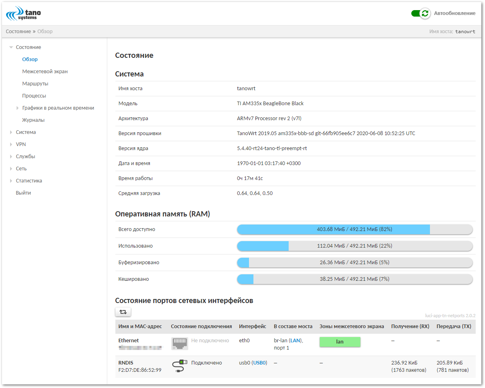
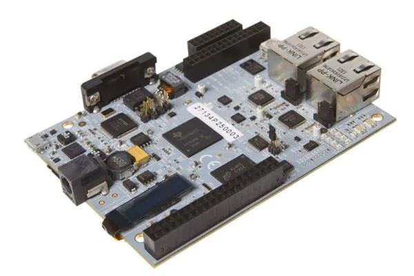
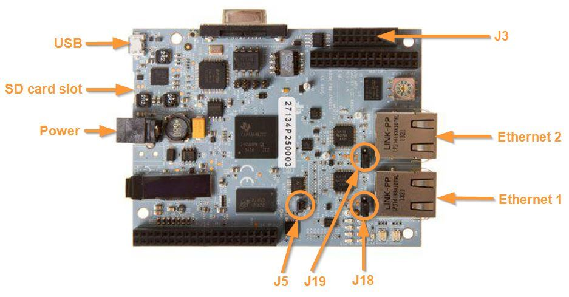
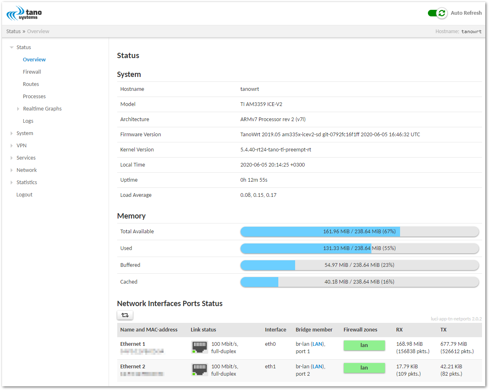
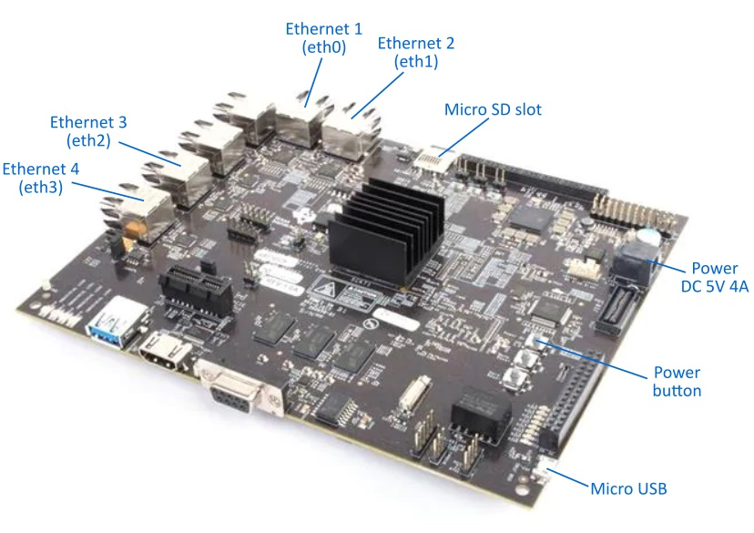
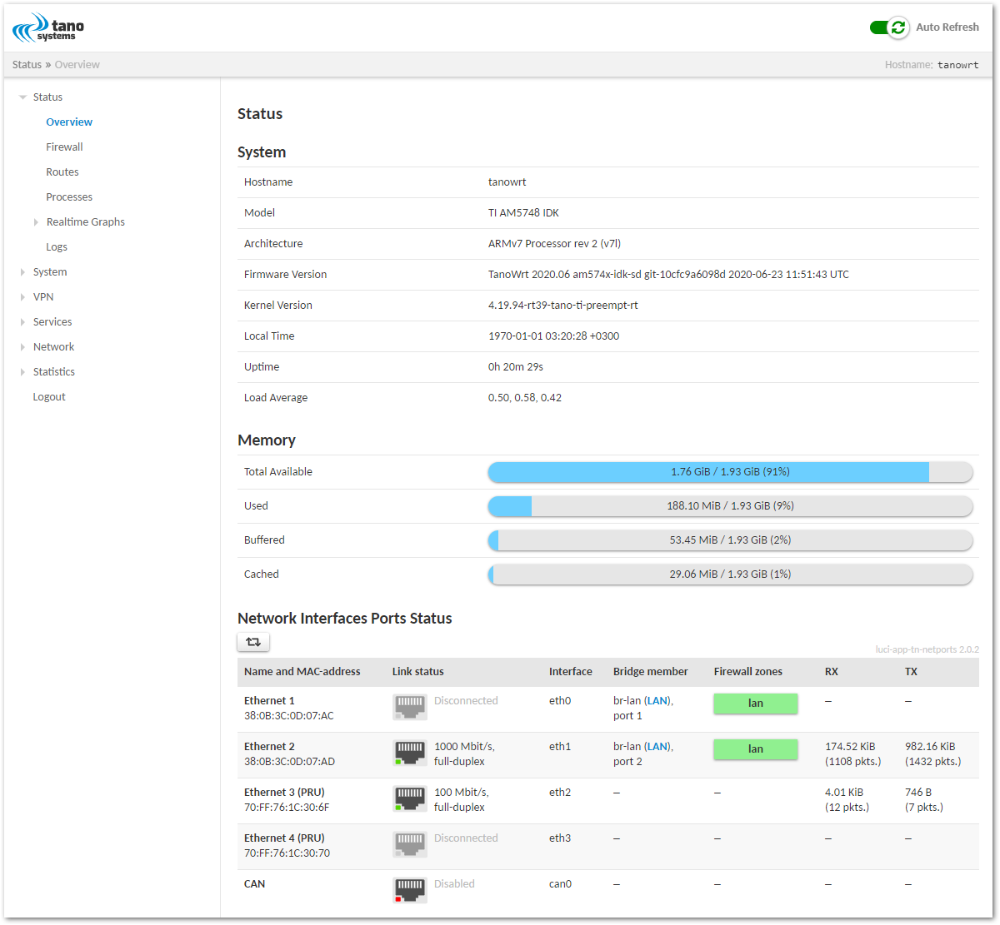

# meta-tanowrt-hsl-ti

[TanoWrt](https://github.com/tano-systems/meta-tanowrt) hardware support layer for the Texas Instruments (TI) SoC based boards.


This layer contains various parts (recipes, files, etc.) from the [meta-arago](http://arago-project.org/git/meta-arago.git) and [meta-processor-sdk](http://arago-project.org/git/projects/meta-processor-sdk.git) layers.

## 1 Supported Hardware

| `MACHINE`         | Board(s)                                                                              |
| ----------------- | ------------------------------------------------------------------------------------- |
| `am335x-bbb-sd`   | [BeagleBone Black](https://beagleboard.org/black) SD card image                       |
| `am335x-icev2-sd` | [TI AM3359 ICEv2 EVM](http://www.ti.com/tool/TMDSICE3359) (TMDSICE3359) SD card image |
| `am574x-idk-sd`   | [TI AM574x IDK EVM](https://www.ti.com/tool/TMDSIDK574) (TMDSIDK574) SD card image    |

## 2 Supported Images

| Recipe               | Image                                       |
| -------------------- | ------------------------------------------- |
| `tanowrt-image-base` | TanoWrt base image                          |
| `tanowrt-image-full` | TanoWrt full featured image (recommended)   |


## 3 Prerequisites

Follow the instructions outlined in "[Prerequisites](../README.md#1-Prerequisites)" section of the root README.md.

## 4 Initialize Repositories

Create a working directory (this document uses `~/tanowrt` for example):
```shell
mkdir -p ~/tanowrt
```

Go to the created working directory and execute repo tool:
```shell
cd ~/tanowrt
repo init -u https://github.com/tano-systems/meta-tanowrt \
          -m meta-tanowrt-hsl-ti/manifests/tanowrt.xml \
          -b warrior
```

Synchronize all repositories by executing a command:
```shell
repo sync
```

## 5 Initialize Build Environment

Go to the working directory (`~/tanowrt`):
```shell
cd ~/tanowrt
```
You should see the following working directory tree:
```
.
├── bitbake
├── LICENSE
├── LICENSE.GPL-2.0-only
├── LICENSE.MIT
├── meta
├── meta-openembedded
├── meta-ti
├── meta-selftest
├── meta-skeleton
├── meta-tanowrt
├── oe-init-build-env
├── README.LSB
├── README.OE-Core
├── README.qemu
└── scripts
```

The first time you need to add layers and create `local.conf` from the template. To do this, run the command:
```shell
TEMPLATECONF=meta-tanowrt/meta-tanowrt-hsl-ti/templates . ./oe-init-build-env
```

This command automatically creates a `build` subdirectory with the required configuration (`local.conf` and `bblayers.conf`) based on the specified template.

If the `build` subdirectory with configuration has already been created, this command can be used to initialize build environment (without specifying a template directory):
```shell
. ./oe-init-build-env
```

After executing `oe-init-build-env` script, the current directory will be automatically changed to `build` subdirectory of the working directory. Any build commands must be always run from the `build` subdirectory.

## 6 Building

Build SD card image for BeagleBone Black board as an example:

```shell
MACHINE=am335x-bbb-sd bitbake tanowrt-image-full
```

When the build is complete, the SD card image file will be located in folder
```
./tanowrt-glibc/deploy/images/am335x-bbb-sd/tanowrt-image-full-am335x-bbb-sd.sdcard.img
```

All images supported by this layer are listed in the "[Supported Images](#2-Supported-Images)" section.

Other available machines are listed in the "[Supported Hardware](#1-Supported-Hardware)" section.

## 7 Running on Hardware

### 7.1 BeagleBone Black (`am335x-bbb-sd`)





#### 7.1.1 Writing Image to SD Card

Use the `dd` utility to write the generated `.sdcard.img` image to the SD card.

#### 7.1.2 Booting

1. Insert the SD card into the slot on the BeagleBone Black board (power is off).
2. Press and hold the S2 button.
3. Power on board.
4. Wait 1–3 seconds and release S2 button.
5. System from SD card will be booting.
6. For login use credentials specified in "[Access](#8-Access)" section.

#### 7.1.3 Default Network Configuration

By default Ethernet port (`eth0` interface) are joined into a bridge (`br-lan` interface). Bridge (`br-lan`) configured with static IP address 192.168.0.1/24 with enabled DHCP server.

Also you can connect to the board using USB RNDIS connection (`usb0` interface). RNDIS interface configured with static IP address 172.16.0.1/24 with enabled DHCP server.

The web-configuration interface can be accessed via Ethernet port through HTTP(s) protocol. You must see something like this in browser:



The Ethernet port (`eth0`) has LLDP enabled by default.

### 7.2 TI AM3359 ICEv2 EVM (`am335x-icev2-sd`)





#### 7.2.1 Writing Image to SD Card

Use the `dd` utility to write the generated `.sdcard.img` image to the SD card.

#### 7.2.2 Preparing Hardware

##### 7.2.2.1 Erasing SPI NOR Flash

Note that booting from an SD card is only possible when there is no bootloader in the SPI NOR flash. If you have an bootloader in the SPI NOR flash you must erase SPI NOR flash contents. Follow these [instructions](http://software-dl.ti.com/processor-sdk-linux/esd/docs/latest/linux/How_to_Guides/Host/AM335x_ICEv2_flash_erase.html#am335x-icev2-flash-erase) to erase flash contents:

1. Make sure pins 1 and 2 of Jumper J5 (sysboot) are connected on the board
2. Make sure that USB cable is connected from the AM3359 ICE board to your host development machine
3. Launch Code Composer Studio (CCS)
    - If you do not have CCS, download it here: [CCS Download](http://processors.wiki.ti.com/index.php/Download_CCS)
4. Create a target configuration file in CCS to connect to the AM3359 ICE board:
    - Click "File -> New -> Target Configuration File"
    - Filename: `AM3359-ice-v2.ccxml`. Check "Use shared location" to be available to anyone who uses the workspace. Click "Finish". A window opens up which is to configure the connection details
      - Connection: Texas Instruments XDS100v2 USB Debug Probe
      - Device: ICE_AM3359
      - Click "Save"
5. Launch your AM3359 ICE Target Configuration:
    - Click "Window -> Show View -> Target Configurations"
    - Right click on the `AM3359-ice-v2.ccxml` file and the click "Launch Selected Configuration"
    - This should switch your current perspective to the "CCS Debug" perspective. If it doesn't, click "View -> Debug" to get to the "CCS Debug" perspective
6. Connect the debugger to the CortexA8 core:
    - Right click on "Texas Instruments XDS100v2 USB Debug Probe_0/CortxA8" listed in the "Debug view" and select "Connect Target".
7. Load the SPI flash programmer into the CortexA8 core:
    - Download the SPI flash programmer and unzip it: [Isdk_spi_flasher.zip](http://processors.wiki.ti.com/index.php/File:Isdk_spi_flasher.zip)
    - Highlight the "Texas Instruments XDS100v2 USB Debug Probe_0/CortxA8" by clicking on it
    - Click "Run -> Load -> Load Program"
    - Browse to the `isdk_spi_flasher.out` file (that you just downloaded and unzipped) and click "OK"
8. Run the SPI flash programmer on the CortexA8:
    - Highlight the "Texas Instruments XDS100v2 USB Debug Probe_0/CortxA8" by clicking on it
    - Click "Run -> Resume"
9. At this point the SPI flash programmer is running on the CortexA8 and we just need to follow the prompts to clear the flash:
    - If it isn't opened already, open the "Console view" by clicking "Window -> Show View -> Console"
    - The program will give you the following prompts, type the responses and press "Enter":

      ```
      Enter Operation [1 - Flash] [2 - Erase]: 2
      Enter the offset [in Hex]: 0
      Enter size to be erased in Kilo bytes: 64
      ```

##### 7.2.2.2 Choosing Boot Mode

Short pin 2 and 3 on J5 (sysboot) for choosing MMC/SD boot mode.

##### 7.2.2.3 Choosing Ethernet Mode

Jumpers J18 and J19 must be set to control the Ethernet ports using CPSW (gigabit switch) or PRU-ICSS mode. For PRU-ICSS mode, short pins 2 and 3. For CPSW mode, short pins 1 and 2.

#### 7.2.3 Booting

1. Insert the SD card into the slot on the EVM board (power is off).
2. Power on board.
3. System from SD card will be booting.
4. For login use credentials specified in "[Access](#8-Access)" section.

#### 7.2.4 Default Network Configuration

By default Ethernet 1 and 2 ports (`eth0` and `eth1` interfaces) are joined into a bridge (`br-lan` interface) with enabled RSTP protocol. Bridge (`br-lan`) configured with static IP address 192.168.0.1/24 with enabled DHCP server.

The web-configuration interface can be accessed via Ethernet port through HTTP(s) protocol. You must see something like this in browser:



Ethernet ports 1 and 2 (`eth0` and `eth1`) have LLDP enabled by default.

### 7.3 TI AM574x IDK EVM (`am574x-idk-sd`)



#### 7.2.1 Writing Image to SD Card

Use the `dd` utility to write the generated `.sdcard.img` image to the SD card.

#### 7.2.2 Preparing Hardware

No special things to do.

#### 7.2.3 Booting

1. Insert the SD card into the slot on the EVM board (power is off).
2. Power on board.
3. System from SD card will be booting.
4. For login use credentials specified in "[Access](#8-Access)" section.

#### 7.2.4 Default Network Configuration

By default Ethernet 1 and 2 ports (`eth0` and `eth1` interfaces) are joined into a bridge (`br-lan` interface) with enabled RSTP protocol. Bridge (`br-lan`) configured with static IP address 192.168.0.1/24 with enabled DHCP server.

ICSS PRU ethernet ports 3 and 4 (`eth2` and `eth3` interfaces) are not configured by default.

The web-configuration interface can be accessed via Ethernet port through HTTP(s) protocol. You must see something like this in browser:



Ethernet ports 1 and 2 (`eth0` and `eth1`) have LLDP enabled by default.

## 8 Access

The following credentials are used to access the operating system (terminal) and the LuCI web-configuration interface:
* User name: `root`
* Password: `root`

## 9 Issues

### 9.1 Known issues

| ID       | Machine(s)      | Description                                                                                          |
| -------- | --------------- | ---------------------------------------------------------------------------------------------------- |
| HSL-TI-1 | `am574x-idk-sd` | USB RNDIS is not working (`usb0` interface)                                                          |
| HSL-TI-2 | `am574x-idk-sd` | kernel 5.4: When trying to bridge PRU ethernet interfaces (`eth2` or/and `eth3`), the kernel crashes |

## 10 Dependencies

This layer depends on the [meta-tanowrt](../meta-tanowrt/README.md) layer (TanoWrt Linux distribution core layer) with all its dependencies.

Additional dependencies are listed here:

* meta-ti  
  URI: <git://git.yoctoproject.org/meta-ti>  
  Branch: master

The current exact revisions of all listed dependencies are given in [manifests/deps.xml](manifests/deps.xml).

## 11 License

All metadata is MIT licensed unless otherwise stated. Source code included in tree for individual recipes is under the LICENSE stated in each recipe (.bb file) unless otherwise stated.

## 12 Maintainers

Anton Kikin <a.kikin@tano-systems.com>
